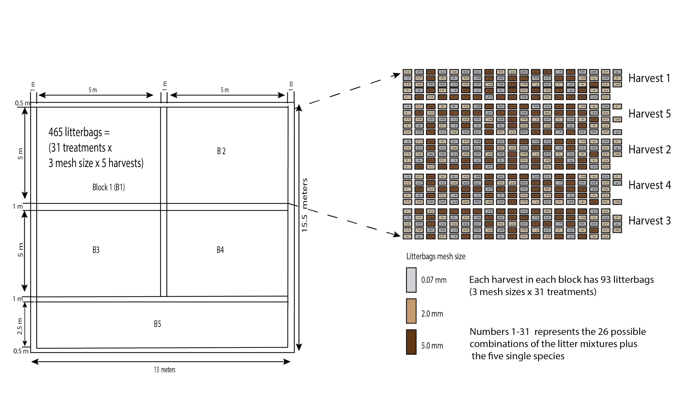
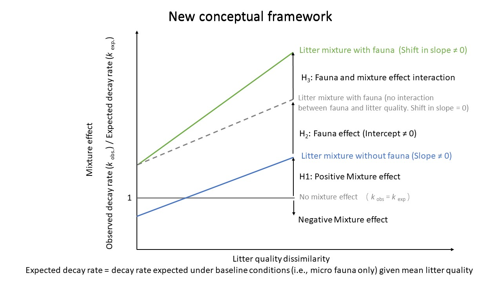

```{r setup, include=FALSE}
knitr::opts_chunk$set(echo = TRUE,cache = TRUE)
```

# R script description
Update on `r Sys.Date()`


This script shows the analysis of leaf litter mixture decomposition using five species,three litterbag mesh sizes (0.07 mm not allowing any fauna at all, 2 mm allowing mesofauna and 5 mm allowing macrofauna) with single species litter and all possible combinations of mixture from 2 species richness to five species richness.
A total of 2,325 litterbags incubated in a common garden (open field in Wuhan Botanical Garden). This experiment was part of Denis Njoroge MSc thesis defended in May 2021.

# List of required library
```{r}
library(lme4)## For linear mixed effect model
library(lmerTest) ## For linear mixed effect model to conduct model simplification
library(pbkrtest) ## For linear mixed effect model to provide p values
library(MuMIn) ## For best model selection 
library(nlme) ## For non linear model
library(ggplot2) ## For good plotting figures
library(vegan) ## For calculating litter quality dissimilarity
library(dplyr) ## For calculating means and attaching new columns to data frame
```

# Litter data input

The litter data file consists of data collect over 16 month long decomposition experiment.

```{r input data}

litter<-read.csv("sixteen_mon_sample.csv", header = TRUE, sep = ",", quote = "\"",
                 dec = ".", fill = TRUE, comment.char = "")
```

# Experiment design and litterbags layout in the field



Figure S: Complete experimental design and layout of litterbags


Harvest 1 was retrieved in month 1, harvest 2 month 3, harvest 3 month 6,  harvest 4 month 9 and harvest 5 in month 16

# Compute expected mass loss in mixtures

The expected mass loss was calculated based on the single species litter in fine mesh size
Where expected mass loss was calculated as:

Expected mass loss % = ∑fiMi is the percentage mass loss and fi the mass proportion of each single species litter in the litter mixture.

Since, the proportion of mass of single species in the mixture is the same for all single constituents, we can use the mean of the mass loss of the constituents forming the litter mixture as the expected mass loss for the mixture.

First, we extract single species mass loss which we will use to calculate the expected mass loss for the litter mixtures per litter mixture. This needs to be done per harvest time and per plot.

## Single species per mesh size per plot per harvest

```{r, results='hold', warning=FALSE}
litter_single<- litter[litter$No_species == "1",]

#we extract the mass loss for single species in 0.07 mm mesh size. 
litter_single_fine_mesh<- litter_single[litter_single$mesh_size == "0.07 mm",]
dim(litter_single_fine_mesh)
#View(litter_single)
litter_single_fine_mesh$percent_ml<-as.numeric(litter_single_fine_mesh$percent_ml)

library(dplyr)
ml_s<-litter_single_fine_mesh%>%
  group_by(code,Time_month,plot)%>%
  summarize(per_ml=mean(percent_ml,na.rm = TRUE)
            
  )
dim(ml_s)
ml_s

# here we extract the mass loss for plot one (R1) 
ml_s_r1<- ml_s[ml_s$plot == "R1",]

#Convert the data frame to wide format to ensure that each harvest month is in one column 
library(tidyr)
ml_wide_r1 <- spread(ml_s_r1, Time_month, per_ml)
ml_wide_r1

ml_wide_r1$code<-as.factor(ml_wide_r1$code)
ml_wide_r1$`one month`<-as.numeric(ml_wide_r1$`one month`)
ml_wide_r1$`three months`<-as.numeric(ml_wide_r1$`three months`)
ml_wide_r1$`six months`<-as.numeric(ml_wide_r1$`six months`)
ml_wide_r1$`nine months`<-as.numeric(ml_wide_r1$`nine months`)
ml_wide_r1$`sixteen months`<-as.numeric(ml_wide_r1$`sixteen months`)
```

## Expected mass loss based on 0.07 mm mesh size  at plot 1 month 16

```{r, results='hold', warning=FALSE}
#A
expected_r1_mon_16_a <- ml_wide_r1 %>%
  filter(code == 'A')
expected_r1_mon_16_a<-sum(expected_r1_mon_16_a$`sixteen months`)/1
#AB
expected_r1_mon_16_a_b <- ml_wide_r1 %>%
  filter(code == 'A'| code == 'B')
expected_r1_mon_16_a_b<-sum(expected_r1_mon_16_a_b$`sixteen months`)/2
#ABC
expected_r1_mon_16_a_b_c <- ml_wide_r1 %>%
  filter(code == 'A'| code == 'B'| code == 'C')
expected_r1_mon_16_a_b_c<-sum(expected_r1_mon_16_a_b_c$`sixteen months`)/3
#ABCD
expected_r1_mon_16_a_b_c_d <- ml_wide_r1 %>%
  filter(code == 'A'| code == 'B'| code == 'C'| code == 'D')
expected_r1_mon_16_a_b_c_d<-sum(expected_r1_mon_16_a_b_c_d$`sixteen months`)/4
#ABCDE
expected_r1_mon_16_a_b_c_d_e <- ml_wide_r1 %>%
  filter(code == 'A'| code == 'B'| code == 'C'| code == 'D'| code == 'E')
expected_r1_mon_16_a_b_c_d_e<-sum(expected_r1_mon_16_a_b_c_d_e$`sixteen months`)/5
#ABCE
expected_r1_mon_16_a_b_c_e <- ml_wide_r1 %>%
  filter(code == 'A'| code == 'B'| code == 'C'| code == 'E')
expected_r1_mon_16_a_b_c_e<-sum(expected_r1_mon_16_a_b_c_e$`sixteen months`)/4
#ABD
expected_r1_mon_16_a_b_d <- ml_wide_r1 %>%
  filter(code == 'A'| code == 'B'| code == 'D')
expected_r1_mon_16_a_b_d<-sum(expected_r1_mon_16_a_b_d$`sixteen months`)/3
#ABDE
expected_r1_mon_16_a_b_d_e <- ml_wide_r1 %>%
  filter(code == 'A'| code == 'B'| code == 'D'| code == 'E')
expected_r1_mon_16_a_b_d_e<-sum(expected_r1_mon_16_a_b_d_e$`sixteen months`)/4
#ABE
expected_r1_mon_16_a_b_e <- ml_wide_r1 %>%
  filter(code == 'A'| code == 'B'| code == 'E')
expected_r1_mon_16_a_b_e<-sum(expected_r1_mon_16_a_b_e$`sixteen months`)/3
#AC
expected_r1_mon_16_a_c <- ml_wide_r1 %>%
  filter(code == 'A'| code == 'C')
expected_r1_mon_16_a_c<-sum(expected_r1_mon_16_a_c$`sixteen months`)/2
#ACD
expected_r1_mon_16_a_c_d <- ml_wide_r1 %>%
  filter(code == 'A'| code == 'C'| code == 'D')
expected_r1_mon_16_a_c_d<-sum(expected_r1_mon_16_a_c_d$`sixteen months`)/3
#ACDE
expected_r1_mon_16_a_c_d_e <- ml_wide_r1 %>%
  filter(code == 'A'| code == 'C'| code == 'D'| code == 'E')
expected_r1_mon_16_a_c_d_e<-sum(expected_r1_mon_16_a_c_d_e$`sixteen months`)/4
#ACE
expected_r1_mon_16_a_c_e <- ml_wide_r1 %>%
  filter(code == 'A'| code == 'C'| code == 'E')
expected_r1_mon_16_a_c_e<-sum(expected_r1_mon_16_a_c_e$`sixteen months`)/3
#AD
expected_r1_mon_16_a_d <- ml_wide_r1 %>%
  filter(code == 'A'| code == 'D')
expected_r1_mon_16_a_d<-sum(expected_r1_mon_16_a_d$`sixteen months`)/2
#ADE
expected_r1_mon_16_a_d_e <- ml_wide_r1 %>%
  filter(code == 'A'| code == 'D'| code == 'E')
expected_r1_mon_16_a_d_e<-sum(expected_r1_mon_16_a_d_e$`sixteen months`)/3
#AE
expected_r1_mon_16_a_e <- ml_wide_r1 %>%
  filter(code == 'A'| code == 'E')
expected_r1_mon_16_a_e<-sum(expected_r1_mon_16_a_e$`sixteen months`)/2
#B
expected_r1_mon_16_b <- ml_wide_r1 %>%
  filter(code == 'B')
expected_r1_mon_16_b<-sum(expected_r1_mon_16_b$`sixteen months`)/1
#BC
expected_r1_mon_16_b_c <- ml_wide_r1 %>%
  filter(code == 'B'| code == 'C')
expected_r1_mon_16_b_c<-sum(expected_r1_mon_16_b_c$`sixteen months`)/2
#BCD
expected_r1_mon_16_b_c_d <- ml_wide_r1 %>%
  filter(code == 'B'| code == 'C'| code == 'D')
expected_r1_mon_16_b_c_d<-sum(expected_r1_mon_16_b_c_d$`sixteen months`)/3
#BCDE
expected_r1_mon_16_b_c_d_e <- ml_wide_r1 %>%
  filter(code == 'B'| code == 'C'| code == 'D'| code == 'E')
expected_r1_mon_16_b_c_d_e<-sum(expected_r1_mon_16_b_c_d_e$`sixteen months`)/4
#BCE
expected_r1_mon_16_b_c_e <- ml_wide_r1 %>%
  filter(code == 'B'| code == 'C'| code == 'E')
expected_r1_mon_16_b_c_e<-sum(expected_r1_mon_16_b_c_e$`sixteen months`)/3
#BD
expected_r1_mon_16_b_d <- ml_wide_r1 %>%
  filter(code == 'B'| code == 'D')
expected_r1_mon_16_b_d<-sum(expected_r1_mon_16_b_d$`sixteen months`)/2
#BDE
expected_r1_mon_16_b_d_e <- ml_wide_r1 %>%
  filter(code == 'B'| code == 'D'| code == 'E')
expected_r1_mon_16_b_d_e<-sum(expected_r1_mon_16_b_d_e$`sixteen months`)/3
#BE
expected_r1_mon_16_b_e <- ml_wide_r1 %>%
  filter(code == 'B'| code == 'E')
expected_r1_mon_16_b_e<-sum(expected_r1_mon_16_b_e$`sixteen months`)/2
#C
expected_r1_mon_16_c <- ml_wide_r1 %>%
  filter(code == 'C')
expected_r1_mon_16_c<-sum(expected_r1_mon_16_c$`sixteen months`)/1
#CD
expected_r1_mon_16_c_d <- ml_wide_r1 %>%
  filter(code == 'C'| code == 'D')
expected_r1_mon_16_c_d<-sum(expected_r1_mon_16_c_d$`sixteen months`)/2
#CDE
expected_r1_mon_16_c_d_e <- ml_wide_r1 %>%
  filter(code == 'C'| code == 'D'| code == 'E')
expected_r1_mon_16_c_d_e<-sum(expected_r1_mon_16_c_d_e$`sixteen months`)/3
#CE
expected_r1_mon_16_c_e <- ml_wide_r1 %>%
  filter(code == 'C'| code == 'E')
expected_r1_mon_16_c_e<-sum(expected_r1_mon_16_c_e$`sixteen months`)/2
#D
expected_r1_mon_16_d <- ml_wide_r1 %>%
  filter(code == 'D')
expected_r1_mon_16_d<-sum(expected_r1_mon_16_d$`sixteen months`)/1
#DE
expected_r1_mon_16_d_e <- ml_wide_r1 %>%
  filter(code == 'D'| code == 'E')
expected_r1_mon_16_d_e<-sum(expected_r1_mon_16_d_e$`sixteen months`)/2
#E
expected_r1_mon_16_e <- ml_wide_r1 %>%
  filter(code == 'E')
expected_r1_mon_16_e<-sum(expected_r1_mon_16_e$`sixteen months`)/1

expected_r1_ml_16<-data.frame(item=c("A", "AB", "ABC", "ABCD", "ABCDE", "ABCE","ABD","ABDE","ABE", "AC", "ACD","ACDE","ACE","AD","ADE", "AE", "B", "BC", "BCD", "BCDE", "BCE", "BD", "BDE", "BE", "C", "CD", "CDE", "CE", "D", "DE", "E"), 
                         expected_r1_ml_16=c(expected_r1_mon_16_a,expected_r1_mon_16_a_b,expected_r1_mon_16_a_b_c,expected_r1_mon_16_a_b_c_d,expected_r1_mon_16_a_b_c_d_e, expected_r1_mon_16_a_b_c_e,expected_r1_mon_16_a_b_d,expected_r1_mon_16_a_b_d_e,expected_r1_mon_16_a_b_e,expected_r1_mon_16_a_c, expected_r1_mon_16_a_c_d,expected_r1_mon_16_a_b_c_d_e,
                                     expected_r1_mon_16_a_c_e,expected_r1_mon_16_a_d,expected_r1_mon_16_a_d_e,expected_r1_mon_16_a_e,expected_r1_mon_16_b,expected_r1_mon_16_b_c,expected_r1_mon_16_b_c_d,expected_r1_mon_16_b_c_d_e,expected_r1_mon_16_b_c_e,expected_r1_mon_16_b_d,expected_r1_mon_16_b_d_e, expected_r1_mon_16_b_e,expected_r1_mon_16_c,expected_r1_mon_16_c_d,expected_r1_mon_16_c_d_e,expected_r1_mon_16_c_e,
                                     expected_r1_mon_16_d,expected_r1_mon_16_d_e,expected_r1_mon_16_e))
```

## Expected mass loss based on 0.07 mm mesh size at plot 2 month 16

```{r, results='hold', warning=FALSE}
ml_s_r2<- ml_s[ml_s$plot == "R2",]

library(tidyr)
ml_wide_r2 <- spread(ml_s_r2, Time_month, per_ml)
ml_wide_r2

ml_wide_r2$code<-as.factor(ml_wide_r2$code)
ml_wide_r2$`one month`<-as.numeric(ml_wide_r2$`one month`)
ml_wide_r2$`three months`<-as.numeric(ml_wide_r2$`three months`)
ml_wide_r2$`six months`<-as.numeric(ml_wide_r2$`six months`)
ml_wide_r2$`nine months`<-as.numeric(ml_wide_r2$`nine months`)
ml_wide_r2$`sixteen months`<-as.numeric(ml_wide_r2$`sixteen months`)

#ml_wide_r2$nine=ml_wide_r2$`nine months`


#A
expected_r2_mon_16_a <- ml_wide_r2 %>%
  filter(code == 'A')
expected_r2_mon_16_a<-sum(expected_r2_mon_16_a$`sixteen months`)/1
#AB
expected_r2_mon_16_a_b <- ml_wide_r2 %>%
  filter(code == 'A'| code == 'B')
expected_r2_mon_16_a_b<-sum(expected_r2_mon_16_a_b$`sixteen months`)/2
#ABC
expected_r2_mon_16_a_b_c <- ml_wide_r2 %>%
  filter(code == 'A'| code == 'B'| code == 'C')
expected_r2_mon_16_a_b_c<-sum(expected_r2_mon_16_a_b_c$`sixteen months`)/3
#ABCD
expected_r2_mon_16_a_b_c_d <- ml_wide_r2 %>%
  filter(code == 'A'| code == 'B'| code == 'C'| code == 'D')
expected_r2_mon_16_a_b_c_d<-sum(expected_r2_mon_16_a_b_c_d$`sixteen months`)/4
#ABCDE
expected_r2_mon_16_a_b_c_d_e <- ml_wide_r2 %>%
  filter(code == 'A'| code == 'B'| code == 'C'| code == 'D'| code == 'E')
expected_r2_mon_16_a_b_c_d_e<-sum(expected_r2_mon_16_a_b_c_d_e$`sixteen months`)/5
#ABCE
expected_r2_mon_16_a_b_c_e <- ml_wide_r2 %>%
  filter(code == 'A'| code == 'B'| code == 'C'| code == 'E')
expected_r2_mon_16_a_b_c_e<-sum(expected_r2_mon_16_a_b_c_e$`sixteen months`)/4
#ABD
expected_r2_mon_16_a_b_d <- ml_wide_r2 %>%
  filter(code == 'A'| code == 'B'| code == 'D')
expected_r2_mon_16_a_b_d<-sum(expected_r2_mon_16_a_b_d$`sixteen months`)/3
#ABDE
expected_r2_mon_16_a_b_d_e <- ml_wide_r2 %>%
  filter(code == 'A'| code == 'B'| code == 'D'| code == 'E')
expected_r2_mon_16_a_b_d_e<-sum(expected_r2_mon_16_a_b_d_e$`sixteen months`)/4
#ABE
expected_r2_mon_16_a_b_e <- ml_wide_r2 %>%
  filter(code == 'A'| code == 'B'| code == 'E')
expected_r2_mon_16_a_b_e<-sum(expected_r2_mon_16_a_b_e$`sixteen months`)/3
#AC
expected_r2_mon_16_a_c <- ml_wide_r2 %>%
  filter(code == 'A'| code == 'C')
expected_r2_mon_16_a_c<-sum(expected_r2_mon_16_a_c$`sixteen months`)/2
#ACD
expected_r2_mon_16_a_c_d <- ml_wide_r2 %>%
  filter(code == 'A'| code == 'C'| code == 'D')
expected_r2_mon_16_a_c_d<-sum(expected_r2_mon_16_a_c_d$`sixteen months`)/3
#ACDE
expected_r2_mon_16_a_c_d_e <- ml_wide_r2 %>%
  filter(code == 'A'| code == 'C'| code == 'D'| code == 'E')
expected_r2_mon_16_a_c_d_e<-sum(expected_r2_mon_16_a_c_d_e$`sixteen months`)/4
#ACE
expected_r2_mon_16_a_c_e <- ml_wide_r2 %>%
  filter(code == 'A'| code == 'C'| code == 'E')
expected_r2_mon_16_a_c_e<-sum(expected_r2_mon_16_a_c_e$`sixteen months`)/3
#AD
expected_r2_mon_16_a_d <- ml_wide_r2 %>%
  filter(code == 'A'| code == 'D')
expected_r2_mon_16_a_d<-sum(expected_r2_mon_16_a_d$`sixteen months`)/2
#ADE
expected_r2_mon_16_a_d_e <- ml_wide_r2 %>%
  filter(code == 'A'| code == 'D'| code == 'E')
expected_r2_mon_16_a_d_e<-sum(expected_r2_mon_16_a_d_e$`sixteen months`)/3
#AE
expected_r2_mon_16_a_e <- ml_wide_r2 %>%
  filter(code == 'A'| code == 'E')
expected_r2_mon_16_a_e<-sum(expected_r2_mon_16_a_e$`sixteen months`)/2
#B
expected_r2_mon_16_b <- ml_wide_r2 %>%
  filter(code == 'B')
expected_r2_mon_16_b<-sum(expected_r2_mon_16_b$`sixteen months`)/1
#BC
expected_r2_mon_16_b_c <- ml_wide_r2 %>%
  filter(code == 'B'| code == 'C')
expected_r2_mon_16_b_c<-sum(expected_r2_mon_16_b_c$`sixteen months`)/2
#BCD
expected_r2_mon_16_b_c_d <- ml_wide_r2 %>%
  filter(code == 'B'| code == 'C'| code == 'D')
expected_r2_mon_16_b_c_d<-sum(expected_r2_mon_16_b_c_d$`sixteen months`)/3
#BCDE
expected_r2_mon_16_b_c_d_e <- ml_wide_r2 %>%
  filter(code == 'B'| code == 'C'| code == 'D'| code == 'E')
expected_r2_mon_16_b_c_d_e<-sum(expected_r2_mon_16_b_c_d_e$`sixteen months`)/4
#BCE
expected_r2_mon_16_b_c_e <- ml_wide_r2 %>%
  filter(code == 'B'| code == 'C'| code == 'E')
expected_r2_mon_16_b_c_e<-sum(expected_r2_mon_16_b_c_e$`sixteen months`)/3
#BD
expected_r2_mon_16_b_d <- ml_wide_r2 %>%
  filter(code == 'B'| code == 'D')
expected_r2_mon_16_b_d<-sum(expected_r2_mon_16_b_d$`sixteen months`)/2
#BDE
expected_r2_mon_16_b_d_e <- ml_wide_r2 %>%
  filter(code == 'B'| code == 'D'| code == 'E')
expected_r2_mon_16_b_d_e<-sum(expected_r2_mon_16_b_d_e$`sixteen months`)/3
#BE
expected_r2_mon_16_b_e <- ml_wide_r2 %>%
  filter(code == 'B'| code == 'E')
expected_r2_mon_16_b_e<-sum(expected_r2_mon_16_b_e$`sixteen months`)/2
#C
expected_r2_mon_16_c <- ml_wide_r2 %>%
  filter(code == 'C')
expected_r2_mon_16_c<-sum(expected_r2_mon_16_c$`sixteen months`)/1
#CD
expected_r2_mon_16_c_d <- ml_wide_r2 %>%
  filter(code == 'C'| code == 'D')
expected_r2_mon_16_c_d<-sum(expected_r2_mon_16_c_d$`sixteen months`)/2
#CDE
expected_r2_mon_16_c_d_e <- ml_wide_r2 %>%
  filter(code == 'C'| code == 'D'| code == 'E')
expected_r2_mon_16_c_d_e<-sum(expected_r2_mon_16_c_d_e$`sixteen months`)/3
#CE
expected_r2_mon_16_c_e <- ml_wide_r2 %>%
  filter(code == 'C'| code == 'E')
expected_r2_mon_16_c_e<-sum(expected_r2_mon_16_c_e$`sixteen months`)/2
#D
expected_r2_mon_16_d <- ml_wide_r2 %>%
  filter(code == 'D')
expected_r2_mon_16_d<-sum(expected_r2_mon_16_d$`sixteen months`)/1
#DE
expected_r2_mon_16_d_e <- ml_wide_r2 %>%
  filter(code == 'D'| code == 'E')
expected_r2_mon_16_d_e<-sum(expected_r2_mon_16_d_e$`sixteen months`)/2
#E
expected_r2_mon_16_e <- ml_wide_r2 %>%
  filter(code == 'E')
expected_r2_mon_16_e<-sum(expected_r2_mon_16_e$`sixteen months`)/1

expected_r2_ml_16<-data.frame(item=c("A", "AB", "ABC", "ABCD", "ABCDE", "ABCE","ABD","ABDE","ABE", "AC", "ACD","ACDE","ACE","AD","ADE", "AE", "B", "BC", "BCD", "BCDE", "BCE", "BD", "BDE", "BE", "C", "CD", "CDE", "CE", "D", "DE", "E"), 
                              expected_r2_ml_16=c(expected_r2_mon_16_a,expected_r2_mon_16_a_b,expected_r2_mon_16_a_b_c,expected_r2_mon_16_a_b_c_d,expected_r2_mon_16_a_b_c_d_e, expected_r2_mon_16_a_b_c_e,expected_r2_mon_16_a_b_d,expected_r2_mon_16_a_b_d_e,expected_r2_mon_16_a_b_e,expected_r2_mon_16_a_c, expected_r2_mon_16_a_c_d,expected_r2_mon_16_a_b_c_d_e,
                                                  expected_r2_mon_16_a_c_e,expected_r2_mon_16_a_d,expected_r2_mon_16_a_d_e,expected_r2_mon_16_a_e,expected_r2_mon_16_b,expected_r2_mon_16_b_c,expected_r2_mon_16_b_c_d,expected_r2_mon_16_b_c_d_e,expected_r2_mon_16_b_c_e,expected_r2_mon_16_b_d,expected_r2_mon_16_b_d_e, expected_r2_mon_16_b_e,expected_r2_mon_16_c,expected_r2_mon_16_c_d,expected_r2_mon_16_c_d_e,expected_r2_mon_16_c_e,
                                                  expected_r2_mon_16_d,expected_r2_mon_16_d_e,expected_r2_mon_16_e))
```

## Expected mass loss based on 0.07 mm mesh size  at plot 3 month 16

```{r, results='hold', warning=FALSE}
ml_s_r3<- ml_s[ml_s$plot == "R3",]

library(tidyr)
ml_wide_r3 <- spread(ml_s_r3, Time_month, per_ml)
ml_wide_r3

ml_wide_r3$code<-as.factor(ml_wide_r3$code)
ml_wide_r3$`one month`<-as.numeric(ml_wide_r3$`one month`)
ml_wide_r3$`three months`<-as.numeric(ml_wide_r3$`three months`)
ml_wide_r3$`six months`<-as.numeric(ml_wide_r3$`six months`)
ml_wide_r3$`nine months`<-as.numeric(ml_wide_r3$`nine months`)
ml_wide_r3$`sixteen months`<-as.numeric(ml_wide_r3$`sixteen months`)
ml_wide_r3$nine=ml_wide_r3$`nine months`


#A
expected_r3_mon_16_a <- ml_wide_r3 %>%
  filter(code == 'A')
expected_r3_mon_16_a<-sum(expected_r3_mon_16_a$`sixteen months`)/1
#AB
expected_r3_mon_16_a_b <- ml_wide_r3 %>%
  filter(code == 'A'| code == 'B')
expected_r3_mon_16_a_b<-sum(expected_r3_mon_16_a_b$`sixteen months`)/2
#ABC
expected_r3_mon_16_a_b_c <- ml_wide_r3 %>%
  filter(code == 'A'| code == 'B'| code == 'C')
expected_r3_mon_16_a_b_c<-sum(expected_r3_mon_16_a_b_c$`sixteen months`)/3
#ABCD
expected_r3_mon_16_a_b_c_d <- ml_wide_r3 %>%
  filter(code == 'A'| code == 'B'| code == 'C'| code == 'D')
expected_r3_mon_16_a_b_c_d<-sum(expected_r3_mon_16_a_b_c_d$`sixteen months`)/4
#ABCDE
expected_r3_mon_16_a_b_c_d_e <- ml_wide_r3 %>%
  filter(code == 'A'| code == 'B'| code == 'C'| code == 'D'| code == 'E')
expected_r3_mon_16_a_b_c_d_e<-sum(expected_r3_mon_16_a_b_c_d_e$`sixteen months`)/5
#ABCE
expected_r3_mon_16_a_b_c_e <- ml_wide_r3 %>%
  filter(code == 'A'| code == 'B'| code == 'C'| code == 'E')
expected_r3_mon_16_a_b_c_e<-sum(expected_r3_mon_16_a_b_c_e$`sixteen months`)/4
#ABD
expected_r3_mon_16_a_b_d <- ml_wide_r3 %>%
  filter(code == 'A'| code == 'B'| code == 'D')
expected_r3_mon_16_a_b_d<-sum(expected_r3_mon_16_a_b_d$`sixteen months`)/3
#ABDE
expected_r3_mon_16_a_b_d_e <- ml_wide_r3 %>%
  filter(code == 'A'| code == 'B'| code == 'D'| code == 'E')
expected_r3_mon_16_a_b_d_e<-sum(expected_r3_mon_16_a_b_d_e$`sixteen months`)/4
#ABE
expected_r3_mon_16_a_b_e <- ml_wide_r3 %>%
  filter(code == 'A'| code == 'B'| code == 'E')
expected_r3_mon_16_a_b_e<-sum(expected_r3_mon_16_a_b_e$`sixteen months`)/3
#AC
expected_r3_mon_16_a_c <- ml_wide_r3 %>%
  filter(code == 'A'| code == 'C')
expected_r3_mon_16_a_c<-sum(expected_r3_mon_16_a_c$`sixteen months`)/2
#ACD
expected_r3_mon_16_a_c_d <- ml_wide_r3 %>%
  filter(code == 'A'| code == 'C'| code == 'D')
expected_r3_mon_16_a_c_d<-sum(expected_r3_mon_16_a_c_d$`sixteen months`)/3
#ACDE
expected_r3_mon_16_a_c_d_e <- ml_wide_r3 %>%
  filter(code == 'A'| code == 'C'| code == 'D'| code == 'E')
expected_r3_mon_16_a_c_d_e<-sum(expected_r3_mon_16_a_c_d_e$`sixteen months`)/4
#ACE
expected_r3_mon_16_a_c_e <- ml_wide_r3 %>%
  filter(code == 'A'| code == 'C'| code == 'E')
expected_r3_mon_16_a_c_e<-sum(expected_r3_mon_16_a_c_e$`sixteen months`)/3
#AD
expected_r3_mon_16_a_d <- ml_wide_r3 %>%
  filter(code == 'A'| code == 'D')
expected_r3_mon_16_a_d<-sum(expected_r3_mon_16_a_d$`sixteen months`)/2
#ADE
expected_r3_mon_16_a_d_e <- ml_wide_r3 %>%
  filter(code == 'A'| code == 'D'| code == 'E')
expected_r3_mon_16_a_d_e<-sum(expected_r3_mon_16_a_d_e$`sixteen months`)/3
#AE
expected_r3_mon_16_a_e <- ml_wide_r3 %>%
  filter(code == 'A'| code == 'E')
expected_r3_mon_16_a_e<-sum(expected_r3_mon_16_a_e$`sixteen months`)/2
#B
expected_r3_mon_16_b <- ml_wide_r3 %>%
  filter(code == 'B')
expected_r3_mon_16_b<-sum(expected_r3_mon_16_b$`sixteen months`)/1
#BC
expected_r3_mon_16_b_c <- ml_wide_r3 %>%
  filter(code == 'B'| code == 'C')
expected_r3_mon_16_b_c<-sum(expected_r3_mon_16_b_c$`sixteen months`)/2
#BCD
expected_r3_mon_16_b_c_d <- ml_wide_r3 %>%
  filter(code == 'B'| code == 'C'| code == 'D')
expected_r3_mon_16_b_c_d<-sum(expected_r3_mon_16_b_c_d$`sixteen months`)/3
#BCDE
expected_r3_mon_16_b_c_d_e <- ml_wide_r3 %>%
  filter(code == 'B'| code == 'C'| code == 'D'| code == 'E')
expected_r3_mon_16_b_c_d_e<-sum(expected_r3_mon_16_b_c_d_e$`sixteen months`)/4
#BCE
expected_r3_mon_16_b_c_e <- ml_wide_r3 %>%
  filter(code == 'B'| code == 'C'| code == 'E')
expected_r3_mon_16_b_c_e<-sum(expected_r3_mon_16_b_c_e$`sixteen months`)/3
#BD
expected_r3_mon_16_b_d <- ml_wide_r3 %>%
  filter(code == 'B'| code == 'D')
expected_r3_mon_16_b_d<-sum(expected_r3_mon_16_b_d$`sixteen months`)/2
#BDE
expected_r3_mon_16_b_d_e <- ml_wide_r3 %>%
  filter(code == 'B'| code == 'D'| code == 'E')
expected_r3_mon_16_b_d_e<-sum(expected_r3_mon_16_b_d_e$`sixteen months`)/3
#BE
expected_r3_mon_16_b_e <- ml_wide_r3 %>%
  filter(code == 'B'| code == 'E')
expected_r3_mon_16_b_e<-sum(expected_r3_mon_16_b_e$`sixteen months`)/2
#C
expected_r3_mon_16_c <- ml_wide_r3 %>%
  filter(code == 'C')
expected_r3_mon_16_c<-sum(expected_r3_mon_16_c$`sixteen months`)/1
#CD
expected_r3_mon_16_c_d <- ml_wide_r3 %>%
  filter(code == 'C'| code == 'D')
expected_r3_mon_16_c_d<-sum(expected_r3_mon_16_c_d$`sixteen months`)/2
#CDE
expected_r3_mon_16_c_d_e <- ml_wide_r3 %>%
  filter(code == 'C'| code == 'D'| code == 'E')
expected_r3_mon_16_c_d_e<-sum(expected_r3_mon_16_c_d_e$`sixteen months`)/3
#CE
expected_r3_mon_16_c_e <- ml_wide_r3 %>%
  filter(code == 'C'| code == 'E')
expected_r3_mon_16_c_e<-sum(expected_r3_mon_16_c_e$`sixteen months`)/2
#D
expected_r3_mon_16_d <- ml_wide_r3 %>%
  filter(code == 'D')
expected_r3_mon_16_d<-sum(expected_r3_mon_16_d$`sixteen months`)/1
#DE
expected_r3_mon_16_d_e <- ml_wide_r3 %>%
  filter(code == 'D'| code == 'E')
expected_r3_mon_16_d_e<-sum(expected_r3_mon_16_d_e$`sixteen months`)/2
#E
expected_r3_mon_16_e <- ml_wide_r3 %>%
  filter(code == 'E')
expected_r3_mon_16_e<-sum(expected_r3_mon_16_e$`sixteen months`)/1

expected_r3_ml_16<-data.frame(item=c("A", "AB", "ABC", "ABCD", "ABCDE", "ABCE","ABD","ABDE","ABE", "AC", "ACD","ACDE","ACE","AD","ADE", "AE", "B", "BC", "BCD", "BCDE", "BCE", "BD", "BDE", "BE", "C", "CD", "CDE", "CE", "D", "DE", "E"), 
                              expected_r3_ml_16=c(expected_r3_mon_16_a,expected_r3_mon_16_a_b,expected_r3_mon_16_a_b_c,expected_r3_mon_16_a_b_c_d,expected_r3_mon_16_a_b_c_d_e, expected_r3_mon_16_a_b_c_e,expected_r3_mon_16_a_b_d,expected_r3_mon_16_a_b_d_e,expected_r3_mon_16_a_b_e,expected_r3_mon_16_a_c, expected_r3_mon_16_a_c_d,expected_r3_mon_16_a_b_c_d_e,
                                                  expected_r3_mon_16_a_c_e,expected_r3_mon_16_a_d,expected_r3_mon_16_a_d_e,expected_r3_mon_16_a_e,expected_r3_mon_16_b,expected_r3_mon_16_b_c,expected_r3_mon_16_b_c_d,expected_r3_mon_16_b_c_d_e,expected_r3_mon_16_b_c_e,expected_r3_mon_16_b_d,expected_r3_mon_16_b_d_e, expected_r3_mon_16_b_e,expected_r3_mon_16_c,expected_r3_mon_16_c_d,expected_r3_mon_16_c_d_e,expected_r3_mon_16_c_e,
                                                  expected_r3_mon_16_d,expected_r3_mon_16_d_e,expected_r3_mon_16_e))
```

## Expected mass loss based on 0.07 mm mesh size at plot 4 month 16

```{r, results='hold', warning=FALSE}
ml_s_r4<- ml_s[ml_s$plot == "R4",]

library(tidyr)
ml_wide_r4 <- spread(ml_s_r4, Time_month, per_ml)
ml_wide_r4

ml_wide_r4$code<-as.factor(ml_wide_r4$code)
ml_wide_r4$`one month`<-as.numeric(ml_wide_r4$`one month`)
ml_wide_r4$`three months`<-as.numeric(ml_wide_r4$`three months`)
ml_wide_r4$`six months`<-as.numeric(ml_wide_r4$`six months`)
ml_wide_r4$`nine months`<-as.numeric(ml_wide_r4$`nine months`)
ml_wide_r4$`sixteen months`<-as.numeric(ml_wide_r4$`sixteen months`)
ml_wide_r4$nine=ml_wide_r4$`nine months`


#A
expected_r4_mon_16_a <- ml_wide_r4 %>%
  filter(code == 'A')
expected_r4_mon_16_a<-sum(expected_r4_mon_16_a$`sixteen months`)/1
#AB
expected_r4_mon_16_a_b <- ml_wide_r4 %>%
  filter(code == 'A'| code == 'B')
expected_r4_mon_16_a_b<-sum(expected_r4_mon_16_a_b$`sixteen months`)/2
#ABC
expected_r4_mon_16_a_b_c <- ml_wide_r4 %>%
  filter(code == 'A'| code == 'B'| code == 'C')
expected_r4_mon_16_a_b_c<-sum(expected_r4_mon_16_a_b_c$`sixteen months`)/3
#ABCD
expected_r4_mon_16_a_b_c_d <- ml_wide_r4 %>%
  filter(code == 'A'| code == 'B'| code == 'C'| code == 'D')
expected_r4_mon_16_a_b_c_d<-sum(expected_r4_mon_16_a_b_c_d$`sixteen months`)/4
#ABCDE
expected_r4_mon_16_a_b_c_d_e <- ml_wide_r4 %>%
  filter(code == 'A'| code == 'B'| code == 'C'| code == 'D'| code == 'E')
expected_r4_mon_16_a_b_c_d_e<-sum(expected_r4_mon_16_a_b_c_d_e$`sixteen months`)/5
#ABCE
expected_r4_mon_16_a_b_c_e <- ml_wide_r4 %>%
  filter(code == 'A'| code == 'B'| code == 'C'| code == 'E')
expected_r4_mon_16_a_b_c_e<-sum(expected_r4_mon_16_a_b_c_e$`sixteen months`)/4
#ABD
expected_r4_mon_16_a_b_d <- ml_wide_r4 %>%
  filter(code == 'A'| code == 'B'| code == 'D')
expected_r4_mon_16_a_b_d<-sum(expected_r4_mon_16_a_b_d$`sixteen months`)/3
#ABDE
expected_r4_mon_16_a_b_d_e <- ml_wide_r4 %>%
  filter(code == 'A'| code == 'B'| code == 'D'| code == 'E')
expected_r4_mon_16_a_b_d_e<-sum(expected_r4_mon_16_a_b_d_e$`sixteen months`)/4
#ABE
expected_r4_mon_16_a_b_e <- ml_wide_r4 %>%
  filter(code == 'A'| code == 'B'| code == 'E')
expected_r4_mon_16_a_b_e<-sum(expected_r4_mon_16_a_b_e$`sixteen months`)/3
#AC
expected_r4_mon_16_a_c <- ml_wide_r4 %>%
  filter(code == 'A'| code == 'C')
expected_r4_mon_16_a_c<-sum(expected_r4_mon_16_a_c$`sixteen months`)/2
#ACD
expected_r4_mon_16_a_c_d <- ml_wide_r4 %>%
  filter(code == 'A'| code == 'C'| code == 'D')
expected_r4_mon_16_a_c_d<-sum(expected_r4_mon_16_a_c_d$`sixteen months`)/3
#ACDE
expected_r4_mon_16_a_c_d_e <- ml_wide_r4 %>%
  filter(code == 'A'| code == 'C'| code == 'D'| code == 'E')
expected_r4_mon_16_a_c_d_e<-sum(expected_r4_mon_16_a_c_d_e$`sixteen months`)/4
#ACE
expected_r4_mon_16_a_c_e <- ml_wide_r4 %>%
  filter(code == 'A'| code == 'C'| code == 'E')
expected_r4_mon_16_a_c_e<-sum(expected_r4_mon_16_a_c_e$`sixteen months`)/3
#AD
expected_r4_mon_16_a_d <- ml_wide_r4 %>%
  filter(code == 'A'| code == 'D')
expected_r4_mon_16_a_d<-sum(expected_r4_mon_16_a_d$`sixteen months`)/2
#ADE
expected_r4_mon_16_a_d_e <- ml_wide_r4 %>%
  filter(code == 'A'| code == 'D'| code == 'E')
expected_r4_mon_16_a_d_e<-sum(expected_r4_mon_16_a_d_e$`sixteen months`)/3
#AE
expected_r4_mon_16_a_e <- ml_wide_r4 %>%
  filter(code == 'A'| code == 'E')
expected_r4_mon_16_a_e<-sum(expected_r4_mon_16_a_e$`sixteen months`)/2
#B
expected_r4_mon_16_b <- ml_wide_r4 %>%
  filter(code == 'B')
expected_r4_mon_16_b<-sum(expected_r4_mon_16_b$`sixteen months`)/1
#BC
expected_r4_mon_16_b_c <- ml_wide_r4 %>%
  filter(code == 'B'| code == 'C')
expected_r4_mon_16_b_c<-sum(expected_r4_mon_16_b_c$`sixteen months`)/2
#BCD
expected_r4_mon_16_b_c_d <- ml_wide_r4 %>%
  filter(code == 'B'| code == 'C'| code == 'D')
expected_r4_mon_16_b_c_d<-sum(expected_r4_mon_16_b_c_d$`sixteen months`)/3
#BCDE
expected_r4_mon_16_b_c_d_e <- ml_wide_r4 %>%
  filter(code == 'B'| code == 'C'| code == 'D'| code == 'E')
expected_r4_mon_16_b_c_d_e<-sum(expected_r4_mon_16_b_c_d_e$`sixteen months`)/4
#BCE
expected_r4_mon_16_b_c_e <- ml_wide_r4 %>%
  filter(code == 'B'| code == 'C'| code == 'E')
expected_r4_mon_16_b_c_e<-sum(expected_r4_mon_16_b_c_e$`sixteen months`)/3
#BD
expected_r4_mon_16_b_d <- ml_wide_r4 %>%
  filter(code == 'B'| code == 'D')
expected_r4_mon_16_b_d<-sum(expected_r4_mon_16_b_d$`sixteen months`)/2
#BDE
expected_r4_mon_16_b_d_e <- ml_wide_r4 %>%
  filter(code == 'B'| code == 'D'| code == 'E')
expected_r4_mon_16_b_d_e<-sum(expected_r4_mon_16_b_d_e$`sixteen months`)/3
#BE
expected_r4_mon_16_b_e <- ml_wide_r4 %>%
  filter(code == 'B'| code == 'E')
expected_r4_mon_16_b_e<-sum(expected_r4_mon_16_b_e$`sixteen months`)/2
#C
expected_r4_mon_16_c <- ml_wide_r4 %>%
  filter(code == 'C')
expected_r4_mon_16_c<-sum(expected_r4_mon_16_c$`sixteen months`)/1
#CD
expected_r4_mon_16_c_d <- ml_wide_r4 %>%
  filter(code == 'C'| code == 'D')
expected_r4_mon_16_c_d<-sum(expected_r4_mon_16_c_d$`sixteen months`)/2
#CDE
expected_r4_mon_16_c_d_e <- ml_wide_r4 %>%
  filter(code == 'C'| code == 'D'| code == 'E')
expected_r4_mon_16_c_d_e<-sum(expected_r4_mon_16_c_d_e$`sixteen months`)/3
#CE
expected_r4_mon_16_c_e <- ml_wide_r4 %>%
  filter(code == 'C'| code == 'E')
expected_r4_mon_16_c_e<-sum(expected_r4_mon_16_c_e$`sixteen months`)/2
#D
expected_r4_mon_16_d <- ml_wide_r4 %>%
  filter(code == 'D')
expected_r4_mon_16_d<-sum(expected_r4_mon_16_d$`sixteen months`)/1
#DE
expected_r4_mon_16_d_e <- ml_wide_r4 %>%
  filter(code == 'D'| code == 'E')
expected_r4_mon_16_d_e<-sum(expected_r4_mon_16_d_e$`sixteen months`)/2
#E
expected_r4_mon_16_e <- ml_wide_r4 %>%
  filter(code == 'E')
expected_r4_mon_16_e<-sum(expected_r4_mon_16_e$`sixteen months`)/1

expected_r4_ml_16<-data.frame(item=c("A", "AB", "ABC", "ABCD", "ABCDE", "ABCE","ABD","ABDE","ABE", "AC", "ACD","ACDE","ACE","AD","ADE", "AE", "B", "BC", "BCD", "BCDE", "BCE", "BD", "BDE", "BE", "C", "CD", "CDE", "CE", "D", "DE", "E"), 
                              expected_r4_ml_16=c(expected_r4_mon_16_a,expected_r4_mon_16_a_b,expected_r4_mon_16_a_b_c,expected_r4_mon_16_a_b_c_d,expected_r4_mon_16_a_b_c_d_e, expected_r4_mon_16_a_b_c_e,expected_r4_mon_16_a_b_d,expected_r4_mon_16_a_b_d_e,expected_r4_mon_16_a_b_e,expected_r4_mon_16_a_c, expected_r4_mon_16_a_c_d,expected_r4_mon_16_a_b_c_d_e,
                                                  expected_r4_mon_16_a_c_e,expected_r4_mon_16_a_d,expected_r4_mon_16_a_d_e,expected_r4_mon_16_a_e,expected_r4_mon_16_b,expected_r4_mon_16_b_c,expected_r4_mon_16_b_c_d,expected_r4_mon_16_b_c_d_e,expected_r4_mon_16_b_c_e,expected_r4_mon_16_b_d,expected_r4_mon_16_b_d_e, expected_r4_mon_16_b_e,expected_r4_mon_16_c,expected_r4_mon_16_c_d,expected_r4_mon_16_c_d_e,expected_r4_mon_16_c_e,
                                                  expected_r4_mon_16_d,expected_r4_mon_16_d_e,expected_r4_mon_16_e))
```

## Expected mass loss based on 0.07 mm mesh size at plot 5 month 16

```{r, results='hold', warning=FALSE}
ml_s_r5<- ml_s[ml_s$plot == "R5",]
ml_wide_r5 <- spread(ml_s_r5, Time_month, per_ml)
ml_wide_r5
ml_wide_r5$code<-as.factor(ml_wide_r5$code)
ml_wide_r5$`one month`<-as.numeric(ml_wide_r5$`one month`)
ml_wide_r5$`three months`<-as.numeric(ml_wide_r5$`three months`)
ml_wide_r5$`six months`<-as.numeric(ml_wide_r5$`six months`)
ml_wide_r5$`nine months`<-as.numeric(ml_wide_r5$`nine months`)
ml_wide_r5$`sixteen months`<-as.numeric(ml_wide_r5$`sixteen months`)
ml_wide_r5$nine=ml_wide_r5$`nine months`

#A
expected_r5_mon_16_a <- ml_wide_r5 %>%
  filter(code == 'A')
expected_r5_mon_16_a<-sum(expected_r5_mon_16_a$`sixteen months`)/1
#AB
expected_r5_mon_16_a_b <- ml_wide_r5 %>%
  filter(code == 'A'| code == 'B')
expected_r5_mon_16_a_b<-sum(expected_r5_mon_16_a_b$`sixteen months`)/2
#ABC
expected_r5_mon_16_a_b_c <- ml_wide_r5 %>%
  filter(code == 'A'| code == 'B'| code == 'C')
expected_r5_mon_16_a_b_c<-sum(expected_r5_mon_16_a_b_c$`sixteen months`)/3
#ABCD
expected_r5_mon_16_a_b_c_d <- ml_wide_r5 %>%
  filter(code == 'A'| code == 'B'| code == 'C'| code == 'D')
expected_r5_mon_16_a_b_c_d<-sum(expected_r5_mon_16_a_b_c_d$`sixteen months`)/4
#ABCDE
expected_r5_mon_16_a_b_c_d_e <- ml_wide_r5 %>%
  filter(code == 'A'| code == 'B'| code == 'C'| code == 'D'| code == 'E')
expected_r5_mon_16_a_b_c_d_e<-sum(expected_r5_mon_16_a_b_c_d_e$`sixteen months`)/5
#ABCE
expected_r5_mon_16_a_b_c_e <- ml_wide_r5 %>%
  filter(code == 'A'| code == 'B'| code == 'C'| code == 'E')
expected_r5_mon_16_a_b_c_e<-sum(expected_r5_mon_16_a_b_c_e$`sixteen months`)/4
#ABD
expected_r5_mon_16_a_b_d <- ml_wide_r5 %>%
  filter(code == 'A'| code == 'B'| code == 'D')
expected_r5_mon_16_a_b_d<-sum(expected_r5_mon_16_a_b_d$`sixteen months`)/3
#ABDE
expected_r5_mon_16_a_b_d_e <- ml_wide_r5 %>%
  filter(code == 'A'| code == 'B'| code == 'D'| code == 'E')
expected_r5_mon_16_a_b_d_e<-sum(expected_r5_mon_16_a_b_d_e$`sixteen months`)/4
#ABE
expected_r5_mon_16_a_b_e <- ml_wide_r5 %>%
  filter(code == 'A'| code == 'B'| code == 'E')
expected_r5_mon_16_a_b_e<-sum(expected_r5_mon_16_a_b_e$`sixteen months`)/3
#AC
expected_r5_mon_16_a_c <- ml_wide_r5 %>%
  filter(code == 'A'| code == 'C')
expected_r5_mon_16_a_c<-sum(expected_r5_mon_16_a_c$`sixteen months`)/2
#ACD
expected_r5_mon_16_a_c_d <- ml_wide_r5 %>%
  filter(code == 'A'| code == 'C'| code == 'D')
expected_r5_mon_16_a_c_d<-sum(expected_r5_mon_16_a_c_d$`sixteen months`)/3
#ACDE
expected_r5_mon_16_a_c_d_e <- ml_wide_r5 %>%
  filter(code == 'A'| code == 'C'| code == 'D'| code == 'E')
expected_r5_mon_16_a_c_d_e<-sum(expected_r5_mon_16_a_c_d_e$`sixteen months`)/4
#ACE
expected_r5_mon_16_a_c_e <- ml_wide_r5 %>%
  filter(code == 'A'| code == 'C'| code == 'E')
expected_r5_mon_16_a_c_e<-sum(expected_r5_mon_16_a_c_e$`sixteen months`)/3
#AD
expected_r5_mon_16_a_d <- ml_wide_r5 %>%
  filter(code == 'A'| code == 'D')
expected_r5_mon_16_a_d<-sum(expected_r5_mon_16_a_d$`sixteen months`)/2
#ADE
expected_r5_mon_16_a_d_e <- ml_wide_r5 %>%
  filter(code == 'A'| code == 'D'| code == 'E')
expected_r5_mon_16_a_d_e<-sum(expected_r5_mon_16_a_d_e$`sixteen months`)/3
#AE
expected_r5_mon_16_a_e <- ml_wide_r5 %>%
  filter(code == 'A'| code == 'E')
expected_r5_mon_16_a_e<-sum(expected_r5_mon_16_a_e$`sixteen months`)/2
#B
expected_r5_mon_16_b <- ml_wide_r5 %>%
  filter(code == 'B')
expected_r5_mon_16_b<-sum(expected_r5_mon_16_b$`sixteen months`)/1
#BC
expected_r5_mon_16_b_c <- ml_wide_r5 %>%
  filter(code == 'B'| code == 'C')
expected_r5_mon_16_b_c<-sum(expected_r5_mon_16_b_c$`sixteen months`)/2
#BCD
expected_r5_mon_16_b_c_d <- ml_wide_r5 %>%
  filter(code == 'B'| code == 'C'| code == 'D')
expected_r5_mon_16_b_c_d<-sum(expected_r5_mon_16_b_c_d$`sixteen months`)/3
#BCDE
expected_r5_mon_16_b_c_d_e <- ml_wide_r5 %>%
  filter(code == 'B'| code == 'C'| code == 'D'| code == 'E')
expected_r5_mon_16_b_c_d_e<-sum(expected_r5_mon_16_b_c_d_e$`sixteen months`)/4
#BCE
expected_r5_mon_16_b_c_e <- ml_wide_r5 %>%
  filter(code == 'B'| code == 'C'| code == 'E')
expected_r5_mon_16_b_c_e<-sum(expected_r5_mon_16_b_c_e$`sixteen months`)/3
#BD
expected_r5_mon_16_b_d <- ml_wide_r5 %>%
  filter(code == 'B'| code == 'D')
expected_r5_mon_16_b_d<-sum(expected_r5_mon_16_b_d$`sixteen months`)/2
#BDE
expected_r5_mon_16_b_d_e <- ml_wide_r5 %>%
  filter(code == 'B'| code == 'D'| code == 'E')
expected_r5_mon_16_b_d_e<-sum(expected_r5_mon_16_b_d_e$`sixteen months`)/3
#BE
expected_r5_mon_16_b_e <- ml_wide_r5 %>%
  filter(code == 'B'| code == 'E')
expected_r5_mon_16_b_e<-sum(expected_r5_mon_16_b_e$`sixteen months`)/2
#C
expected_r5_mon_16_c <- ml_wide_r5 %>%
  filter(code == 'C')
expected_r5_mon_16_c<-sum(expected_r5_mon_16_c$`sixteen months`)/1
#CD
expected_r5_mon_16_c_d <- ml_wide_r5 %>%
  filter(code == 'C'| code == 'D')
expected_r5_mon_16_c_d<-sum(expected_r5_mon_16_c_d$`sixteen months`)/2
#CDE
expected_r5_mon_16_c_d_e <- ml_wide_r5 %>%
  filter(code == 'C'| code == 'D'| code == 'E')
expected_r5_mon_16_c_d_e<-sum(expected_r5_mon_16_c_d_e$`sixteen months`)/3
#CE
expected_r5_mon_16_c_e <- ml_wide_r5 %>%
  filter(code == 'C'| code == 'E')
expected_r5_mon_16_c_e<-sum(expected_r5_mon_16_c_e$`sixteen months`)/2
#D
expected_r5_mon_16_d <- ml_wide_r5 %>%
  filter(code == 'D')
expected_r5_mon_16_d<-sum(expected_r5_mon_16_d$`sixteen months`)/1
#DE
expected_r5_mon_16_d_e <- ml_wide_r5 %>%
  filter(code == 'D'| code == 'E')
expected_r5_mon_16_d_e<-sum(expected_r5_mon_16_d_e$`sixteen months`)/2
#E
expected_r5_mon_16_e <- ml_wide_r5 %>%
  filter(code == 'E')
expected_r5_mon_16_e<-sum(expected_r5_mon_16_e$`sixteen months`)/1

expected_r5_ml_16<-data.frame(item=c("A", "AB", "ABC", "ABCD", "ABCDE", "ABCE","ABD","ABDE","ABE", "AC", "ACD","ACDE","ACE","AD","ADE", "AE", "B", "BC", "BCD", "BCDE", "BCE", "BD", "BDE", "BE", "C", "CD", "CDE", "CE", "D", "DE", "E"), 
                              expected_r5_ml_16=c(expected_r5_mon_16_a,expected_r5_mon_16_a_b,expected_r5_mon_16_a_b_c,expected_r5_mon_16_a_b_c_d,expected_r5_mon_16_a_b_c_d_e, expected_r5_mon_16_a_b_c_e,expected_r5_mon_16_a_b_d,expected_r5_mon_16_a_b_d_e,expected_r5_mon_16_a_b_e,expected_r5_mon_16_a_c, expected_r5_mon_16_a_c_d,expected_r5_mon_16_a_b_c_d_e,
                                                  expected_r5_mon_16_a_c_e,expected_r5_mon_16_a_d,expected_r5_mon_16_a_d_e,expected_r5_mon_16_a_e,expected_r5_mon_16_b,expected_r5_mon_16_b_c,expected_r5_mon_16_b_c_d,expected_r5_mon_16_b_c_d_e,expected_r5_mon_16_b_c_e,expected_r5_mon_16_b_d,expected_r5_mon_16_b_d_e, expected_r5_mon_16_b_e,expected_r5_mon_16_c,expected_r5_mon_16_c_d,expected_r5_mon_16_c_d_e,expected_r5_mon_16_c_e,
                                                  expected_r5_mon_16_d,expected_r5_mon_16_d_e,expected_r5_mon_16_e))
```

## Expected mass loss based on 0.07 mm mesh size at plot 1 month 1

```{r, results='hold', warning=FALSE}
#A
expected_r1_mon_1_a <- ml_wide_r1 %>%
  filter(code == 'A')
expected_r1_mon_1_a<-sum(expected_r1_mon_1_a$`one month`)/1
#AB
expected_r1_mon_1_a_b <- ml_wide_r1 %>%
  filter(code == 'A'| code == 'B')
expected_r1_mon_1_a_b<-sum(expected_r1_mon_1_a_b$`one month`)/2
#ABC
expected_r1_mon_1_a_b_c <- ml_wide_r1 %>%
  filter(code == 'A'| code == 'B'| code == 'C')
expected_r1_mon_1_a_b_c<-sum(expected_r1_mon_1_a_b_c$`one month`)/3
#ABCD
expected_r1_mon_1_a_b_c_d <- ml_wide_r1 %>%
  filter(code == 'A'| code == 'B'| code == 'C'| code == 'D')
expected_r1_mon_1_a_b_c_d<-sum(expected_r1_mon_1_a_b_c_d$`one month`)/4
#ABCDE
expected_r1_mon_1_a_b_c_d_e <- ml_wide_r1 %>%
  filter(code == 'A'| code == 'B'| code == 'C'| code == 'D'| code == 'E')
expected_r1_mon_1_a_b_c_d_e<-sum(expected_r1_mon_1_a_b_c_d_e$`one month`)/5
#ABCE
expected_r1_mon_1_a_b_c_e <- ml_wide_r1 %>%
  filter(code == 'A'| code == 'B'| code == 'C'| code == 'E')
expected_r1_mon_1_a_b_c_e<-sum(expected_r1_mon_1_a_b_c_e$`one month`)/4
#ABD
expected_r1_mon_1_a_b_d <- ml_wide_r1 %>%
  filter(code == 'A'| code == 'B'| code == 'D')
expected_r1_mon_1_a_b_d<-sum(expected_r1_mon_1_a_b_d$`one month`)/3
#ABDE
expected_r1_mon_1_a_b_d_e <- ml_wide_r1 %>%
  filter(code == 'A'| code == 'B'| code == 'D'| code == 'E')
expected_r1_mon_1_a_b_d_e<-sum(expected_r1_mon_1_a_b_d_e$`one month`)/4
#ABE
expected_r1_mon_1_a_b_e <- ml_wide_r1 %>%
  filter(code == 'A'| code == 'B'| code == 'E')
expected_r1_mon_1_a_b_e<-sum(expected_r1_mon_1_a_b_e$`one month`)/3
#AC
expected_r1_mon_1_a_c <- ml_wide_r1 %>%
  filter(code == 'A'| code == 'C')
expected_r1_mon_1_a_c<-sum(expected_r1_mon_1_a_c$`one month`)/2
#ACD
expected_r1_mon_1_a_c_d <- ml_wide_r1 %>%
  filter(code == 'A'| code == 'C'| code == 'D')
expected_r1_mon_1_a_c_d<-sum(expected_r1_mon_1_a_c_d$`one month`)/3
#ACDE
expected_r1_mon_1_a_c_d_e <- ml_wide_r1 %>%
  filter(code == 'A'| code == 'C'| code == 'D'| code == 'E')
expected_r1_mon_1_a_c_d_e<-sum(expected_r1_mon_1_a_c_d_e$`one month`)/4
#ACE
expected_r1_mon_1_a_c_e <- ml_wide_r1 %>%
  filter(code == 'A'| code == 'C'| code == 'E')
expected_r1_mon_1_a_c_e<-sum(expected_r1_mon_1_a_c_e$`one month`)/3
#AD
expected_r1_mon_1_a_d <- ml_wide_r1 %>%
  filter(code == 'A'| code == 'D')
expected_r1_mon_1_a_d<-sum(expected_r1_mon_1_a_d$`one month`)/2
#ADE
expected_r1_mon_1_a_d_e <- ml_wide_r1 %>%
  filter(code == 'A'| code == 'D'| code == 'E')
expected_r1_mon_1_a_d_e<-sum(expected_r1_mon_1_a_d_e$`one month`)/3
#AE
expected_r1_mon_1_a_e <- ml_wide_r1 %>%
  filter(code == 'A'| code == 'E')
expected_r1_mon_1_a_e<-sum(expected_r1_mon_1_a_e$`one month`)/2
#B
expected_r1_mon_1_b <- ml_wide_r1 %>%
  filter(code == 'B')
expected_r1_mon_1_b<-sum(expected_r1_mon_1_b$`one month`)/1
#BC
expected_r1_mon_1_b_c <- ml_wide_r1 %>%
  filter(code == 'B'| code == 'C')
expected_r1_mon_1_b_c<-sum(expected_r1_mon_1_b_c$`one month`)/2
#BCD
expected_r1_mon_1_b_c_d <- ml_wide_r1 %>%
  filter(code == 'B'| code == 'C'| code == 'D')
expected_r1_mon_1_b_c_d<-sum(expected_r1_mon_1_b_c_d$`one month`)/3
#BCDE
expected_r1_mon_1_b_c_d_e <- ml_wide_r1 %>%
  filter(code == 'B'| code == 'C'| code == 'D'| code == 'E')
expected_r1_mon_1_b_c_d_e<-sum(expected_r1_mon_1_b_c_d_e$`one month`)/4
#BCE
expected_r1_mon_1_b_c_e <- ml_wide_r1 %>%
  filter(code == 'B'| code == 'C'| code == 'E')
expected_r1_mon_1_b_c_e<-sum(expected_r1_mon_1_b_c_e$`one month`)/3
#BD
expected_r1_mon_1_b_d <- ml_wide_r1 %>%
  filter(code == 'B'| code == 'D')
expected_r1_mon_1_b_d<-sum(expected_r1_mon_1_b_d$`one month`)/2
#BDE
expected_r1_mon_1_b_d_e <- ml_wide_r1 %>%
  filter(code == 'B'| code == 'D'| code == 'E')
expected_r1_mon_1_b_d_e<-sum(expected_r1_mon_1_b_d_e$`one month`)/3
#BE
expected_r1_mon_1_b_e <- ml_wide_r1 %>%
  filter(code == 'B'| code == 'E')
expected_r1_mon_1_b_e<-sum(expected_r1_mon_1_b_e$`one month`)/2
#C
expected_r1_mon_1_c <- ml_wide_r1 %>%
  filter(code == 'C')
expected_r1_mon_1_c<-sum(expected_r1_mon_1_c$`one month`)/1
#CD
expected_r1_mon_1_c_d <- ml_wide_r1 %>%
  filter(code == 'C'| code == 'D')
expected_r1_mon_1_c_d<-sum(expected_r1_mon_1_c_d$`one month`)/2
#CDE
expected_r1_mon_1_c_d_e <- ml_wide_r1 %>%
  filter(code == 'C'| code == 'D'| code == 'E')
expected_r1_mon_1_c_d_e<-sum(expected_r1_mon_1_c_d_e$`one month`)/3
#CE
expected_r1_mon_1_c_e <- ml_wide_r1 %>%
  filter(code == 'C'| code == 'E')
expected_r1_mon_1_c_e<-sum(expected_r1_mon_1_c_e$`one month`)/2
#D
expected_r1_mon_1_d <- ml_wide_r1 %>%
  filter(code == 'D')
expected_r1_mon_1_d<-sum(expected_r1_mon_1_d$`one month`)/1
#DE
expected_r1_mon_1_d_e <- ml_wide_r1 %>%
  filter(code == 'D'| code == 'E')
expected_r1_mon_1_d_e<-sum(expected_r1_mon_1_d_e$`one month`)/2
#E
expected_r1_mon_1_e <- ml_wide_r1 %>%
  filter(code == 'E')
expected_r1_mon_1_e<-sum(expected_r1_mon_1_e$`one month`)/1

expected_r1_ml_1<-data.frame(item=c("A", "AB", "ABC", "ABCD", "ABCDE", "ABCE","ABD","ABDE","ABE", "AC", "ACD","ACDE","ACE","AD","ADE", "AE", "B", "BC", "BCD", "BCDE", "BCE", "BD", "BDE", "BE", "C", "CD", "CDE", "CE", "D", "DE", "E"), 
                              expected_r1_ml_1=c(expected_r1_mon_1_a,expected_r1_mon_1_a_b,expected_r1_mon_1_a_b_c,expected_r1_mon_1_a_b_c_d,expected_r1_mon_1_a_b_c_d_e, expected_r1_mon_1_a_b_c_e,expected_r1_mon_1_a_b_d,expected_r1_mon_1_a_b_d_e,expected_r1_mon_1_a_b_e,expected_r1_mon_1_a_c, expected_r1_mon_1_a_c_d,expected_r1_mon_1_a_b_c_d_e,
                                                  expected_r1_mon_1_a_c_e,expected_r1_mon_1_a_d,expected_r1_mon_1_a_d_e,expected_r1_mon_1_a_e,expected_r1_mon_1_b,expected_r1_mon_1_b_c,expected_r1_mon_1_b_c_d,expected_r1_mon_1_b_c_d_e,expected_r1_mon_1_b_c_e,expected_r1_mon_1_b_d,expected_r1_mon_1_b_d_e, expected_r1_mon_1_b_e,expected_r1_mon_1_c,expected_r1_mon_1_c_d,expected_r1_mon_1_c_d_e,expected_r1_mon_1_c_e,
                                                  expected_r1_mon_1_d,expected_r1_mon_1_d_e,expected_r1_mon_1_e))
```


## Expected mass loss based on 0.07 mm mesh size at plot 2 month 1

```{r, results='hold', warning=FALSE}
#A
expected_r2_mon_1_a <- ml_wide_r2 %>%
  filter(code == 'A')
expected_r2_mon_1_a<-sum(expected_r2_mon_1_a$`one month`)/1
#AB
expected_r2_mon_1_a_b <- ml_wide_r2 %>%
  filter(code == 'A'| code == 'B')
expected_r2_mon_1_a_b<-sum(expected_r2_mon_1_a_b$`one month`)/2
#ABC
expected_r2_mon_1_a_b_c <- ml_wide_r2 %>%
  filter(code == 'A'| code == 'B'| code == 'C')
expected_r2_mon_1_a_b_c<-sum(expected_r2_mon_1_a_b_c$`one month`)/3
#ABCD
expected_r2_mon_1_a_b_c_d <- ml_wide_r2 %>%
  filter(code == 'A'| code == 'B'| code == 'C'| code == 'D')
expected_r2_mon_1_a_b_c_d<-sum(expected_r2_mon_1_a_b_c_d$`one month`)/4
#ABCDE
expected_r2_mon_1_a_b_c_d_e <- ml_wide_r2 %>%
  filter(code == 'A'| code == 'B'| code == 'C'| code == 'D'| code == 'E')
expected_r2_mon_1_a_b_c_d_e<-sum(expected_r2_mon_1_a_b_c_d_e$`one month`)/5
#ABCE
expected_r2_mon_1_a_b_c_e <- ml_wide_r2 %>%
  filter(code == 'A'| code == 'B'| code == 'C'| code == 'E')
expected_r2_mon_1_a_b_c_e<-sum(expected_r2_mon_1_a_b_c_e$`one month`)/4
#ABD
expected_r2_mon_1_a_b_d <- ml_wide_r2 %>%
  filter(code == 'A'| code == 'B'| code == 'D')
expected_r2_mon_1_a_b_d<-sum(expected_r2_mon_1_a_b_d$`one month`)/3
#ABDE
expected_r2_mon_1_a_b_d_e <- ml_wide_r2 %>%
  filter(code == 'A'| code == 'B'| code == 'D'| code == 'E')
expected_r2_mon_1_a_b_d_e<-sum(expected_r2_mon_1_a_b_d_e$`one month`)/4
#ABE
expected_r2_mon_1_a_b_e <- ml_wide_r2 %>%
  filter(code == 'A'| code == 'B'| code == 'E')
expected_r2_mon_1_a_b_e<-sum(expected_r2_mon_1_a_b_e$`one month`)/3
#AC
expected_r2_mon_1_a_c <- ml_wide_r2 %>%
  filter(code == 'A'| code == 'C')
expected_r2_mon_1_a_c<-sum(expected_r2_mon_1_a_c$`one month`)/2
#ACD
expected_r2_mon_1_a_c_d <- ml_wide_r2 %>%
  filter(code == 'A'| code == 'C'| code == 'D')
expected_r2_mon_1_a_c_d<-sum(expected_r2_mon_1_a_c_d$`one month`)/3
#ACDE
expected_r2_mon_1_a_c_d_e <- ml_wide_r2 %>%
  filter(code == 'A'| code == 'C'| code == 'D'| code == 'E')
expected_r2_mon_1_a_c_d_e<-sum(expected_r2_mon_1_a_c_d_e$`one month`)/4
#ACE
expected_r2_mon_1_a_c_e <- ml_wide_r2 %>%
  filter(code == 'A'| code == 'C'| code == 'E')
expected_r2_mon_1_a_c_e<-sum(expected_r2_mon_1_a_c_e$`one month`)/3
#AD
expected_r2_mon_1_a_d <- ml_wide_r2 %>%
  filter(code == 'A'| code == 'D')
expected_r2_mon_1_a_d<-sum(expected_r2_mon_1_a_d$`one month`)/2
#ADE
expected_r2_mon_1_a_d_e <- ml_wide_r2 %>%
  filter(code == 'A'| code == 'D'| code == 'E')
expected_r2_mon_1_a_d_e<-sum(expected_r2_mon_1_a_d_e$`one month`)/3
#AE
expected_r2_mon_1_a_e <- ml_wide_r2 %>%
  filter(code == 'A'| code == 'E')
expected_r2_mon_1_a_e<-sum(expected_r2_mon_1_a_e$`one month`)/2
#B
expected_r2_mon_1_b <- ml_wide_r2 %>%
  filter(code == 'B')
expected_r2_mon_1_b<-sum(expected_r2_mon_1_b$`one month`)/1
#BC
expected_r2_mon_1_b_c <- ml_wide_r2 %>%
  filter(code == 'B'| code == 'C')
expected_r2_mon_1_b_c<-sum(expected_r2_mon_1_b_c$`one month`)/2
#BCD
expected_r2_mon_1_b_c_d <- ml_wide_r2 %>%
  filter(code == 'B'| code == 'C'| code == 'D')
expected_r2_mon_1_b_c_d<-sum(expected_r2_mon_1_b_c_d$`one month`)/3
#BCDE
expected_r2_mon_1_b_c_d_e <- ml_wide_r2 %>%
  filter(code == 'B'| code == 'C'| code == 'D'| code == 'E')
expected_r2_mon_1_b_c_d_e<-sum(expected_r2_mon_1_b_c_d_e$`one month`)/4
#BCE
expected_r2_mon_1_b_c_e <- ml_wide_r2 %>%
  filter(code == 'B'| code == 'C'| code == 'E')
expected_r2_mon_1_b_c_e<-sum(expected_r2_mon_1_b_c_e$`one month`)/3
#BD
expected_r2_mon_1_b_d <- ml_wide_r2 %>%
  filter(code == 'B'| code == 'D')
expected_r2_mon_1_b_d<-sum(expected_r2_mon_1_b_d$`one month`)/2
#BDE
expected_r2_mon_1_b_d_e <- ml_wide_r2 %>%
  filter(code == 'B'| code == 'D'| code == 'E')
expected_r2_mon_1_b_d_e<-sum(expected_r2_mon_1_b_d_e$`one month`)/3
#BE
expected_r2_mon_1_b_e <- ml_wide_r2 %>%
  filter(code == 'B'| code == 'E')
expected_r2_mon_1_b_e<-sum(expected_r2_mon_1_b_e$`one month`)/2
#C
expected_r2_mon_1_c <- ml_wide_r2 %>%
  filter(code == 'C')
expected_r2_mon_1_c<-sum(expected_r2_mon_1_c$`one month`)/1
#CD
expected_r2_mon_1_c_d <- ml_wide_r2 %>%
  filter(code == 'C'| code == 'D')
expected_r2_mon_1_c_d<-sum(expected_r2_mon_1_c_d$`one month`)/2
#CDE
expected_r2_mon_1_c_d_e <- ml_wide_r2 %>%
  filter(code == 'C'| code == 'D'| code == 'E')
expected_r2_mon_1_c_d_e<-sum(expected_r2_mon_1_c_d_e$`one month`)/3
#CE
expected_r2_mon_1_c_e <- ml_wide_r2 %>%
  filter(code == 'C'| code == 'E')
expected_r2_mon_1_c_e<-sum(expected_r2_mon_1_c_e$`one month`)/2
#D
expected_r2_mon_1_d <- ml_wide_r2 %>%
  filter(code == 'D')
expected_r2_mon_1_d<-sum(expected_r2_mon_1_d$`one month`)/1
#DE
expected_r2_mon_1_d_e <- ml_wide_r2 %>%
  filter(code == 'D'| code == 'E')
expected_r2_mon_1_d_e<-sum(expected_r2_mon_1_d_e$`one month`)/2
#E
expected_r2_mon_1_e <- ml_wide_r2 %>%
  filter(code == 'E')
expected_r2_mon_1_e<-sum(expected_r2_mon_1_e$`one month`)/1

expected_r2_ml_1<-data.frame(item=c("A", "AB", "ABC", "ABCD", "ABCDE", "ABCE","ABD","ABDE","ABE", "AC", "ACD","ACDE","ACE","AD","ADE", "AE", "B", "BC", "BCD", "BCDE", "BCE", "BD", "BDE", "BE", "C", "CD", "CDE", "CE", "D", "DE", "E"), 
                              expected_r2_ml_1=c(expected_r2_mon_1_a,expected_r2_mon_1_a_b,expected_r2_mon_1_a_b_c,expected_r2_mon_1_a_b_c_d,expected_r2_mon_1_a_b_c_d_e, expected_r2_mon_1_a_b_c_e,expected_r2_mon_1_a_b_d,expected_r2_mon_1_a_b_d_e,expected_r2_mon_1_a_b_e,expected_r2_mon_1_a_c, expected_r2_mon_1_a_c_d,expected_r2_mon_1_a_b_c_d_e,
                                                  expected_r2_mon_1_a_c_e,expected_r2_mon_1_a_d,expected_r2_mon_1_a_d_e,expected_r2_mon_1_a_e,expected_r2_mon_1_b,expected_r2_mon_1_b_c,expected_r2_mon_1_b_c_d,expected_r2_mon_1_b_c_d_e,expected_r2_mon_1_b_c_e,expected_r2_mon_1_b_d,expected_r2_mon_1_b_d_e, expected_r2_mon_1_b_e,expected_r2_mon_1_c,expected_r2_mon_1_c_d,expected_r2_mon_1_c_d_e,expected_r2_mon_1_c_e,
                                                  expected_r2_mon_1_d,expected_r2_mon_1_d_e,expected_r2_mon_1_e))
```

## Expected mass loss based on 0.07 mm mesh size at plot 3 month 1

```{r, results='hold', warning=FALSE}
#A
expected_r3_mon_1_a <- ml_wide_r3 %>%
  filter(code == 'A')
expected_r3_mon_1_a<-sum(expected_r3_mon_1_a$`one month`)/1
#AB
expected_r3_mon_1_a_b <- ml_wide_r3 %>%
  filter(code == 'A'| code == 'B')
expected_r3_mon_1_a_b<-sum(expected_r3_mon_1_a_b$`one month`)/2
#ABC
expected_r3_mon_1_a_b_c <- ml_wide_r3 %>%
  filter(code == 'A'| code == 'B'| code == 'C')
expected_r3_mon_1_a_b_c<-sum(expected_r3_mon_1_a_b_c$`one month`)/3
#ABCD
expected_r3_mon_1_a_b_c_d <- ml_wide_r3 %>%
  filter(code == 'A'| code == 'B'| code == 'C'| code == 'D')
expected_r3_mon_1_a_b_c_d<-sum(expected_r3_mon_1_a_b_c_d$`one month`)/4
#ABCDE
expected_r3_mon_1_a_b_c_d_e <- ml_wide_r3 %>%
  filter(code == 'A'| code == 'B'| code == 'C'| code == 'D'| code == 'E')
expected_r3_mon_1_a_b_c_d_e<-sum(expected_r3_mon_1_a_b_c_d_e$`one month`)/5
#ABCE
expected_r3_mon_1_a_b_c_e <- ml_wide_r3 %>%
  filter(code == 'A'| code == 'B'| code == 'C'| code == 'E')
expected_r3_mon_1_a_b_c_e<-sum(expected_r3_mon_1_a_b_c_e$`one month`)/4
#ABD
expected_r3_mon_1_a_b_d <- ml_wide_r3 %>%
  filter(code == 'A'| code == 'B'| code == 'D')
expected_r3_mon_1_a_b_d<-sum(expected_r3_mon_1_a_b_d$`one month`)/3
#ABDE
expected_r3_mon_1_a_b_d_e <- ml_wide_r3 %>%
  filter(code == 'A'| code == 'B'| code == 'D'| code == 'E')
expected_r3_mon_1_a_b_d_e<-sum(expected_r3_mon_1_a_b_d_e$`one month`)/4
#ABE
expected_r3_mon_1_a_b_e <- ml_wide_r3 %>%
  filter(code == 'A'| code == 'B'| code == 'E')
expected_r3_mon_1_a_b_e<-sum(expected_r3_mon_1_a_b_e$`one month`)/3
#AC
expected_r3_mon_1_a_c <- ml_wide_r3 %>%
  filter(code == 'A'| code == 'C')
expected_r3_mon_1_a_c<-sum(expected_r3_mon_1_a_c$`one month`)/2
#ACD
expected_r3_mon_1_a_c_d <- ml_wide_r3 %>%
  filter(code == 'A'| code == 'C'| code == 'D')
expected_r3_mon_1_a_c_d<-sum(expected_r3_mon_1_a_c_d$`one month`)/3
#ACDE
expected_r3_mon_1_a_c_d_e <- ml_wide_r3 %>%
  filter(code == 'A'| code == 'C'| code == 'D'| code == 'E')
expected_r3_mon_1_a_c_d_e<-sum(expected_r3_mon_1_a_c_d_e$`one month`)/4
#ACE
expected_r3_mon_1_a_c_e <- ml_wide_r3 %>%
  filter(code == 'A'| code == 'C'| code == 'E')
expected_r3_mon_1_a_c_e<-sum(expected_r3_mon_1_a_c_e$`one month`)/3
#AD
expected_r3_mon_1_a_d <- ml_wide_r3 %>%
  filter(code == 'A'| code == 'D')
expected_r3_mon_1_a_d<-sum(expected_r3_mon_1_a_d$`one month`)/2
#ADE
expected_r3_mon_1_a_d_e <- ml_wide_r3 %>%
  filter(code == 'A'| code == 'D'| code == 'E')
expected_r3_mon_1_a_d_e<-sum(expected_r3_mon_1_a_d_e$`one month`)/3
#AE
expected_r3_mon_1_a_e <- ml_wide_r3 %>%
  filter(code == 'A'| code == 'E')
expected_r3_mon_1_a_e<-sum(expected_r3_mon_1_a_e$`one month`)/2
#B
expected_r3_mon_1_b <- ml_wide_r3 %>%
  filter(code == 'B')
expected_r3_mon_1_b<-sum(expected_r3_mon_1_b$`one month`)/1
#BC
expected_r3_mon_1_b_c <- ml_wide_r3 %>%
  filter(code == 'B'| code == 'C')
expected_r3_mon_1_b_c<-sum(expected_r3_mon_1_b_c$`one month`)/2
#BCD
expected_r3_mon_1_b_c_d <- ml_wide_r3 %>%
  filter(code == 'B'| code == 'C'| code == 'D')
expected_r3_mon_1_b_c_d<-sum(expected_r3_mon_1_b_c_d$`one month`)/3
#BCDE
expected_r3_mon_1_b_c_d_e <- ml_wide_r3 %>%
  filter(code == 'B'| code == 'C'| code == 'D'| code == 'E')
expected_r3_mon_1_b_c_d_e<-sum(expected_r3_mon_1_b_c_d_e$`one month`)/4
#BCE
expected_r3_mon_1_b_c_e <- ml_wide_r3 %>%
  filter(code == 'B'| code == 'C'| code == 'E')
expected_r3_mon_1_b_c_e<-sum(expected_r3_mon_1_b_c_e$`one month`)/3
#BD
expected_r3_mon_1_b_d <- ml_wide_r3 %>%
  filter(code == 'B'| code == 'D')
expected_r3_mon_1_b_d<-sum(expected_r3_mon_1_b_d$`one month`)/2
#BDE
expected_r3_mon_1_b_d_e <- ml_wide_r3 %>%
  filter(code == 'B'| code == 'D'| code == 'E')
expected_r3_mon_1_b_d_e<-sum(expected_r3_mon_1_b_d_e$`one month`)/3
#BE
expected_r3_mon_1_b_e <- ml_wide_r3 %>%
  filter(code == 'B'| code == 'E')
expected_r3_mon_1_b_e<-sum(expected_r3_mon_1_b_e$`one month`)/2
#C
expected_r3_mon_1_c <- ml_wide_r3 %>%
  filter(code == 'C')
expected_r3_mon_1_c<-sum(expected_r3_mon_1_c$`one month`)/1
#CD
expected_r3_mon_1_c_d <- ml_wide_r3 %>%
  filter(code == 'C'| code == 'D')
expected_r3_mon_1_c_d<-sum(expected_r3_mon_1_c_d$`one month`)/2
#CDE
expected_r3_mon_1_c_d_e <- ml_wide_r3 %>%
  filter(code == 'C'| code == 'D'| code == 'E')
expected_r3_mon_1_c_d_e<-sum(expected_r3_mon_1_c_d_e$`one month`)/3
#CE
expected_r3_mon_1_c_e <- ml_wide_r3 %>%
  filter(code == 'C'| code == 'E')
expected_r3_mon_1_c_e<-sum(expected_r3_mon_1_c_e$`one month`)/2
#D
expected_r3_mon_1_d <- ml_wide_r3 %>%
  filter(code == 'D')
expected_r3_mon_1_d<-sum(expected_r3_mon_1_d$`one month`)/1
#DE
expected_r3_mon_1_d_e <- ml_wide_r3 %>%
  filter(code == 'D'| code == 'E')
expected_r3_mon_1_d_e<-sum(expected_r3_mon_1_d_e$`one month`)/2
#E
expected_r3_mon_1_e <- ml_wide_r3 %>%
  filter(code == 'E')
expected_r3_mon_1_e<-sum(expected_r3_mon_1_e$`one month`)/1

expected_r3_ml_1<-data.frame(item=c("A", "AB", "ABC", "ABCD", "ABCDE", "ABCE","ABD","ABDE","ABE", "AC", "ACD","ACDE","ACE","AD","ADE", "AE", "B", "BC", "BCD", "BCDE", "BCE", "BD", "BDE", "BE", "C", "CD", "CDE", "CE", "D", "DE", "E"), 
                              expected_r3_ml_1=c(expected_r3_mon_1_a,expected_r3_mon_1_a_b,expected_r3_mon_1_a_b_c,expected_r3_mon_1_a_b_c_d,expected_r3_mon_1_a_b_c_d_e, expected_r3_mon_1_a_b_c_e,expected_r3_mon_1_a_b_d,expected_r3_mon_1_a_b_d_e,expected_r3_mon_1_a_b_e,expected_r3_mon_1_a_c, expected_r3_mon_1_a_c_d,expected_r3_mon_1_a_b_c_d_e,
                                                  expected_r3_mon_1_a_c_e,expected_r3_mon_1_a_d,expected_r3_mon_1_a_d_e,expected_r3_mon_1_a_e,expected_r3_mon_1_b,expected_r3_mon_1_b_c,expected_r3_mon_1_b_c_d,expected_r3_mon_1_b_c_d_e,expected_r3_mon_1_b_c_e,expected_r3_mon_1_b_d,expected_r3_mon_1_b_d_e, expected_r3_mon_1_b_e,expected_r3_mon_1_c,expected_r3_mon_1_c_d,expected_r3_mon_1_c_d_e,expected_r3_mon_1_c_e,
                                                  expected_r3_mon_1_d,expected_r3_mon_1_d_e,expected_r3_mon_1_e))
```

## Expected mass loss based on 0.07 mm mesh size at plot 4 month 1

```{r, results='hold', warning=FALSE}
#A
expected_r4_mon_1_a <- ml_wide_r4 %>%
  filter(code == 'A')
expected_r4_mon_1_a<-sum(expected_r4_mon_1_a$`one month`)/1
#AB
expected_r4_mon_1_a_b <- ml_wide_r4 %>%
  filter(code == 'A'| code == 'B')
expected_r4_mon_1_a_b<-sum(expected_r4_mon_1_a_b$`one month`)/2
#ABC
expected_r4_mon_1_a_b_c <- ml_wide_r4 %>%
  filter(code == 'A'| code == 'B'| code == 'C')
expected_r4_mon_1_a_b_c<-sum(expected_r4_mon_1_a_b_c$`one month`)/3
#ABCD
expected_r4_mon_1_a_b_c_d <- ml_wide_r4 %>%
  filter(code == 'A'| code == 'B'| code == 'C'| code == 'D')
expected_r4_mon_1_a_b_c_d<-sum(expected_r4_mon_1_a_b_c_d$`one month`)/4
#ABCDE
expected_r4_mon_1_a_b_c_d_e <- ml_wide_r4 %>%
  filter(code == 'A'| code == 'B'| code == 'C'| code == 'D'| code == 'E')
expected_r4_mon_1_a_b_c_d_e<-sum(expected_r4_mon_1_a_b_c_d_e$`one month`)/5
#ABCE
expected_r4_mon_1_a_b_c_e <- ml_wide_r4 %>%
  filter(code == 'A'| code == 'B'| code == 'C'| code == 'E')
expected_r4_mon_1_a_b_c_e<-sum(expected_r4_mon_1_a_b_c_e$`one month`)/4
#ABD
expected_r4_mon_1_a_b_d <- ml_wide_r4 %>%
  filter(code == 'A'| code == 'B'| code == 'D')
expected_r4_mon_1_a_b_d<-sum(expected_r4_mon_1_a_b_d$`one month`)/3
#ABDE
expected_r4_mon_1_a_b_d_e <- ml_wide_r4 %>%
  filter(code == 'A'| code == 'B'| code == 'D'| code == 'E')
expected_r4_mon_1_a_b_d_e<-sum(expected_r4_mon_1_a_b_d_e$`one month`)/4
#ABE
expected_r4_mon_1_a_b_e <- ml_wide_r4 %>%
  filter(code == 'A'| code == 'B'| code == 'E')
expected_r4_mon_1_a_b_e<-sum(expected_r4_mon_1_a_b_e$`one month`)/3
#AC
expected_r4_mon_1_a_c <- ml_wide_r4 %>%
  filter(code == 'A'| code == 'C')
expected_r4_mon_1_a_c<-sum(expected_r4_mon_1_a_c$`one month`)/2
#ACD
expected_r4_mon_1_a_c_d <- ml_wide_r4 %>%
  filter(code == 'A'| code == 'C'| code == 'D')
expected_r4_mon_1_a_c_d<-sum(expected_r4_mon_1_a_c_d$`one month`)/3
#ACDE
expected_r4_mon_1_a_c_d_e <- ml_wide_r4 %>%
  filter(code == 'A'| code == 'C'| code == 'D'| code == 'E')
expected_r4_mon_1_a_c_d_e<-sum(expected_r4_mon_1_a_c_d_e$`one month`)/4
#ACE
expected_r4_mon_1_a_c_e <- ml_wide_r4 %>%
  filter(code == 'A'| code == 'C'| code == 'E')
expected_r4_mon_1_a_c_e<-sum(expected_r4_mon_1_a_c_e$`one month`)/3
#AD
expected_r4_mon_1_a_d <- ml_wide_r4 %>%
  filter(code == 'A'| code == 'D')
expected_r4_mon_1_a_d<-sum(expected_r4_mon_1_a_d$`one month`)/2
#ADE
expected_r4_mon_1_a_d_e <- ml_wide_r4 %>%
  filter(code == 'A'| code == 'D'| code == 'E')
expected_r4_mon_1_a_d_e<-sum(expected_r4_mon_1_a_d_e$`one month`)/3
#AE
expected_r4_mon_1_a_e <- ml_wide_r4 %>%
  filter(code == 'A'| code == 'E')
expected_r4_mon_1_a_e<-sum(expected_r4_mon_1_a_e$`one month`)/2
#B
expected_r4_mon_1_b <- ml_wide_r4 %>%
  filter(code == 'B')
expected_r4_mon_1_b<-sum(expected_r4_mon_1_b$`one month`)/1
#BC
expected_r4_mon_1_b_c <- ml_wide_r4 %>%
  filter(code == 'B'| code == 'C')
expected_r4_mon_1_b_c<-sum(expected_r4_mon_1_b_c$`one month`)/2
#BCD
expected_r4_mon_1_b_c_d <- ml_wide_r4 %>%
  filter(code == 'B'| code == 'C'| code == 'D')
expected_r4_mon_1_b_c_d<-sum(expected_r4_mon_1_b_c_d$`one month`)/3
#BCDE
expected_r4_mon_1_b_c_d_e <- ml_wide_r4 %>%
  filter(code == 'B'| code == 'C'| code == 'D'| code == 'E')
expected_r4_mon_1_b_c_d_e<-sum(expected_r4_mon_1_b_c_d_e$`one month`)/4
#BCE
expected_r4_mon_1_b_c_e <- ml_wide_r4 %>%
  filter(code == 'B'| code == 'C'| code == 'E')
expected_r4_mon_1_b_c_e<-sum(expected_r4_mon_1_b_c_e$`one month`)/3
#BD
expected_r4_mon_1_b_d <- ml_wide_r4 %>%
  filter(code == 'B'| code == 'D')
expected_r4_mon_1_b_d<-sum(expected_r4_mon_1_b_d$`one month`)/2
#BDE
expected_r4_mon_1_b_d_e <- ml_wide_r4 %>%
  filter(code == 'B'| code == 'D'| code == 'E')
expected_r4_mon_1_b_d_e<-sum(expected_r4_mon_1_b_d_e$`one month`)/3
#BE
expected_r4_mon_1_b_e <- ml_wide_r4 %>%
  filter(code == 'B'| code == 'E')
expected_r4_mon_1_b_e<-sum(expected_r4_mon_1_b_e$`one month`)/2
#C
expected_r4_mon_1_c <- ml_wide_r4 %>%
  filter(code == 'C')
expected_r4_mon_1_c<-sum(expected_r4_mon_1_c$`one month`)/1
#CD
expected_r4_mon_1_c_d <- ml_wide_r4 %>%
  filter(code == 'C'| code == 'D')
expected_r4_mon_1_c_d<-sum(expected_r4_mon_1_c_d$`one month`)/2
#CDE
expected_r4_mon_1_c_d_e <- ml_wide_r4 %>%
  filter(code == 'C'| code == 'D'| code == 'E')
expected_r4_mon_1_c_d_e<-sum(expected_r4_mon_1_c_d_e$`one month`)/3
#CE
expected_r4_mon_1_c_e <- ml_wide_r4 %>%
  filter(code == 'C'| code == 'E')
expected_r4_mon_1_c_e<-sum(expected_r4_mon_1_c_e$`one month`)/2
#D
expected_r4_mon_1_d <- ml_wide_r4 %>%
  filter(code == 'D')
expected_r4_mon_1_d<-sum(expected_r4_mon_1_d$`one month`)/1
#DE
expected_r4_mon_1_d_e <- ml_wide_r4 %>%
  filter(code == 'D'| code == 'E')
expected_r4_mon_1_d_e<-sum(expected_r4_mon_1_d_e$`one month`)/2
#E
expected_r4_mon_1_e <- ml_wide_r4 %>%
  filter(code == 'E')
expected_r4_mon_1_e<-sum(expected_r4_mon_1_e$`one month`)/1

expected_r4_ml_1<-data.frame(item=c("A", "AB", "ABC", "ABCD", "ABCDE", "ABCE","ABD","ABDE","ABE", "AC", "ACD","ACDE","ACE","AD","ADE", "AE", "B", "BC", "BCD", "BCDE", "BCE", "BD", "BDE", "BE", "C", "CD", "CDE", "CE", "D", "DE", "E"), 
                              expected_r4_ml_1=c(expected_r4_mon_1_a,expected_r4_mon_1_a_b,expected_r4_mon_1_a_b_c,expected_r4_mon_1_a_b_c_d,expected_r4_mon_1_a_b_c_d_e, expected_r4_mon_1_a_b_c_e,expected_r4_mon_1_a_b_d,expected_r4_mon_1_a_b_d_e,expected_r4_mon_1_a_b_e,expected_r4_mon_1_a_c, expected_r4_mon_1_a_c_d,expected_r4_mon_1_a_b_c_d_e,
                                                  expected_r4_mon_1_a_c_e,expected_r4_mon_1_a_d,expected_r4_mon_1_a_d_e,expected_r4_mon_1_a_e,expected_r4_mon_1_b,expected_r4_mon_1_b_c,expected_r4_mon_1_b_c_d,expected_r4_mon_1_b_c_d_e,expected_r4_mon_1_b_c_e,expected_r4_mon_1_b_d,expected_r4_mon_1_b_d_e, expected_r4_mon_1_b_e,expected_r4_mon_1_c,expected_r4_mon_1_c_d,expected_r4_mon_1_c_d_e,expected_r4_mon_1_c_e,
                                                  expected_r4_mon_1_d,expected_r4_mon_1_d_e,expected_r4_mon_1_e))
```

## Expected mass loss based on 0.07 mm mesh size at plot 5 month 1

```{r, results='hold', warning=FALSE}
#A
expected_r5_mon_1_a <- ml_wide_r5 %>%
  filter(code == 'A')
expected_r5_mon_1_a<-sum(expected_r5_mon_1_a$`one month`)/1
#AB
expected_r5_mon_1_a_b <- ml_wide_r5 %>%
  filter(code == 'A'| code == 'B')
expected_r5_mon_1_a_b<-sum(expected_r5_mon_1_a_b$`one month`)/2
#ABC
expected_r5_mon_1_a_b_c <- ml_wide_r5 %>%
  filter(code == 'A'| code == 'B'| code == 'C')
expected_r5_mon_1_a_b_c<-sum(expected_r5_mon_1_a_b_c$`one month`)/3
#ABCD
expected_r5_mon_1_a_b_c_d <- ml_wide_r5 %>%
  filter(code == 'A'| code == 'B'| code == 'C'| code == 'D')
expected_r5_mon_1_a_b_c_d<-sum(expected_r5_mon_1_a_b_c_d$`one month`)/4
#ABCDE
expected_r5_mon_1_a_b_c_d_e <- ml_wide_r5 %>%
  filter(code == 'A'| code == 'B'| code == 'C'| code == 'D'| code == 'E')
expected_r5_mon_1_a_b_c_d_e<-sum(expected_r5_mon_1_a_b_c_d_e$`one month`)/5
#ABCE
expected_r5_mon_1_a_b_c_e <- ml_wide_r5 %>%
  filter(code == 'A'| code == 'B'| code == 'C'| code == 'E')
expected_r5_mon_1_a_b_c_e<-sum(expected_r5_mon_1_a_b_c_e$`one month`)/4
#ABD
expected_r5_mon_1_a_b_d <- ml_wide_r5 %>%
  filter(code == 'A'| code == 'B'| code == 'D')
expected_r5_mon_1_a_b_d<-sum(expected_r5_mon_1_a_b_d$`one month`)/3
#ABDE
expected_r5_mon_1_a_b_d_e <- ml_wide_r5 %>%
  filter(code == 'A'| code == 'B'| code == 'D'| code == 'E')
expected_r5_mon_1_a_b_d_e<-sum(expected_r5_mon_1_a_b_d_e$`one month`)/4
#ABE
expected_r5_mon_1_a_b_e <- ml_wide_r5 %>%
  filter(code == 'A'| code == 'B'| code == 'E')
expected_r5_mon_1_a_b_e<-sum(expected_r5_mon_1_a_b_e$`one month`)/3
#AC
expected_r5_mon_1_a_c <- ml_wide_r5 %>%
  filter(code == 'A'| code == 'C')
expected_r5_mon_1_a_c<-sum(expected_r5_mon_1_a_c$`one month`)/2
#ACD
expected_r5_mon_1_a_c_d <- ml_wide_r5 %>%
  filter(code == 'A'| code == 'C'| code == 'D')
expected_r5_mon_1_a_c_d<-sum(expected_r5_mon_1_a_c_d$`one month`)/3
#ACDE
expected_r5_mon_1_a_c_d_e <- ml_wide_r5 %>%
  filter(code == 'A'| code == 'C'| code == 'D'| code == 'E')
expected_r5_mon_1_a_c_d_e<-sum(expected_r5_mon_1_a_c_d_e$`one month`)/4
#ACE
expected_r5_mon_1_a_c_e <- ml_wide_r5 %>%
  filter(code == 'A'| code == 'C'| code == 'E')
expected_r5_mon_1_a_c_e<-sum(expected_r5_mon_1_a_c_e$`one month`)/3
#AD
expected_r5_mon_1_a_d <- ml_wide_r5 %>%
  filter(code == 'A'|  code == 'D')
expected_r5_mon_1_a_d<-sum(expected_r5_mon_1_a_d$`one month`)/2
#ADE
expected_r5_mon_1_a_d_e <- ml_wide_r5 %>%
  filter(code == 'A'| code == 'D'| code == 'E')
expected_r5_mon_1_a_d_e<-sum(expected_r5_mon_1_a_d_e$`one month`)/3
#AE
expected_r5_mon_1_a_e <- ml_wide_r5 %>%
  filter(code == 'A'| code == 'E')
expected_r5_mon_1_a_e<-sum(expected_r5_mon_1_a_e$`one month`)/2
#B
expected_r5_mon_1_b <- ml_wide_r5 %>%
  filter(code == 'B')
expected_r5_mon_1_b<-sum(expected_r5_mon_1_b$`one month`)/1
#BC
expected_r5_mon_1_b_c <- ml_wide_r5 %>%
  filter(code == 'B'| code == 'C')
expected_r5_mon_1_b_c<-sum(expected_r5_mon_1_b_c$`one month`)/2
#BCD
expected_r5_mon_1_b_c_d <- ml_wide_r5 %>%
  filter(code == 'B'| code == 'C'| code == 'D')
expected_r5_mon_1_b_c_d<-sum(expected_r5_mon_1_b_c_d$`one month`)/3
#BCDE
expected_r5_mon_1_b_c_d_e <- ml_wide_r5 %>%
  filter(code == 'B'| code == 'C'| code == 'D'| code == 'E')
expected_r5_mon_1_b_c_d_e<-sum(expected_r5_mon_1_b_c_d_e$`one month`)/4
#BCE
expected_r5_mon_1_b_c_e <- ml_wide_r5 %>%
  filter(code == 'B'| code == 'C'| code == 'E')
expected_r5_mon_1_b_c_e<-sum(expected_r5_mon_1_b_c_e$`one month`)/3
#BD
expected_r5_mon_1_b_d <- ml_wide_r5 %>%
  filter(code == 'B'| code == 'D')
expected_r5_mon_1_b_d<-sum(expected_r5_mon_1_b_d$`one month`)/2
#BDE
expected_r5_mon_1_b_d_e <- ml_wide_r5 %>%
  filter(code == 'B'| code == 'D'| code == 'E')
expected_r5_mon_1_b_d_e<-sum(expected_r5_mon_1_b_d_e$`one month`)/3
#BE
expected_r5_mon_1_b_e <- ml_wide_r5 %>%
  filter(code == 'B'| code == 'E')
expected_r5_mon_1_b_e<-sum(expected_r5_mon_1_b_e$`one month`)/2
#C
expected_r5_mon_1_c <- ml_wide_r5 %>%
  filter(code == 'C')
expected_r5_mon_1_c<-sum(expected_r5_mon_1_c$`one month`)/1
#CD
expected_r5_mon_1_c_d <- ml_wide_r5 %>%
  filter(code == 'C'| code == 'D')
expected_r5_mon_1_c_d<-sum(expected_r5_mon_1_c_d$`one month`)/2
#CDE
expected_r5_mon_1_c_d_e <- ml_wide_r5 %>%
  filter(code == 'C'| code == 'D'| code == 'E')
expected_r5_mon_1_c_d_e<-sum(expected_r5_mon_1_c_d_e$`one month`)/3
#CE
expected_r5_mon_1_c_e <- ml_wide_r5 %>%
  filter(code == 'C'| code == 'E')
expected_r5_mon_1_c_e<-sum(expected_r5_mon_1_c_e$`one month`)/2
#D
expected_r5_mon_1_d <- ml_wide_r5 %>%
  filter(code == 'D')
expected_r5_mon_1_d<-sum(expected_r5_mon_1_d$`one month`)/1
#DE
expected_r5_mon_1_d_e <- ml_wide_r5 %>%
  filter(code == 'D'| code == 'E')
expected_r5_mon_1_d_e<-sum(expected_r5_mon_1_d_e$`one month`)/2
#E
expected_r5_mon_1_e <- ml_wide_r5 %>%
  filter(code == 'E')
expected_r5_mon_1_e<-sum(expected_r5_mon_1_e$`one month`)/1

expected_r5_ml_1<-data.frame(item=c("A", "AB", "ABC", "ABCD", "ABCDE", "ABCE","ABD","ABDE","ABE", "AC", "ACD","ACDE","ACE","AD","ADE", "AE", "B", "BC", "BCD", "BCDE", "BCE", "BD", "BDE", "BE", "C", "CD", "CDE", "CE", "D", "DE", "E"), 
                              expected_r5_ml_1=c(expected_r5_mon_1_a,expected_r5_mon_1_a_b,expected_r5_mon_1_a_b_c,expected_r5_mon_1_a_b_c_d,expected_r5_mon_1_a_b_c_d_e, expected_r5_mon_1_a_b_c_e,expected_r5_mon_1_a_b_d,expected_r5_mon_1_a_b_d_e,expected_r5_mon_1_a_b_e,expected_r5_mon_1_a_c, expected_r5_mon_1_a_c_d,expected_r5_mon_1_a_b_c_d_e,
                                                  expected_r5_mon_1_a_c_e,expected_r5_mon_1_a_d,expected_r5_mon_1_a_d_e,expected_r5_mon_1_a_e,expected_r5_mon_1_b,expected_r5_mon_1_b_c,expected_r5_mon_1_b_c_d,expected_r5_mon_1_b_c_d_e,expected_r5_mon_1_b_c_e,expected_r5_mon_1_b_d,expected_r5_mon_1_b_d_e, expected_r5_mon_1_b_e,expected_r5_mon_1_c,expected_r5_mon_1_c_d,expected_r5_mon_1_c_d_e,expected_r5_mon_1_c_e,
                                                  expected_r5_mon_1_d,expected_r5_mon_1_d_e,expected_r5_mon_1_e))
```

## Expected mass loss based on 0.07 mm mesh size at plot 1 month 3

```{r, results='hold', warning=FALSE}
#A
expected_r1_mon_3_a <- ml_wide_r1 %>%
  filter(code == 'A')
expected_r1_mon_3_a<-sum(expected_r1_mon_3_a$`three months`)/1
#AB
expected_r1_mon_3_a_b <- ml_wide_r1 %>%
  filter(code == 'A'| code == 'B')
expected_r1_mon_3_a_b<-sum(expected_r1_mon_3_a_b$`three months`)/2
#ABC
expected_r1_mon_3_a_b_c <- ml_wide_r1 %>%
  filter(code == 'A'| code == 'B'| code == 'C')
expected_r1_mon_3_a_b_c<-sum(expected_r1_mon_3_a_b_c$`three months`)/3
#ABCD
expected_r1_mon_3_a_b_c_d <- ml_wide_r1 %>%
  filter(code == 'A'| code == 'B'| code == 'C'| code == 'D')
expected_r1_mon_3_a_b_c_d<-sum(expected_r1_mon_3_a_b_c_d$`three months`)/4
#ABCDE
expected_r1_mon_3_a_b_c_d_e <- ml_wide_r1 %>%
  filter(code == 'A'| code == 'B'| code == 'C'| code == 'D'| code == 'E')
expected_r1_mon_3_a_b_c_d_e<-sum(expected_r1_mon_3_a_b_c_d_e$`three months`)/5
#ABCE
expected_r1_mon_3_a_b_c_e <- ml_wide_r1 %>%
  filter(code == 'A'| code == 'B'| code == 'C'| code == 'E')
expected_r1_mon_3_a_b_c_e<-sum(expected_r1_mon_3_a_b_c_e$`three months`)/4
#ABD
expected_r1_mon_3_a_b_d <- ml_wide_r1 %>%
  filter(code == 'A'| code == 'B'| code == 'D')
expected_r1_mon_3_a_b_d<-sum(expected_r1_mon_3_a_b_d$`three months`)/3
#ABDE
expected_r1_mon_3_a_b_d_e <- ml_wide_r1 %>%
  filter(code == 'A'| code == 'B'| code == 'D'| code == 'E')
expected_r1_mon_3_a_b_d_e<-sum(expected_r1_mon_3_a_b_d_e$`three months`)/4
#ABE
expected_r1_mon_3_a_b_e <- ml_wide_r1 %>%
  filter(code == 'A'| code == 'B'| code == 'E')
expected_r1_mon_3_a_b_e<-sum(expected_r1_mon_3_a_b_e$`three months`)/3
#AC
expected_r1_mon_3_a_c <- ml_wide_r1 %>%
  filter(code == 'A'| code == 'C')
expected_r1_mon_3_a_c<-sum(expected_r1_mon_3_a_c$`three months`)/2
#ACD
expected_r1_mon_3_a_c_d <- ml_wide_r1 %>%
  filter(code == 'A'| code == 'C'| code == 'D')
expected_r1_mon_3_a_c_d<-sum(expected_r1_mon_3_a_c_d$`three months`)/3
#ACDE
expected_r1_mon_3_a_c_d_e <- ml_wide_r1 %>%
  filter(code == 'A'| code == 'C'| code == 'D'| code == 'E')
expected_r1_mon_3_a_c_d_e<-sum(expected_r1_mon_3_a_c_d_e$`three months`)/4
#ACE
expected_r1_mon_3_a_c_e <- ml_wide_r1 %>%
  filter(code == 'A'| code == 'C'| code == 'E')
expected_r1_mon_3_a_c_e<-sum(expected_r1_mon_3_a_c_e$`three months`)/3
#AD
expected_r1_mon_3_a_d <- ml_wide_r1 %>%
  filter(code == 'A'|  code == 'D')
expected_r1_mon_3_a_d<-sum(expected_r1_mon_3_a_d$`three months`)/2
#ADE
expected_r1_mon_3_a_d_e <- ml_wide_r1 %>%
  filter(code == 'A'| code == 'D'| code == 'E')
expected_r1_mon_3_a_d_e<-sum(expected_r1_mon_3_a_d_e$`three months`)/3
#AE
expected_r1_mon_3_a_e <- ml_wide_r1 %>%
  filter(code == 'A'| code == 'E')
expected_r1_mon_3_a_e<-sum(expected_r1_mon_3_a_e$`three months`)/2
#B
expected_r1_mon_3_b <- ml_wide_r1 %>%
  filter(code == 'B')
expected_r1_mon_3_b<-sum(expected_r1_mon_3_b$`three months`)/1
#BC
expected_r1_mon_3_b_c <- ml_wide_r1 %>%
  filter(code == 'B'| code == 'C')
expected_r1_mon_3_b_c<-sum(expected_r1_mon_3_b_c$`three months`)/2
#BCD
expected_r1_mon_3_b_c_d <- ml_wide_r1 %>%
  filter(code == 'B'| code == 'C'| code == 'D')
expected_r1_mon_3_b_c_d<-sum(expected_r1_mon_3_b_c_d$`three months`)/3
#BCDE
expected_r1_mon_3_b_c_d_e <- ml_wide_r1 %>%
  filter(code == 'B'| code == 'C'| code == 'D'| code == 'E')
expected_r1_mon_3_b_c_d_e<-sum(expected_r1_mon_3_b_c_d_e$`three months`)/4
#BCE
expected_r1_mon_3_b_c_e <- ml_wide_r1 %>%
  filter(code == 'B'| code == 'C'| code == 'E')
expected_r1_mon_3_b_c_e<-sum(expected_r1_mon_3_b_c_e$`three months`)/3
#BD
expected_r1_mon_3_b_d <- ml_wide_r1 %>%
  filter(code == 'B'| code == 'D')
expected_r1_mon_3_b_d<-sum(expected_r1_mon_3_b_d$`three months`)/2
#BDE
expected_r1_mon_3_b_d_e <- ml_wide_r1 %>%
  filter(code == 'B'| code == 'D'| code == 'E')
expected_r1_mon_3_b_d_e<-sum(expected_r1_mon_3_b_d_e$`three months`)/3
#BE
expected_r1_mon_3_b_e <- ml_wide_r1 %>%
  filter(code == 'B'| code == 'E')
expected_r1_mon_3_b_e<-sum(expected_r1_mon_3_b_e$`three months`)/2
#C
expected_r1_mon_3_c <- ml_wide_r1 %>%
  filter(code == 'C')
expected_r1_mon_3_c<-sum(expected_r1_mon_3_c$`three months`)/1
#CD
expected_r1_mon_3_c_d <- ml_wide_r1 %>%
  filter(code == 'C'| code == 'D')
expected_r1_mon_3_c_d<-sum(expected_r1_mon_3_c_d$`three months`)/2
#CDE
expected_r1_mon_3_c_d_e <- ml_wide_r1 %>%
  filter(code == 'C'| code == 'D'| code == 'E')
expected_r1_mon_3_c_d_e<-sum(expected_r1_mon_3_c_d_e$`three months`)/3
#CE
expected_r1_mon_3_c_e <- ml_wide_r1 %>%
  filter(code == 'C'| code == 'E')
expected_r1_mon_3_c_e<-sum(expected_r1_mon_3_c_e$`three months`)/2
#D
expected_r1_mon_3_d <- ml_wide_r1 %>%
  filter(code == 'D')
expected_r1_mon_3_d<-sum(expected_r1_mon_3_d$`three months`)/1
#DE
expected_r1_mon_3_d_e <- ml_wide_r1 %>%
  filter(code == 'D'| code == 'E')
expected_r1_mon_3_d_e<-sum(expected_r1_mon_3_d_e$`three months`)/2
#E
expected_r1_mon_3_e <- ml_wide_r1 %>%
  filter(code == 'E')
expected_r1_mon_3_e<-sum(expected_r1_mon_3_e$`three months`)/1

expected_r1_ml_3<-data.frame(item=c("A", "AB", "ABC", "ABCD", "ABCDE", "ABCE","ABD","ABDE","ABE", "AC", "ACD","ACDE","ACE","AD","ADE", "AE", "B", "BC", "BCD", "BCDE", "BCE", "BD", "BDE", "BE", "C", "CD", "CDE", "CE", "D", "DE", "E"), expected_r1_ml_3=c(expected_r1_mon_3_a,expected_r1_mon_3_a_b,expected_r1_mon_3_a_b_c,expected_r1_mon_3_a_b_c_d,expected_r1_mon_3_a_b_c_d_e, expected_r1_mon_3_a_b_c_e,expected_r1_mon_3_a_b_d,expected_r1_mon_3_a_b_d_e,expected_r1_mon_3_a_b_e,expected_r1_mon_3_a_c, expected_r1_mon_3_a_c_d,expected_r1_mon_3_a_b_c_d_e,expected_r1_mon_3_a_c_e,expected_r1_mon_3_a_d,expected_r1_mon_3_a_d_e,expected_r1_mon_3_a_e,expected_r1_mon_3_b,expected_r1_mon_3_b_c,expected_r1_mon_3_b_c_d,expected_r1_mon_3_b_c_d_e,expected_r1_mon_3_b_c_e,expected_r1_mon_3_b_d,expected_r1_mon_3_b_d_e, expected_r1_mon_3_b_e,expected_r1_mon_3_c,expected_r1_mon_3_c_d,expected_r1_mon_3_c_d_e,expected_r1_mon_3_c_e,expected_r1_mon_3_d,expected_r1_mon_3_d_e,expected_r1_mon_3_e))

```

## Expected mass loss based on 0.07 mm mesh size at plot 2 month 3

```{r, results='hold', warning=FALSE}
#A
expected_r2_mon_3_a <- ml_wide_r2 %>%
  filter(code == 'A')
expected_r2_mon_3_a<-sum(expected_r2_mon_3_a$`three months`)/1
#AB
expected_r2_mon_3_a_b <- ml_wide_r2 %>%
  filter(code == 'A'| code == 'B')
expected_r2_mon_3_a_b<-sum(expected_r2_mon_3_a_b$`three months`)/2
#ABC
expected_r2_mon_3_a_b_c <- ml_wide_r2 %>%
  filter(code == 'A'| code == 'B'| code == 'C')
expected_r2_mon_3_a_b_c<-sum(expected_r2_mon_3_a_b_c$`three months`)/3
#ABCD
expected_r2_mon_3_a_b_c_d <- ml_wide_r2 %>%
  filter(code == 'A'| code == 'B'| code == 'C'| code == 'D')
expected_r2_mon_3_a_b_c_d<-sum(expected_r2_mon_3_a_b_c_d$`three months`)/4
#ABCDE
expected_r2_mon_3_a_b_c_d_e <- ml_wide_r2 %>%
  filter(code == 'A'| code == 'B'| code == 'C'| code == 'D'| code == 'E')
expected_r2_mon_3_a_b_c_d_e<-sum(expected_r2_mon_3_a_b_c_d_e$`three months`)/5
#ABCE
expected_r2_mon_3_a_b_c_e <- ml_wide_r2 %>%
  filter(code == 'A'| code == 'B'| code == 'C'| code == 'E')
expected_r2_mon_3_a_b_c_e<-sum(expected_r2_mon_3_a_b_c_e$`three months`)/4
#ABD
expected_r2_mon_3_a_b_d <- ml_wide_r2 %>%
  filter(code == 'A'| code == 'B'| code == 'D')
expected_r2_mon_3_a_b_d<-sum(expected_r2_mon_3_a_b_d$`three months`)/3
#ABDE
expected_r2_mon_3_a_b_d_e <- ml_wide_r2 %>%
  filter(code == 'A'| code == 'B'| code == 'D'| code == 'E')
expected_r2_mon_3_a_b_d_e<-sum(expected_r2_mon_3_a_b_d_e$`three months`)/4
#ABE
expected_r2_mon_3_a_b_e <- ml_wide_r2 %>%
  filter(code == 'A'| code == 'B'| code == 'E')
expected_r2_mon_3_a_b_e<-sum(expected_r2_mon_3_a_b_e$`three months`)/3
#AC
expected_r2_mon_3_a_c <- ml_wide_r2 %>%
  filter(code == 'A'| code == 'C')
expected_r2_mon_3_a_c<-sum(expected_r2_mon_3_a_c$`three months`)/2
#ACD
expected_r2_mon_3_a_c_d <- ml_wide_r2 %>%
  filter(code == 'A'| code == 'C'| code == 'D')
expected_r2_mon_3_a_c_d<-sum(expected_r2_mon_3_a_c_d$`three months`)/3
#ACDE
expected_r2_mon_3_a_c_d_e <- ml_wide_r2 %>%
  filter(code == 'A'| code == 'C'| code == 'D'| code == 'E')
expected_r2_mon_3_a_c_d_e<-sum(expected_r2_mon_3_a_c_d_e$`three months`)/4
#ACE
expected_r2_mon_3_a_c_e <- ml_wide_r2 %>%
  filter(code == 'A'| code == 'C'| code == 'E')
expected_r2_mon_3_a_c_e<-sum(expected_r2_mon_3_a_c_e$`three months`)/3
#AD
expected_r2_mon_3_a_d <- ml_wide_r2 %>%
  filter(code == 'A'| code == 'D')
expected_r2_mon_3_a_d<-sum(expected_r2_mon_3_a_d$`three months`)/2
#ADE
expected_r2_mon_3_a_d_e <- ml_wide_r2 %>%
  filter(code == 'A'| code == 'D'| code == 'E')
expected_r2_mon_3_a_d_e<-sum(expected_r2_mon_3_a_d_e$`three months`)/3
#AE
expected_r2_mon_3_a_e <- ml_wide_r2 %>%
  filter(code == 'A'| code == 'E')
expected_r2_mon_3_a_e<-sum(expected_r2_mon_3_a_e$`three months`)/2
#B
expected_r2_mon_3_b <- ml_wide_r2 %>%
  filter(code == 'B')
expected_r2_mon_3_b<-sum(expected_r2_mon_3_b$`three months`)/1
#BC
expected_r2_mon_3_b_c <- ml_wide_r2 %>%
  filter(code == 'B'| code == 'C')
expected_r2_mon_3_b_c<-sum(expected_r2_mon_3_b_c$`three months`)/2
#BCD
expected_r2_mon_3_b_c_d <- ml_wide_r2 %>%
  filter(code == 'B'| code == 'C'| code == 'D')
expected_r2_mon_3_b_c_d<-sum(expected_r2_mon_3_b_c_d$`three months`)/3
#BCDE
expected_r2_mon_3_b_c_d_e <- ml_wide_r2 %>%
  filter(code == 'B'| code == 'C'| code == 'D'| code == 'E')
expected_r2_mon_3_b_c_d_e<-sum(expected_r2_mon_3_b_c_d_e$`three months`)/4
#BCE
expected_r2_mon_3_b_c_e <- ml_wide_r2 %>%
  filter(code == 'B'| code == 'C'| code == 'E')
expected_r2_mon_3_b_c_e<-sum(expected_r2_mon_3_b_c_e$`three months`)/3
#BD
expected_r2_mon_3_b_d <- ml_wide_r2 %>%
  filter(code == 'B'| code == 'D')
expected_r2_mon_3_b_d<-sum(expected_r2_mon_3_b_d$`three months`)/2
#BDE
expected_r2_mon_3_b_d_e <- ml_wide_r2 %>%
  filter(code == 'B'| code == 'D'| code == 'E')
expected_r2_mon_3_b_d_e<-sum(expected_r2_mon_3_b_d_e$`three months`)/3
#BE
expected_r2_mon_3_b_e <- ml_wide_r2 %>%
  filter(code == 'B'| code == 'E')
expected_r2_mon_3_b_e<-sum(expected_r2_mon_3_b_e$`three months`)/2
#C
expected_r2_mon_3_c <- ml_wide_r2 %>%
  filter(code == 'C')
expected_r2_mon_3_c<-sum(expected_r2_mon_3_c$`three months`)/1
#CD
expected_r2_mon_3_c_d <- ml_wide_r2 %>%
  filter(code == 'C'| code == 'D')
expected_r2_mon_3_c_d<-sum(expected_r2_mon_3_c_d$`three months`)/2
#CDE
expected_r2_mon_3_c_d_e <- ml_wide_r2 %>%
  filter(code == 'C'| code == 'D'| code == 'E')
expected_r2_mon_3_c_d_e<-sum(expected_r2_mon_3_c_d_e$`three months`)/3
#CE
expected_r2_mon_3_c_e <- ml_wide_r2 %>%
  filter(code == 'C'| code == 'E')
expected_r2_mon_3_c_e<-sum(expected_r2_mon_3_c_e$`three months`)/2
#D
expected_r2_mon_3_d <- ml_wide_r2 %>%
  filter(code == 'D')
expected_r2_mon_3_d<-sum(expected_r2_mon_3_d$`three months`)/1
#DE
expected_r2_mon_3_d_e <- ml_wide_r2 %>%
  filter(code == 'D'| code == 'E')
expected_r2_mon_3_d_e<-sum(expected_r2_mon_3_d_e$`three months`)/2
#E
expected_r2_mon_3_e <- ml_wide_r2 %>%
  filter(code == 'E')
expected_r2_mon_3_e<-sum(expected_r2_mon_3_e$`three months`)/1

expected_r2_ml_3<-data.frame(item=c("A", "AB", "ABC", "ABCD", "ABCDE", "ABCE","ABD","ABDE","ABE", "AC", "ACD","ACDE","ACE","AD","ADE", "AE", "B", "BC", "BCD", "BCDE", "BCE", "BD", "BDE", "BE", "C", "CD", "CDE", "CE", "D", "DE", "E"), 
                             expected_r2_ml_3=c(expected_r2_mon_3_a,expected_r2_mon_3_a_b,expected_r2_mon_3_a_b_c,expected_r2_mon_3_a_b_c_d,expected_r2_mon_3_a_b_c_d_e, expected_r2_mon_3_a_b_c_e,expected_r2_mon_3_a_b_d,expected_r2_mon_3_a_b_d_e,expected_r2_mon_3_a_b_e,expected_r2_mon_3_a_c, expected_r2_mon_3_a_c_d,expected_r2_mon_3_a_b_c_d_e,
                                                expected_r2_mon_3_a_c_e,expected_r2_mon_3_a_d,expected_r2_mon_3_a_d_e,expected_r2_mon_3_a_e,expected_r2_mon_3_b,expected_r2_mon_3_b_c,expected_r2_mon_3_b_c_d,expected_r2_mon_3_b_c_d_e,expected_r2_mon_3_b_c_e,expected_r2_mon_3_b_d,expected_r2_mon_3_b_d_e, expected_r2_mon_3_b_e,expected_r2_mon_3_c,expected_r2_mon_3_c_d,expected_r2_mon_3_c_d_e,expected_r2_mon_3_c_e,
                                                expected_r2_mon_3_d,expected_r2_mon_3_d_e,expected_r2_mon_3_e))
```

## Expected mass loss based on 0.07 mm mesh size at plot 3 month 3

```{r, results='hold', warning=FALSE}
#A
expected_r3_mon_3_a <- ml_wide_r3 %>%
  filter(code == 'A')
expected_r3_mon_3_a<-sum(expected_r3_mon_3_a$`three months`)/1
#AB
expected_r3_mon_3_a_b <- ml_wide_r3 %>%
  filter(code == 'A'| code == 'B')
expected_r3_mon_3_a_b<-sum(expected_r3_mon_3_a_b$`three months`)/2
#ABC
expected_r3_mon_3_a_b_c <- ml_wide_r3 %>%
  filter(code == 'A'| code == 'B'| code == 'C')
expected_r3_mon_3_a_b_c<-sum(expected_r3_mon_3_a_b_c$`three months`)/3
#ABCD
expected_r3_mon_3_a_b_c_d <- ml_wide_r3 %>%
  filter(code == 'A'| code == 'B'| code == 'C'| code == 'D')
expected_r3_mon_3_a_b_c_d<-sum(expected_r3_mon_3_a_b_c_d$`three months`)/4
#ABCDE
expected_r3_mon_3_a_b_c_d_e <- ml_wide_r3 %>%
  filter(code == 'A'| code == 'B'| code == 'C'| code == 'D'| code == 'E')
expected_r3_mon_3_a_b_c_d_e<-sum(expected_r3_mon_3_a_b_c_d_e$`three months`)/5
#ABCE
expected_r3_mon_3_a_b_c_e <- ml_wide_r3 %>%
  filter(code == 'A'| code == 'B'| code == 'C'| code == 'E')
expected_r3_mon_3_a_b_c_e<-sum(expected_r3_mon_3_a_b_c_e$`three months`)/4
#ABD
expected_r3_mon_3_a_b_d <- ml_wide_r3 %>%
  filter(code == 'A'| code == 'B'| code == 'D')
expected_r3_mon_3_a_b_d<-sum(expected_r3_mon_3_a_b_d$`three months`)/3
#ABDE
expected_r3_mon_3_a_b_d_e <- ml_wide_r3 %>%
  filter(code == 'A'| code == 'B'| code == 'D'| code == 'E')
expected_r3_mon_3_a_b_d_e<-sum(expected_r3_mon_3_a_b_d_e$`three months`)/4
#ABE
expected_r3_mon_3_a_b_e <- ml_wide_r3 %>%
  filter(code == 'A'| code == 'B'| code == 'E')
expected_r3_mon_3_a_b_e<-sum(expected_r3_mon_3_a_b_e$`three months`)/3
#AC
expected_r3_mon_3_a_c <- ml_wide_r3 %>%
  filter(code == 'A'| code == 'C')
expected_r3_mon_3_a_c<-sum(expected_r3_mon_3_a_c$`three months`)/2
#ACD
expected_r3_mon_3_a_c_d <- ml_wide_r3 %>%
  filter(code == 'A'| code == 'C'| code == 'D')
expected_r3_mon_3_a_c_d<-sum(expected_r3_mon_3_a_c_d$`three months`)/3
#ACDE
expected_r3_mon_3_a_c_d_e <- ml_wide_r3 %>%
  filter(code == 'A'| code == 'C'| code == 'D'| code == 'E')
expected_r3_mon_3_a_c_d_e<-sum(expected_r3_mon_3_a_c_d_e$`three months`)/4
#ACE
expected_r3_mon_3_a_c_e <- ml_wide_r3 %>%
  filter(code == 'A'| code == 'C'| code == 'E')
expected_r3_mon_3_a_c_e<-sum(expected_r3_mon_3_a_c_e$`three months`)/3
#AD
expected_r3_mon_3_a_d <- ml_wide_r3 %>%
  filter(code == 'A'| code == 'D')
expected_r3_mon_3_a_d<-sum(expected_r3_mon_3_a_d$`three months`)/2
#ADE
expected_r3_mon_3_a_d_e <- ml_wide_r3 %>%
  filter(code == 'A'| code == 'D'| code == 'E')
expected_r3_mon_3_a_d_e<-sum(expected_r3_mon_3_a_d_e$`three months`)/3
#AE
expected_r3_mon_3_a_e <- ml_wide_r3 %>%
  filter(code == 'A'| code == 'E')
expected_r3_mon_3_a_e<-sum(expected_r3_mon_3_a_e$`three months`)/2
#B
expected_r3_mon_3_b <- ml_wide_r3 %>%
  filter(code == 'B')
expected_r3_mon_3_b<-sum(expected_r3_mon_3_b$`three months`)/1
#BC
expected_r3_mon_3_b_c <- ml_wide_r3 %>%
  filter(code == 'B'| code == 'C')
expected_r3_mon_3_b_c<-sum(expected_r3_mon_3_b_c$`three months`)/2
#BCD
expected_r3_mon_3_b_c_d <- ml_wide_r3 %>%
  filter(code == 'B'| code == 'C'| code == 'D')
expected_r3_mon_3_b_c_d<-sum(expected_r3_mon_3_b_c_d$`three months`)/3
#BCDE
expected_r3_mon_3_b_c_d_e <- ml_wide_r3 %>%
  filter(code == 'B'| code == 'C'| code == 'D'| code == 'E')
expected_r3_mon_3_b_c_d_e<-sum(expected_r3_mon_3_b_c_d_e$`three months`)/4
#BCE
expected_r3_mon_3_b_c_e <- ml_wide_r3 %>%
  filter(code == 'B'| code == 'C'| code == 'E')
expected_r3_mon_3_b_c_e<-sum(expected_r3_mon_3_b_c_e$`three months`)/3
#BD
expected_r3_mon_3_b_d <- ml_wide_r3 %>%
  filter(code == 'B'| code == 'D')
expected_r3_mon_3_b_d<-sum(expected_r3_mon_3_b_d$`three months`)/2
#BDE
expected_r3_mon_3_b_d_e <- ml_wide_r3 %>%
  filter(code == 'B'| code == 'D'| code == 'E')
expected_r3_mon_3_b_d_e<-sum(expected_r3_mon_3_b_d_e$`three months`)/3
#BE
expected_r3_mon_3_b_e <- ml_wide_r3 %>%
  filter(code == 'B'| code == 'E')
expected_r3_mon_3_b_e<-sum(expected_r3_mon_3_b_e$`three months`)/2
#C
expected_r3_mon_3_c <- ml_wide_r3 %>%
  filter(code == 'C')
expected_r3_mon_3_c<-sum(expected_r3_mon_3_c$`three months`)/1
#CD
expected_r3_mon_3_c_d <- ml_wide_r3 %>%
  filter(code == 'C'| code == 'D')
expected_r3_mon_3_c_d<-sum(expected_r3_mon_3_c_d$`three months`)/2
#CDE
expected_r3_mon_3_c_d_e <- ml_wide_r3 %>%
  filter(code == 'C'| code == 'D'| code == 'E')
expected_r3_mon_3_c_d_e<-sum(expected_r3_mon_3_c_d_e$`three months`)/3
#CE
expected_r3_mon_3_c_e <- ml_wide_r3 %>%
  filter(code == 'C'| code == 'E')
expected_r3_mon_3_c_e<-sum(expected_r3_mon_3_c_e$`three months`)/2
#D
expected_r3_mon_3_d <- ml_wide_r3 %>%
  filter(code == 'D')
expected_r3_mon_3_d<-sum(expected_r3_mon_3_d$`three months`)/1
#DE
expected_r3_mon_3_d_e <- ml_wide_r3 %>%
  filter(code == 'D'| code == 'E')
expected_r3_mon_3_d_e<-sum(expected_r3_mon_3_d_e$`three months`)/2
#E
expected_r3_mon_3_e <- ml_wide_r3 %>%
  filter(code == 'E')
expected_r3_mon_3_e<-sum(expected_r3_mon_3_e$`three months`)/1

expected_r3_ml_3<-data.frame(item=c("A", "AB", "ABC", "ABCD", "ABCDE", "ABCE","ABD","ABDE","ABE", "AC", "ACD","ACDE","ACE","AD","ADE", "AE", "B", "BC", "BCD", "BCDE", "BCE", "BD", "BDE", "BE", "C", "CD", "CDE", "CE", "D", "DE", "E"), 
                             expected_r3_ml_3=c(expected_r3_mon_3_a,expected_r3_mon_3_a_b,expected_r3_mon_3_a_b_c,expected_r3_mon_3_a_b_c_d,expected_r3_mon_3_a_b_c_d_e, expected_r3_mon_3_a_b_c_e,expected_r3_mon_3_a_b_d,expected_r3_mon_3_a_b_d_e,expected_r3_mon_3_a_b_e,expected_r3_mon_3_a_c, expected_r3_mon_3_a_c_d,expected_r3_mon_3_a_b_c_d_e,
                                                expected_r3_mon_3_a_c_e,expected_r3_mon_3_a_d,expected_r3_mon_3_a_d_e,expected_r3_mon_3_a_e,expected_r3_mon_3_b,expected_r3_mon_3_b_c,expected_r3_mon_3_b_c_d,expected_r3_mon_3_b_c_d_e,expected_r3_mon_3_b_c_e,expected_r3_mon_3_b_d,expected_r3_mon_3_b_d_e, expected_r3_mon_3_b_e,expected_r3_mon_3_c,expected_r3_mon_3_c_d,expected_r3_mon_3_c_d_e,expected_r3_mon_3_c_e,
                                                expected_r3_mon_3_d,expected_r3_mon_3_d_e,expected_r3_mon_3_e))
```

## Expected mass loss based on 0.07 mm mesh size at plot 4 month 3

```{r, results='hold', warning=FALSE}
#A
expected_r4_mon_3_a <- ml_wide_r4 %>%
  filter(code == 'A')
expected_r4_mon_3_a<-sum(expected_r4_mon_3_a$`three months`)/1
#AB
expected_r4_mon_3_a_b <- ml_wide_r4 %>%
  filter(code == 'A'| code == 'B')
expected_r4_mon_3_a_b<-sum(expected_r4_mon_3_a_b$`three months`)/2
#ABC
expected_r4_mon_3_a_b_c <- ml_wide_r4 %>%
  filter(code == 'A'| code == 'B'| code == 'C')
expected_r4_mon_3_a_b_c<-sum(expected_r4_mon_3_a_b_c$`three months`)/3
#ABCD
expected_r4_mon_3_a_b_c_d <- ml_wide_r4 %>%
  filter(code == 'A'| code == 'B'| code == 'C'| code == 'D')
expected_r4_mon_3_a_b_c_d<-sum(expected_r4_mon_3_a_b_c_d$`three months`)/4
#ABCDE
expected_r4_mon_3_a_b_c_d_e <- ml_wide_r4 %>%
  filter(code == 'A'| code == 'B'| code == 'C'| code == 'D'| code == 'E')
expected_r4_mon_3_a_b_c_d_e<-sum(expected_r4_mon_3_a_b_c_d_e$`three months`)/5
#ABCE
expected_r4_mon_3_a_b_c_e <- ml_wide_r4 %>%
  filter(code == 'A'| code == 'B'| code == 'C'| code == 'E')
expected_r4_mon_3_a_b_c_e<-sum(expected_r4_mon_3_a_b_c_e$`three months`)/4
#ABD
expected_r4_mon_3_a_b_d <- ml_wide_r4 %>%
  filter(code == 'A'| code == 'B'| code == 'D')
expected_r4_mon_3_a_b_d<-sum(expected_r4_mon_3_a_b_d$`three months`)/3
#ABDE
expected_r4_mon_3_a_b_d_e <- ml_wide_r4 %>%
  filter(code == 'A'| code == 'B'| code == 'D'| code == 'E')
expected_r4_mon_3_a_b_d_e<-sum(expected_r4_mon_3_a_b_d_e$`three months`)/4
#ABE
expected_r4_mon_3_a_b_e <- ml_wide_r4 %>%
  filter(code == 'A'| code == 'B'| code == 'E')
expected_r4_mon_3_a_b_e<-sum(expected_r4_mon_3_a_b_e$`three months`)/3
#AC
expected_r4_mon_3_a_c <- ml_wide_r4 %>%
  filter(code == 'A'| code == 'C')
expected_r4_mon_3_a_c<-sum(expected_r4_mon_3_a_c$`three months`)/2
#ACD
expected_r4_mon_3_a_c_d <- ml_wide_r4 %>%
  filter(code == 'A'| code == 'C'| code == 'D')
expected_r4_mon_3_a_c_d<-sum(expected_r4_mon_3_a_c_d$`three months`)/3
#ACDE
expected_r4_mon_3_a_c_d_e <- ml_wide_r4 %>%
  filter(code == 'A'| code == 'C'| code == 'D'| code == 'E')
expected_r4_mon_3_a_c_d_e<-sum(expected_r4_mon_3_a_c_d_e$`three months`)/4
#ACE
expected_r4_mon_3_a_c_e <- ml_wide_r4 %>%
  filter(code == 'A'| code == 'C'| code == 'E')
expected_r4_mon_3_a_c_e<-sum(expected_r4_mon_3_a_c_e$`three months`)/3
#AD
expected_r4_mon_3_a_d <- ml_wide_r4 %>%
  filter(code == 'A'| code == 'D')
expected_r4_mon_3_a_d<-sum(expected_r4_mon_3_a_d$`three months`)/2
#ADE
expected_r4_mon_3_a_d_e <- ml_wide_r4 %>%
  filter(code == 'A'| code == 'D'| code == 'E')
expected_r4_mon_3_a_d_e<-sum(expected_r4_mon_3_a_d_e$`three months`)/3
#AE
expected_r4_mon_3_a_e <- ml_wide_r4 %>%
  filter(code == 'A'| code == 'E')
expected_r4_mon_3_a_e<-sum(expected_r4_mon_3_a_e$`three months`)/2
#B
expected_r4_mon_3_b <- ml_wide_r4 %>%
  filter(code == 'B')
expected_r4_mon_3_b<-sum(expected_r4_mon_3_b$`three months`)/1
#BC
expected_r4_mon_3_b_c <- ml_wide_r4 %>%
  filter(code == 'B'| code == 'C')
expected_r4_mon_3_b_c<-sum(expected_r4_mon_3_b_c$`three months`)/2
#BCD
expected_r4_mon_3_b_c_d <- ml_wide_r4 %>%
  filter(code == 'B'| code == 'C'| code == 'D')
expected_r4_mon_3_b_c_d<-sum(expected_r4_mon_3_b_c_d$`three months`)/3
#BCDE
expected_r4_mon_3_b_c_d_e <- ml_wide_r4 %>%
  filter(code == 'B'| code == 'C'| code == 'D'| code == 'E')
expected_r4_mon_3_b_c_d_e<-sum(expected_r4_mon_3_b_c_d_e$`three months`)/4
#BCE
expected_r4_mon_3_b_c_e <- ml_wide_r4 %>%
  filter(code == 'B'| code == 'C'| code == 'E')
expected_r4_mon_3_b_c_e<-sum(expected_r4_mon_3_b_c_e$`three months`)/3
#BD
expected_r4_mon_3_b_d <- ml_wide_r4 %>%
  filter(code == 'B'| code == 'D')
expected_r4_mon_3_b_d<-sum(expected_r4_mon_3_b_d$`three months`)/2
#BDE
expected_r4_mon_3_b_d_e <- ml_wide_r4 %>%
  filter(code == 'B'| code == 'D'| code == 'E')
expected_r4_mon_3_b_d_e<-sum(expected_r4_mon_3_b_d_e$`three months`)/3
#BE
expected_r4_mon_3_b_e <- ml_wide_r4 %>%
  filter(code == 'B'| code == 'E')
expected_r4_mon_3_b_e<-sum(expected_r4_mon_3_b_e$`three months`)/2
#C
expected_r4_mon_3_c <- ml_wide_r4 %>%
  filter(code == 'C')
expected_r4_mon_3_c<-sum(expected_r4_mon_3_c$`three months`)/1
#CD
expected_r4_mon_3_c_d <- ml_wide_r4 %>%
  filter(code == 'C'| code == 'D')
expected_r4_mon_3_c_d<-sum(expected_r4_mon_3_c_d$`three months`)/2
#CDE
expected_r4_mon_3_c_d_e <- ml_wide_r4 %>%
  filter(code == 'C'| code == 'D'| code == 'E')
expected_r4_mon_3_c_d_e<-sum(expected_r4_mon_3_c_d_e$`three months`)/3
#CE
expected_r4_mon_3_c_e <- ml_wide_r4 %>%
  filter(code == 'C'| code == 'E')
expected_r4_mon_3_c_e<-sum(expected_r4_mon_3_c_e$`three months`)/2
#D
expected_r4_mon_3_d <- ml_wide_r4 %>%
  filter(code == 'D')
expected_r4_mon_3_d<-sum(expected_r4_mon_3_d$`three months`)/1
#DE
expected_r4_mon_3_d_e <- ml_wide_r4 %>%
  filter(code == 'D'| code == 'E')
expected_r4_mon_3_d_e<-sum(expected_r4_mon_3_d_e$`three months`)/2
#E
expected_r4_mon_3_e <- ml_wide_r4 %>%
  filter(code == 'E')
expected_r4_mon_3_e<-sum(expected_r4_mon_3_e$`three months`)/1

expected_r4_ml_3<-data.frame(item=c("A", "AB", "ABC", "ABCD", "ABCDE", "ABCE","ABD","ABDE","ABE", "AC", "ACD","ACDE","ACE","AD","ADE", "AE", "B", "BC", "BCD", "BCDE", "BCE", "BD", "BDE", "BE", "C", "CD", "CDE", "CE", "D", "DE", "E"), 
                             expected_r4_ml_3=c(expected_r4_mon_3_a,expected_r4_mon_3_a_b,expected_r4_mon_3_a_b_c,expected_r4_mon_3_a_b_c_d,expected_r4_mon_3_a_b_c_d_e, expected_r4_mon_3_a_b_c_e,expected_r4_mon_3_a_b_d,expected_r4_mon_3_a_b_d_e,expected_r4_mon_3_a_b_e,expected_r4_mon_3_a_c, expected_r4_mon_3_a_c_d,expected_r4_mon_3_a_b_c_d_e,
                                                expected_r4_mon_3_a_c_e,expected_r4_mon_3_a_d,expected_r4_mon_3_a_d_e,expected_r4_mon_3_a_e,expected_r4_mon_3_b,expected_r4_mon_3_b_c,expected_r4_mon_3_b_c_d,expected_r4_mon_3_b_c_d_e,expected_r4_mon_3_b_c_e,expected_r4_mon_3_b_d,expected_r4_mon_3_b_d_e, expected_r4_mon_3_b_e,expected_r4_mon_3_c,expected_r4_mon_3_c_d,expected_r4_mon_3_c_d_e,expected_r4_mon_3_c_e,
                                                expected_r4_mon_3_d,expected_r4_mon_3_d_e,expected_r4_mon_3_e))

```

## Expected mass loss based on 0.07 mm mesh size at plot 5 month 3

```{r, warning=FALSE}
#A
expected_r5_mon_3_a <- ml_wide_r5 %>%
  filter(code == 'A')
expected_r5_mon_3_a<-sum(expected_r5_mon_3_a$`three months`)/1
#AB
expected_r5_mon_3_a_b <- ml_wide_r5 %>%
  filter(code == 'A'| code == 'B')
expected_r5_mon_3_a_b<-sum(expected_r5_mon_3_a_b$`three months`)/2
#ABC
expected_r5_mon_3_a_b_c <- ml_wide_r5 %>%
  filter(code == 'A'| code == 'B'| code == 'C')
expected_r5_mon_3_a_b_c<-sum(expected_r5_mon_3_a_b_c$`three months`)/3
#ABCD
expected_r5_mon_3_a_b_c_d <- ml_wide_r5 %>%
  filter(code == 'A'| code == 'B'| code == 'C'| code == 'D')
expected_r5_mon_3_a_b_c_d<-sum(expected_r5_mon_3_a_b_c_d$`three months`)/4
#ABCDE
expected_r5_mon_3_a_b_c_d_e <- ml_wide_r5 %>%
  filter(code == 'A'| code == 'B'| code == 'C'| code == 'D'| code == 'E')
expected_r5_mon_3_a_b_c_d_e<-sum(expected_r5_mon_3_a_b_c_d_e$`three months`)/5
#ABCE
expected_r5_mon_3_a_b_c_e <- ml_wide_r5 %>%
  filter(code == 'A'| code == 'B'| code == 'C'| code == 'E')
expected_r5_mon_3_a_b_c_e<-sum(expected_r5_mon_3_a_b_c_e$`three months`)/4
#ABD
expected_r5_mon_3_a_b_d <- ml_wide_r5 %>%
  filter(code == 'A'| code == 'B'| code == 'D')
expected_r5_mon_3_a_b_d<-sum(expected_r5_mon_3_a_b_d$`three months`)/3
#ABDE
expected_r5_mon_3_a_b_d_e <- ml_wide_r5 %>%
  filter(code == 'A'| code == 'B'| code == 'D'| code == 'E')
expected_r5_mon_3_a_b_d_e<-sum(expected_r5_mon_3_a_b_d_e$`three months`)/4
#ABE
expected_r5_mon_3_a_b_e <- ml_wide_r5 %>%
  filter(code == 'A'| code == 'B'| code == 'E')
expected_r5_mon_3_a_b_e<-sum(expected_r5_mon_3_a_b_e$`three months`)/3
#AC
expected_r5_mon_3_a_c <- ml_wide_r5 %>%
  filter(code == 'A'| code == 'C')
expected_r5_mon_3_a_c<-sum(expected_r5_mon_3_a_c$`three months`)/2
#ACD
expected_r5_mon_3_a_c_d <- ml_wide_r5 %>%
  filter(code == 'A'| code == 'C'| code == 'D')
expected_r5_mon_3_a_c_d<-sum(expected_r5_mon_3_a_c_d$`three months`)/3
#ACDE
expected_r5_mon_3_a_c_d_e <- ml_wide_r5 %>%
  filter(code == 'A'| code == 'C'| code == 'D'| code == 'E')
expected_r5_mon_3_a_c_d_e<-sum(expected_r5_mon_3_a_c_d_e$`three months`)/4
#ACE
expected_r5_mon_3_a_c_e <- ml_wide_r5 %>%
  filter(code == 'A'| code == 'C'| code == 'E')
expected_r5_mon_3_a_c_e<-sum(expected_r5_mon_3_a_c_e$`three months`)/3
#AD
expected_r5_mon_3_a_d <- ml_wide_r5 %>%
  filter(code == 'A'| code == 'D')
expected_r5_mon_3_a_d<-sum(expected_r5_mon_3_a_d$`three months`)/2
#ADE
expected_r5_mon_3_a_d_e <- ml_wide_r5 %>%
  filter(code == 'A'| code == 'D'| code == 'E')
expected_r5_mon_3_a_d_e<-sum(expected_r5_mon_3_a_d_e$`three months`)/3
#AE
expected_r5_mon_3_a_e <- ml_wide_r5 %>%
  filter(code == 'A'| code == 'E')
expected_r5_mon_3_a_e<-sum(expected_r5_mon_3_a_e$`three months`)/2
#B
expected_r5_mon_3_b <- ml_wide_r5 %>%
  filter(code == 'B')
expected_r5_mon_3_b<-sum(expected_r5_mon_3_b$`three months`)/1
#BC
expected_r5_mon_3_b_c <- ml_wide_r5 %>%
  filter(code == 'B'| code == 'C')
expected_r5_mon_3_b_c<-sum(expected_r5_mon_3_b_c$`three months`)/2
#BCD
expected_r5_mon_3_b_c_d <- ml_wide_r5 %>%
  filter(code == 'B'| code == 'C'| code == 'D')
expected_r5_mon_3_b_c_d<-sum(expected_r5_mon_3_b_c_d$`three months`)/3
#BCDE
expected_r5_mon_3_b_c_d_e <- ml_wide_r5 %>%
  filter(code == 'B'| code == 'C'| code == 'D'| code == 'E')
expected_r5_mon_3_b_c_d_e<-sum(expected_r5_mon_3_b_c_d_e$`three months`)/4
#BCE
expected_r5_mon_3_b_c_e <- ml_wide_r5 %>%
  filter(code == 'B'| code == 'C'| code == 'E')
expected_r5_mon_3_b_c_e<-sum(expected_r5_mon_3_b_c_e$`three months`)/3
#BD
expected_r5_mon_3_b_d <- ml_wide_r5 %>%
  filter(code == 'B'| code == 'D')
expected_r5_mon_3_b_d<-sum(expected_r5_mon_3_b_d$`three months`)/2
#BDE
expected_r5_mon_3_b_d_e <- ml_wide_r5 %>%
  filter(code == 'B'| code == 'D'| code == 'E')
expected_r5_mon_3_b_d_e<-sum(expected_r5_mon_3_b_d_e$`three months`)/3
#BE
expected_r5_mon_3_b_e <- ml_wide_r5 %>%
  filter(code == 'B'| code == 'E')
expected_r5_mon_3_b_e<-sum(expected_r5_mon_3_b_e$`three months`)/2
#C
expected_r5_mon_3_c <- ml_wide_r5 %>%
  filter(code == 'C')
expected_r5_mon_3_c<-sum(expected_r5_mon_3_c$`three months`)/1
#CD
expected_r5_mon_3_c_d <- ml_wide_r5 %>%
  filter(code == 'C'| code == 'D')
expected_r5_mon_3_c_d<-sum(expected_r5_mon_3_c_d$`three months`)/2
#CDE
expected_r5_mon_3_c_d_e <- ml_wide_r5 %>%
  filter(code == 'C'| code == 'D'| code == 'E')
expected_r5_mon_3_c_d_e<-sum(expected_r5_mon_3_c_d_e$`three months`)/3
#CE
expected_r5_mon_3_c_e <- ml_wide_r5 %>%
  filter(code == 'C'| code == 'E')
expected_r5_mon_3_c_e<-sum(expected_r5_mon_3_c_e$`three months`)/2
#D
expected_r5_mon_3_d <- ml_wide_r5 %>%
  filter(code == 'D')
expected_r5_mon_3_d<-sum(expected_r5_mon_3_d$`three months`)/1
#DE
expected_r5_mon_3_d_e <- ml_wide_r5 %>%
  filter(code == 'D'| code == 'E')
expected_r5_mon_3_d_e<-sum(expected_r5_mon_3_d_e$`three months`)/2
#E
expected_r5_mon_3_e <- ml_wide_r5 %>%
  filter(code == 'E')
expected_r5_mon_3_e<-sum(expected_r5_mon_3_e$`three months`)/1

expected_r5_ml_3<-data.frame(item=c("A", "AB", "ABC", "ABCD", "ABCDE", "ABCE","ABD","ABDE","ABE", "AC", "ACD","ACDE","ACE","AD","ADE", "AE", "B", "BC", "BCD", "BCDE", "BCE", "BD", "BDE", "BE", "C", "CD", "CDE", "CE", "D", "DE", "E"), 
                             expected_r5_ml_3=c(expected_r5_mon_3_a,expected_r5_mon_3_a_b,expected_r5_mon_3_a_b_c,expected_r5_mon_3_a_b_c_d,expected_r5_mon_3_a_b_c_d_e, expected_r5_mon_3_a_b_c_e,expected_r5_mon_3_a_b_d,expected_r5_mon_3_a_b_d_e,expected_r5_mon_3_a_b_e,expected_r5_mon_3_a_c, expected_r5_mon_3_a_c_d,expected_r5_mon_3_a_b_c_d_e,
                                                expected_r5_mon_3_a_c_e,expected_r5_mon_3_a_d,expected_r5_mon_3_a_d_e,expected_r5_mon_3_a_e,expected_r5_mon_3_b,expected_r5_mon_3_b_c,expected_r5_mon_3_b_c_d,expected_r5_mon_3_b_c_d_e,expected_r5_mon_3_b_c_e,expected_r5_mon_3_b_d,expected_r5_mon_3_b_d_e, expected_r5_mon_3_b_e,expected_r5_mon_3_c,expected_r5_mon_3_c_d,expected_r5_mon_3_c_d_e,expected_r5_mon_3_c_e,
                                                expected_r5_mon_3_d,expected_r5_mon_3_d_e,expected_r5_mon_3_e))

```

## Expected mass loss based on 0.07 mm mesh size at plot 1 month 6

```{r, warning=FALSE}
#A
expected_r1_mon_6_a <- ml_wide_r1 %>%
  filter(code == 'A')
expected_r1_mon_6_a<-sum(expected_r1_mon_6_a$`six months`)/1
#AB
expected_r1_mon_6_a_b <- ml_wide_r1 %>%
  filter(code == 'A'| code == 'B')
expected_r1_mon_6_a_b<-sum(expected_r1_mon_6_a_b$`six months`)/2
#ABC
expected_r1_mon_6_a_b_c <- ml_wide_r1 %>%
  filter(code == 'A'| code == 'B'| code == 'C')
expected_r1_mon_6_a_b_c<-sum(expected_r1_mon_6_a_b_c$`six months`)/3
#ABCD
expected_r1_mon_6_a_b_c_d <- ml_wide_r1 %>%
  filter(code == 'A'| code == 'B'| code == 'C'| code == 'D')
expected_r1_mon_6_a_b_c_d<-sum(expected_r1_mon_6_a_b_c_d$`six months`)/4
#ABCDE
expected_r1_mon_6_a_b_c_d_e <- ml_wide_r1 %>%
  filter(code == 'A'| code == 'B'| code == 'C'| code == 'D'| code == 'E')
expected_r1_mon_6_a_b_c_d_e<-sum(expected_r1_mon_6_a_b_c_d_e$`six months`)/5
#ABCE
expected_r1_mon_6_a_b_c_e <- ml_wide_r1 %>%
  filter(code == 'A'| code == 'B'| code == 'C'| code == 'E')
expected_r1_mon_6_a_b_c_e<-sum(expected_r1_mon_6_a_b_c_e$`six months`)/4
#ABD
expected_r1_mon_6_a_b_d <- ml_wide_r1 %>%
  filter(code == 'A'| code == 'B'| code == 'D')
expected_r1_mon_6_a_b_d<-sum(expected_r1_mon_6_a_b_d$`six months`)/3
#ABDE
expected_r1_mon_6_a_b_d_e <- ml_wide_r1 %>%
  filter(code == 'A'| code == 'B'| code == 'D'| code == 'E')
expected_r1_mon_6_a_b_d_e<-sum(expected_r1_mon_6_a_b_d_e$`six months`)/4
#ABE
expected_r1_mon_6_a_b_e <- ml_wide_r1 %>%
  filter(code == 'A'| code == 'B'| code == 'E')
expected_r1_mon_6_a_b_e<-sum(expected_r1_mon_6_a_b_e$`six months`)/3
#AC
expected_r1_mon_6_a_c <- ml_wide_r1 %>%
  filter(code == 'A'| code == 'C')
expected_r1_mon_6_a_c<-sum(expected_r1_mon_6_a_c$`six months`)/2
#ACD
expected_r1_mon_6_a_c_d <- ml_wide_r1 %>%
  filter(code == 'A'| code == 'C'| code == 'D')
expected_r1_mon_6_a_c_d<-sum(expected_r1_mon_6_a_c_d$`six months`)/3
#ACDE
expected_r1_mon_6_a_c_d_e <- ml_wide_r1 %>%
  filter(code == 'A'| code == 'C'| code == 'D'| code == 'E')
expected_r1_mon_6_a_c_d_e<-sum(expected_r1_mon_6_a_c_d_e$`six months`)/4
#ACE
expected_r1_mon_6_a_c_e <- ml_wide_r1 %>%
  filter(code == 'A'| code == 'C'| code == 'E')
expected_r1_mon_6_a_c_e<-sum(expected_r1_mon_6_a_c_e$`six months`)/3
#AD
expected_r1_mon_6_a_d <- ml_wide_r1 %>%
  filter(code == 'A'| code == 'D')
expected_r1_mon_6_a_d<-sum(expected_r1_mon_6_a_d$`six months`)/2
#ADE
expected_r1_mon_6_a_d_e <- ml_wide_r1 %>%
  filter(code == 'A'| code == 'D'| code == 'E')
expected_r1_mon_6_a_d_e<-sum(expected_r1_mon_6_a_d_e$`six months`)/3
#AE
expected_r1_mon_6_a_e <- ml_wide_r1 %>%
  filter(code == 'A'| code == 'E')
expected_r1_mon_6_a_e<-sum(expected_r1_mon_6_a_e$`six months`)/2
#B
expected_r1_mon_6_b <- ml_wide_r1 %>%
  filter(code == 'B')
expected_r1_mon_6_b<-sum(expected_r1_mon_6_b$`six months`)/1
#BC
expected_r1_mon_6_b_c <- ml_wide_r1 %>%
  filter(code == 'B'| code == 'C')
expected_r1_mon_6_b_c<-sum(expected_r1_mon_6_b_c$`six months`)/2
#BCD
expected_r1_mon_6_b_c_d <- ml_wide_r1 %>%
  filter(code == 'B'| code == 'C'| code == 'D')
expected_r1_mon_6_b_c_d<-sum(expected_r1_mon_6_b_c_d$`six months`)/3
#BCDE
expected_r1_mon_6_b_c_d_e <- ml_wide_r1 %>%
  filter(code == 'B'| code == 'C'| code == 'D'| code == 'E')
expected_r1_mon_6_b_c_d_e<-sum(expected_r1_mon_6_b_c_d_e$`six months`)/4
#BCE
expected_r1_mon_6_b_c_e <- ml_wide_r1 %>%
  filter(code == 'B'| code == 'C'| code == 'E')
expected_r1_mon_6_b_c_e<-sum(expected_r1_mon_6_b_c_e$`six months`)/3
#BD
expected_r1_mon_6_b_d <- ml_wide_r1 %>%
  filter(code == 'B'| code == 'D')
expected_r1_mon_6_b_d<-sum(expected_r1_mon_6_b_d$`six months`)/2
#BDE
expected_r1_mon_6_b_d_e <- ml_wide_r1 %>%
  filter(code == 'B'| code == 'D'| code == 'E')
expected_r1_mon_6_b_d_e<-sum(expected_r1_mon_6_b_d_e$`six months`)/3
#BE
expected_r1_mon_6_b_e <- ml_wide_r1 %>%
  filter(code == 'B'| code == 'E')
expected_r1_mon_6_b_e<-sum(expected_r1_mon_6_b_e$`six months`)/2
#C
expected_r1_mon_6_c <- ml_wide_r1 %>%
  filter(code == 'C')
expected_r1_mon_6_c<-sum(expected_r1_mon_6_c$`six months`)/1
#CD
expected_r1_mon_6_c_d <- ml_wide_r1 %>%
  filter(code == 'C'| code == 'D')
expected_r1_mon_6_c_d<-sum(expected_r1_mon_6_c_d$`six months`)/2
#CDE
expected_r1_mon_6_c_d_e <- ml_wide_r1 %>%
  filter(code == 'C'| code == 'D'| code == 'E')
expected_r1_mon_6_c_d_e<-sum(expected_r1_mon_6_c_d_e$`six months`)/3
#CE
expected_r1_mon_6_c_e <- ml_wide_r1 %>%
  filter(code == 'C'| code == 'E')
expected_r1_mon_6_c_e<-sum(expected_r1_mon_6_c_e$`six months`)/2
#D
expected_r1_mon_6_d <- ml_wide_r1 %>%
  filter(code == 'D')
expected_r1_mon_6_d<-sum(expected_r1_mon_6_d$`six months`)/1
#DE
expected_r1_mon_6_d_e <- ml_wide_r1 %>%
  filter(code == 'D'| code == 'E')
expected_r1_mon_6_d_e<-sum(expected_r1_mon_6_d_e$`six months`)/2
#E
expected_r1_mon_6_e <- ml_wide_r1 %>%
  filter(code == 'E')
expected_r1_mon_6_e<-sum(expected_r1_mon_6_e$`six months`)/1

expected_r1_ml_6<-data.frame(item=c("A", "AB", "ABC", "ABCD", "ABCDE", "ABCE","ABD","ABDE","ABE", "AC", "ACD","ACDE","ACE","AD","ADE", "AE", "B", "BC", "BCD", "BCDE", "BCE", "BD", "BDE", "BE", "C", "CD", "CDE", "CE", "D", "DE", "E"), 
                             expected_r1_ml_6=c(expected_r1_mon_6_a,expected_r1_mon_6_a_b,expected_r1_mon_6_a_b_c,expected_r1_mon_6_a_b_c_d,expected_r1_mon_6_a_b_c_d_e, expected_r1_mon_6_a_b_c_e,expected_r1_mon_6_a_b_d,expected_r1_mon_6_a_b_d_e,expected_r1_mon_6_a_b_e,expected_r1_mon_6_a_c, expected_r1_mon_6_a_c_d,expected_r1_mon_6_a_b_c_d_e,
                                                expected_r1_mon_6_a_c_e,expected_r1_mon_6_a_d,expected_r1_mon_6_a_d_e,expected_r1_mon_6_a_e,expected_r1_mon_6_b,expected_r1_mon_6_b_c,expected_r1_mon_6_b_c_d,expected_r1_mon_6_b_c_d_e,expected_r1_mon_6_b_c_e,expected_r1_mon_6_b_d,expected_r1_mon_6_b_d_e, expected_r1_mon_6_b_e,expected_r1_mon_6_c,expected_r1_mon_6_c_d,expected_r1_mon_6_c_d_e,expected_r1_mon_6_c_e,
                                                expected_r1_mon_6_d,expected_r1_mon_6_d_e,expected_r1_mon_6_e))

```

## Expected mass loss based on 0.07 mm mesh size at plot 2 month 6

```{r, warning=FALSE}
#A
expected_r2_mon_6_a <- ml_wide_r2 %>%
  filter(code == 'A')
expected_r2_mon_6_a<-sum(expected_r2_mon_6_a$`six months`)/1
#AB
expected_r2_mon_6_a_b <- ml_wide_r2 %>%
  filter(code == 'A'| code == 'B')
expected_r2_mon_6_a_b<-sum(expected_r2_mon_6_a_b$`six months`)/2
#ABC
expected_r2_mon_6_a_b_c <- ml_wide_r2 %>%
  filter(code == 'A'| code == 'B'| code == 'C')
expected_r2_mon_6_a_b_c<-sum(expected_r2_mon_6_a_b_c$`six months`)/3
#ABCD
expected_r2_mon_6_a_b_c_d <- ml_wide_r2 %>%
  filter(code == 'A'| code == 'B'| code == 'C'| code == 'D')
expected_r2_mon_6_a_b_c_d<-sum(expected_r2_mon_6_a_b_c_d$`six months`)/4
#ABCDE
expected_r2_mon_6_a_b_c_d_e <- ml_wide_r2 %>%
  filter(code == 'A'| code == 'B'| code == 'C'| code == 'D'| code == 'E')
expected_r2_mon_6_a_b_c_d_e<-sum(expected_r2_mon_6_a_b_c_d_e$`six months`)/5
#ABCE
expected_r2_mon_6_a_b_c_e <- ml_wide_r2 %>%
  filter(code == 'A'| code == 'B'| code == 'C'| code == 'E')
expected_r2_mon_6_a_b_c_e<-sum(expected_r2_mon_6_a_b_c_e$`six months`)/4
#ABD
expected_r2_mon_6_a_b_d <- ml_wide_r2 %>%
  filter(code == 'A'| code == 'B'| code == 'D')
expected_r2_mon_6_a_b_d<-sum(expected_r2_mon_6_a_b_d$`six months`)/3
#ABDE
expected_r2_mon_6_a_b_d_e <- ml_wide_r2 %>%
  filter(code == 'A'| code == 'B'| code == 'D'| code == 'E')
expected_r2_mon_6_a_b_d_e<-sum(expected_r2_mon_6_a_b_d_e$`six months`)/4
#ABE
expected_r2_mon_6_a_b_e <- ml_wide_r2 %>%
  filter(code == 'A'| code == 'B'| code == 'E')
expected_r2_mon_6_a_b_e<-sum(expected_r2_mon_6_a_b_e$`six months`)/3
#AC
expected_r2_mon_6_a_c <- ml_wide_r2 %>%
  filter(code == 'A'| code == 'C')
expected_r2_mon_6_a_c<-sum(expected_r2_mon_6_a_c$`six months`)/2
#ACD
expected_r2_mon_6_a_c_d <- ml_wide_r2 %>%
  filter(code == 'A'| code == 'C'| code == 'D')
expected_r2_mon_6_a_c_d<-sum(expected_r2_mon_6_a_c_d$`six months`)/3
#ACDE
expected_r2_mon_6_a_c_d_e <- ml_wide_r2 %>%
  filter(code == 'A'| code == 'C'| code == 'D'| code == 'E')
expected_r2_mon_6_a_c_d_e<-sum(expected_r2_mon_6_a_c_d_e$`six months`)/4
#ACE
expected_r2_mon_6_a_c_e <- ml_wide_r2 %>%
  filter(code == 'A'| code == 'C'| code == 'E')
expected_r2_mon_6_a_c_e<-sum(expected_r2_mon_6_a_c_e$`six months`)/3
#AD
expected_r2_mon_6_a_d <- ml_wide_r2 %>%
  filter(code == 'A'| code == 'D')
expected_r2_mon_6_a_d<-sum(expected_r2_mon_6_a_d$`six months`)/2
#ADE
expected_r2_mon_6_a_d_e <- ml_wide_r2 %>%
  filter(code == 'A'| code == 'D'| code == 'E')
expected_r2_mon_6_a_d_e<-sum(expected_r2_mon_6_a_d_e$`six months`)/3
#AE
expected_r2_mon_6_a_e <- ml_wide_r2 %>%
  filter(code == 'A'| code == 'E')
expected_r2_mon_6_a_e<-sum(expected_r2_mon_6_a_e$`six months`)/2
#B
expected_r2_mon_6_b <- ml_wide_r2 %>%
  filter(code == 'B')
expected_r2_mon_6_b<-sum(expected_r2_mon_6_b$`six months`)/1
#BC
expected_r2_mon_6_b_c <- ml_wide_r2 %>%
  filter(code == 'B'| code == 'C')
expected_r2_mon_6_b_c<-sum(expected_r2_mon_6_b_c$`six months`)/2
#BCD
expected_r2_mon_6_b_c_d <- ml_wide_r2 %>%
  filter(code == 'B'| code == 'C'| code == 'D')
expected_r2_mon_6_b_c_d<-sum(expected_r2_mon_6_b_c_d$`six months`)/3
#BCDE
expected_r2_mon_6_b_c_d_e <- ml_wide_r2 %>%
  filter(code == 'B'| code == 'C'| code == 'D'| code == 'E')
expected_r2_mon_6_b_c_d_e<-sum(expected_r2_mon_6_b_c_d_e$`six months`)/4
#BCE
expected_r2_mon_6_b_c_e <- ml_wide_r2 %>%
  filter(code == 'B'| code == 'C'| code == 'E')
expected_r2_mon_6_b_c_e<-sum(expected_r2_mon_6_b_c_e$`six months`)/3
#BD
expected_r2_mon_6_b_d <- ml_wide_r2 %>%
  filter(code == 'B'| code == 'D')
expected_r2_mon_6_b_d<-sum(expected_r2_mon_6_b_d$`six months`)/2
#BDE
expected_r2_mon_6_b_d_e <- ml_wide_r2 %>%
  filter(code == 'B'| code == 'D'| code == 'E')
expected_r2_mon_6_b_d_e<-sum(expected_r2_mon_6_b_d_e$`six months`)/3
#BE
expected_r2_mon_6_b_e <- ml_wide_r2 %>%
  filter(code == 'B'| code == 'E')
expected_r2_mon_6_b_e<-sum(expected_r2_mon_6_b_e$`six months`)/2
#C
expected_r2_mon_6_c <- ml_wide_r2 %>%
  filter(code == 'C')
expected_r2_mon_6_c<-sum(expected_r2_mon_6_c$`six months`)/1
#CD
expected_r2_mon_6_c_d <- ml_wide_r2 %>%
  filter(code == 'C'| code == 'D')
expected_r2_mon_6_c_d<-sum(expected_r2_mon_6_c_d$`six months`)/2
#CDE
expected_r2_mon_6_c_d_e <- ml_wide_r2 %>%
  filter(code == 'C'| code == 'D'| code == 'E')
expected_r2_mon_6_c_d_e<-sum(expected_r2_mon_6_c_d_e$`six months`)/3
#CE
expected_r2_mon_6_c_e <- ml_wide_r2 %>%
  filter(code == 'C'| code == 'E')
expected_r2_mon_6_c_e<-sum(expected_r2_mon_6_c_e$`six months`)/2
#D
expected_r2_mon_6_d <- ml_wide_r2 %>%
  filter(code == 'D')
expected_r2_mon_6_d<-sum(expected_r2_mon_6_d$`six months`)/1
#DE
expected_r2_mon_6_d_e <- ml_wide_r2 %>%
  filter(code == 'D'| code == 'E')
expected_r2_mon_6_d_e<-sum(expected_r2_mon_6_d_e$`six months`)/2
#E
expected_r2_mon_6_e <- ml_wide_r2 %>%
  filter(code == 'E')
expected_r2_mon_6_e<-sum(expected_r2_mon_6_e$`six months`)/1

expected_r2_ml_6<-data.frame(item=c("A", "AB", "ABC", "ABCD", "ABCDE", "ABCE","ABD","ABDE","ABE", "AC", "ACD","ACDE","ACE","AD","ADE", "AE", "B", "BC", "BCD", "BCDE", "BCE", "BD", "BDE", "BE", "C", "CD", "CDE", "CE", "D", "DE", "E"), 
                             expected_r2_ml_6=c(expected_r2_mon_6_a,expected_r2_mon_6_a_b,expected_r2_mon_6_a_b_c,expected_r2_mon_6_a_b_c_d,expected_r2_mon_6_a_b_c_d_e, expected_r2_mon_6_a_b_c_e,expected_r2_mon_6_a_b_d,expected_r2_mon_6_a_b_d_e,expected_r2_mon_6_a_b_e,expected_r2_mon_6_a_c, expected_r2_mon_6_a_c_d,expected_r2_mon_6_a_b_c_d_e,
                                                expected_r2_mon_6_a_c_e,expected_r2_mon_6_a_d,expected_r2_mon_6_a_d_e,expected_r2_mon_6_a_e,expected_r2_mon_6_b,expected_r2_mon_6_b_c,expected_r2_mon_6_b_c_d,expected_r2_mon_6_b_c_d_e,expected_r2_mon_6_b_c_e,expected_r2_mon_6_b_d,expected_r2_mon_6_b_d_e, expected_r2_mon_6_b_e,expected_r2_mon_6_c,expected_r2_mon_6_c_d,expected_r2_mon_6_c_d_e,expected_r2_mon_6_c_e,
                                                expected_r2_mon_6_d,expected_r2_mon_6_d_e,expected_r2_mon_6_e))
```

## Expected mass loss based on 0.07 mm mesh size at plot 3 month 6

```{r, warning=FALSE}
#A
expected_r3_mon_6_a <- ml_wide_r3 %>%
  filter(code == 'A')
expected_r3_mon_6_a<-sum(expected_r3_mon_6_a$`six months`)/1
#AB
expected_r3_mon_6_a_b <- ml_wide_r3 %>%
  filter(code == 'A'| code == 'B')
expected_r3_mon_6_a_b<-sum(expected_r3_mon_6_a_b$`six months`)/2
#ABC
expected_r3_mon_6_a_b_c <- ml_wide_r3 %>%
  filter(code == 'A'| code == 'B'| code == 'C')
expected_r3_mon_6_a_b_c<-sum(expected_r3_mon_6_a_b_c$`six months`)/3
#ABCD
expected_r3_mon_6_a_b_c_d <- ml_wide_r3 %>%
  filter(code == 'A'| code == 'B'| code == 'C'| code == 'D')
expected_r3_mon_6_a_b_c_d<-sum(expected_r3_mon_6_a_b_c_d$`six months`)/4
#ABCDE
expected_r3_mon_6_a_b_c_d_e <- ml_wide_r3 %>%
  filter(code == 'A'| code == 'B'| code == 'C'| code == 'D'| code == 'E')
expected_r3_mon_6_a_b_c_d_e<-sum(expected_r3_mon_6_a_b_c_d_e$`six months`)/5
#ABCE
expected_r3_mon_6_a_b_c_e <- ml_wide_r3 %>%
  filter(code == 'A'| code == 'B'| code == 'C'| code == 'E')
expected_r3_mon_6_a_b_c_e<-sum(expected_r3_mon_6_a_b_c_e$`six months`)/4
#ABD
expected_r3_mon_6_a_b_d <- ml_wide_r3 %>%
  filter(code == 'A'| code == 'B'| code == 'D')
expected_r3_mon_6_a_b_d<-sum(expected_r3_mon_6_a_b_d$`six months`)/3
#ABDE
expected_r3_mon_6_a_b_d_e <- ml_wide_r3 %>%
  filter(code == 'A'| code == 'B'| code == 'D'| code == 'E')
expected_r3_mon_6_a_b_d_e<-sum(expected_r3_mon_6_a_b_d_e$`six months`)/4
#ABE
expected_r3_mon_6_a_b_e <- ml_wide_r3 %>%
  filter(code == 'A'| code == 'B'| code == 'E')
expected_r3_mon_6_a_b_e<-sum(expected_r3_mon_6_a_b_e$`six months`)/3
#AC
expected_r3_mon_6_a_c <- ml_wide_r3 %>%
  filter(code == 'A'| code == 'C')
expected_r3_mon_6_a_c<-sum(expected_r3_mon_6_a_c$`six months`)/2
#ACD
expected_r3_mon_6_a_c_d <- ml_wide_r3 %>%
  filter(code == 'A'| code == 'C'| code == 'D')
expected_r3_mon_6_a_c_d<-sum(expected_r3_mon_6_a_c_d$`six months`)/3
#ACDE
expected_r3_mon_6_a_c_d_e <- ml_wide_r3 %>%
  filter(code == 'A'| code == 'C'| code == 'D'| code == 'E')
expected_r3_mon_6_a_c_d_e<-sum(expected_r3_mon_6_a_c_d_e$`six months`)/4
#ACE
expected_r3_mon_6_a_c_e <- ml_wide_r3 %>%
  filter(code == 'A'| code == 'C'| code == 'E')
expected_r3_mon_6_a_c_e<-sum(expected_r3_mon_6_a_c_e$`six months`)/3
#AD
expected_r3_mon_6_a_d <- ml_wide_r3 %>%
  filter(code == 'A'| code == 'D')
expected_r3_mon_6_a_d<-sum(expected_r3_mon_6_a_d$`six months`)/2
#ADE
expected_r3_mon_6_a_d_e <- ml_wide_r3 %>%
  filter(code == 'A'| code == 'D'| code == 'E')
expected_r3_mon_6_a_d_e<-sum(expected_r3_mon_6_a_d_e$`six months`)/3
#AE
expected_r3_mon_6_a_e <- ml_wide_r3 %>%
  filter(code == 'A'| code == 'E')
expected_r3_mon_6_a_e<-sum(expected_r3_mon_6_a_e$`six months`)/2
#B
expected_r3_mon_6_b <- ml_wide_r3 %>%
  filter(code == 'B')
expected_r3_mon_6_b<-sum(expected_r3_mon_6_b$`six months`)/1
#BC
expected_r3_mon_6_b_c <- ml_wide_r3 %>%
  filter(code == 'B'| code == 'C')
expected_r3_mon_6_b_c<-sum(expected_r3_mon_6_b_c$`six months`)/2
#BCD
expected_r3_mon_6_b_c_d <- ml_wide_r3 %>%
  filter(code == 'B'| code == 'C'| code == 'D')
expected_r3_mon_6_b_c_d<-sum(expected_r3_mon_6_b_c_d$`six months`)/3
#BCDE
expected_r3_mon_6_b_c_d_e <- ml_wide_r3 %>%
  filter(code == 'B'| code == 'C'| code == 'D'| code == 'E')
expected_r3_mon_6_b_c_d_e<-sum(expected_r3_mon_6_b_c_d_e$`six months`)/4
#BCE
expected_r3_mon_6_b_c_e <- ml_wide_r3 %>%
  filter(code == 'B'| code == 'C'| code == 'E')
expected_r3_mon_6_b_c_e<-sum(expected_r3_mon_6_b_c_e$`six months`)/3
#BD
expected_r3_mon_6_b_d <- ml_wide_r3 %>%
  filter(code == 'B'| code == 'D')
expected_r3_mon_6_b_d<-sum(expected_r3_mon_6_b_d$`six months`)/2
#BDE
expected_r3_mon_6_b_d_e <- ml_wide_r3 %>%
  filter(code == 'B'| code == 'D'| code == 'E')
expected_r3_mon_6_b_d_e<-sum(expected_r3_mon_6_b_d_e$`six months`)/3
#BE
expected_r3_mon_6_b_e <- ml_wide_r3 %>%
  filter(code == 'B'| code == 'E')
expected_r3_mon_6_b_e<-sum(expected_r3_mon_6_b_e$`six months`)/2
#C
expected_r3_mon_6_c <- ml_wide_r3 %>%
  filter(code == 'C')
expected_r3_mon_6_c<-sum(expected_r3_mon_6_c$`six months`)/1
#CD
expected_r3_mon_6_c_d <- ml_wide_r3 %>%
  filter(code == 'C'| code == 'D')
expected_r3_mon_6_c_d<-sum(expected_r3_mon_6_c_d$`six months`)/2
#CDE
expected_r3_mon_6_c_d_e <- ml_wide_r3 %>%
  filter(code == 'C'| code == 'D'| code == 'E')
expected_r3_mon_6_c_d_e<-sum(expected_r3_mon_6_c_d_e$`six months`)/3
#CE
expected_r3_mon_6_c_e <- ml_wide_r3 %>%
  filter(code == 'C'| code == 'E')
expected_r3_mon_6_c_e<-sum(expected_r3_mon_6_c_e$`six months`)/2
#D
expected_r3_mon_6_d <- ml_wide_r3 %>%
  filter(code == 'D')
expected_r3_mon_6_d<-sum(expected_r3_mon_6_d$`six months`)/1
#DE
expected_r3_mon_6_d_e <- ml_wide_r3 %>%
  filter(code == 'D'| code == 'E')
expected_r3_mon_6_d_e<-sum(expected_r3_mon_6_d_e$`six months`)/2
#E
expected_r3_mon_6_e <- ml_wide_r3 %>%
  filter(code == 'E')
expected_r3_mon_6_e<-sum(expected_r3_mon_6_e$`six months`)/1

expected_r3_ml_6<-data.frame(item=c("A", "AB", "ABC", "ABCD", "ABCDE", "ABCE","ABD","ABDE","ABE", "AC", "ACD","ACDE","ACE","AD","ADE", "AE", "B", "BC", "BCD", "BCDE", "BCE", "BD", "BDE", "BE", "C", "CD", "CDE", "CE", "D", "DE", "E"), 
                             expected_r3_ml_6=c(expected_r3_mon_6_a,expected_r3_mon_6_a_b,expected_r3_mon_6_a_b_c,expected_r3_mon_6_a_b_c_d,expected_r3_mon_6_a_b_c_d_e, expected_r3_mon_6_a_b_c_e,expected_r3_mon_6_a_b_d,expected_r3_mon_6_a_b_d_e,expected_r3_mon_6_a_b_e,expected_r3_mon_6_a_c, expected_r3_mon_6_a_c_d,expected_r3_mon_6_a_b_c_d_e,
                                                expected_r3_mon_6_a_c_e,expected_r3_mon_6_a_d,expected_r3_mon_6_a_d_e,expected_r3_mon_6_a_e,expected_r3_mon_6_b,expected_r3_mon_6_b_c,expected_r3_mon_6_b_c_d,expected_r3_mon_6_b_c_d_e,expected_r3_mon_6_b_c_e,expected_r3_mon_6_b_d,expected_r3_mon_6_b_d_e, expected_r3_mon_6_b_e,expected_r3_mon_6_c,expected_r3_mon_6_c_d,expected_r3_mon_6_c_d_e,expected_r3_mon_6_c_e,
                                                expected_r3_mon_6_d,expected_r3_mon_6_d_e,expected_r3_mon_6_e))
```

## Expected mass loss based on 0.07 mm mesh size at plot 4 month 6

```{r, warning=FALSE}
#A
expected_r4_mon_6_a <- ml_wide_r4 %>%
  filter(code == 'A')
expected_r4_mon_6_a<-sum(expected_r4_mon_6_a$`six months`)/1
#AB
expected_r4_mon_6_a_b <- ml_wide_r4 %>%
  filter(code == 'A'| code == 'B')
expected_r4_mon_6_a_b<-sum(expected_r4_mon_6_a_b$`six months`)/2
#ABC
expected_r4_mon_6_a_b_c <- ml_wide_r4 %>%
  filter(code == 'A'| code == 'B'| code == 'C')
expected_r4_mon_6_a_b_c<-sum(expected_r4_mon_6_a_b_c$`six months`)/3
#ABCD
expected_r4_mon_6_a_b_c_d <- ml_wide_r4 %>%
  filter(code == 'A'| code == 'B'| code == 'C'| code == 'D')
expected_r4_mon_6_a_b_c_d<-sum(expected_r4_mon_6_a_b_c_d$`six months`)/4
#ABCDE
expected_r4_mon_6_a_b_c_d_e <- ml_wide_r4 %>%
  filter(code == 'A'| code == 'B'| code == 'C'| code == 'D'| code == 'E')
expected_r4_mon_6_a_b_c_d_e<-sum(expected_r4_mon_6_a_b_c_d_e$`six months`)/5
#ABCE
expected_r4_mon_6_a_b_c_e <- ml_wide_r4 %>%
  filter(code == 'A'| code == 'B'| code == 'C'| code == 'E')
expected_r4_mon_6_a_b_c_e<-sum(expected_r4_mon_6_a_b_c_e$`six months`)/4
#ABD
expected_r4_mon_6_a_b_d <- ml_wide_r4 %>%
  filter(code == 'A'| code == 'B'| code == 'D')
expected_r4_mon_6_a_b_d<-sum(expected_r4_mon_6_a_b_d$`six months`)/3
#ABDE
expected_r4_mon_6_a_b_d_e <- ml_wide_r4 %>%
  filter(code == 'A'| code == 'B'| code == 'D'| code == 'E')
expected_r4_mon_6_a_b_d_e<-sum(expected_r4_mon_6_a_b_d_e$`six months`)/4
#ABE
expected_r4_mon_6_a_b_e <- ml_wide_r4 %>%
  filter(code == 'A'| code == 'B'| code == 'E')
expected_r4_mon_6_a_b_e<-sum(expected_r4_mon_6_a_b_e$`six months`)/3
#AC
expected_r4_mon_6_a_c <- ml_wide_r4 %>%
  filter(code == 'A'| code == 'C')
expected_r4_mon_6_a_c<-sum(expected_r4_mon_6_a_c$`six months`)/2
#ACD
expected_r4_mon_6_a_c_d <- ml_wide_r4 %>%
  filter(code == 'A'| code == 'C'| code == 'D')
expected_r4_mon_6_a_c_d<-sum(expected_r4_mon_6_a_c_d$`six months`)/3
#ACDE
expected_r4_mon_6_a_c_d_e <- ml_wide_r4 %>%
  filter(code == 'A'| code == 'C'| code == 'D'| code == 'E')
expected_r4_mon_6_a_c_d_e<-sum(expected_r4_mon_6_a_c_d_e$`six months`)/4
#ACE
expected_r4_mon_6_a_c_e <- ml_wide_r4 %>%
  filter(code == 'A'| code == 'C'| code == 'E')
expected_r4_mon_6_a_c_e<-sum(expected_r4_mon_6_a_c_e$`six months`)/3
#AD
expected_r4_mon_6_a_d <- ml_wide_r4 %>%
  filter(code == 'A'| code == 'D')
expected_r4_mon_6_a_d<-sum(expected_r4_mon_6_a_d$`six months`)/2
#ADE
expected_r4_mon_6_a_d_e <- ml_wide_r4 %>%
  filter(code == 'A'| code == 'D'| code == 'E')
expected_r4_mon_6_a_d_e<-sum(expected_r4_mon_6_a_d_e$`six months`)/3
#AE
expected_r4_mon_6_a_e <- ml_wide_r4 %>%
  filter(code == 'A'| code == 'E')
expected_r4_mon_6_a_e<-sum(expected_r4_mon_6_a_e$`six months`)/2
#B
expected_r4_mon_6_b <- ml_wide_r4 %>%
  filter(code == 'B')
expected_r4_mon_6_b<-sum(expected_r4_mon_6_b$`six months`)/1
#BC
expected_r4_mon_6_b_c <- ml_wide_r4 %>%
  filter(code == 'B'| code == 'C')
expected_r4_mon_6_b_c<-sum(expected_r4_mon_6_b_c$`six months`)/2
#BCD
expected_r4_mon_6_b_c_d <- ml_wide_r4 %>%
  filter(code == 'B'| code == 'C'| code == 'D')
expected_r4_mon_6_b_c_d<-sum(expected_r4_mon_6_b_c_d$`six months`)/3
#BCDE
expected_r4_mon_6_b_c_d_e <- ml_wide_r4 %>%
  filter(code == 'B'| code == 'C'| code == 'D'| code == 'E')
expected_r4_mon_6_b_c_d_e<-sum(expected_r4_mon_6_b_c_d_e$`six months`)/4
#BCE
expected_r4_mon_6_b_c_e <- ml_wide_r4 %>%
  filter(code == 'B'| code == 'C'| code == 'E')
expected_r4_mon_6_b_c_e<-sum(expected_r4_mon_6_b_c_e$`six months`)/3
#BD
expected_r4_mon_6_b_d <- ml_wide_r4 %>%
  filter(code == 'B'| code == 'D')
expected_r4_mon_6_b_d<-sum(expected_r4_mon_6_b_d$`six months`)/2
#BDE
expected_r4_mon_6_b_d_e <- ml_wide_r4 %>%
  filter(code == 'B'| code == 'D'| code == 'E')
expected_r4_mon_6_b_d_e<-sum(expected_r4_mon_6_b_d_e$`six months`)/3
#BE
expected_r4_mon_6_b_e <- ml_wide_r4 %>%
  filter(code == 'B'| code == 'E')
expected_r4_mon_6_b_e<-sum(expected_r4_mon_6_b_e$`six months`)/2
#C
expected_r4_mon_6_c <- ml_wide_r4 %>%
  filter(code == 'C')
expected_r4_mon_6_c<-sum(expected_r4_mon_6_c$`six months`)/1
#CD
expected_r4_mon_6_c_d <- ml_wide_r4 %>%
  filter(code == 'C'| code == 'D')
expected_r4_mon_6_c_d<-sum(expected_r4_mon_6_c_d$`six months`)/2
#CDE
expected_r4_mon_6_c_d_e <- ml_wide_r4 %>%
  filter(code == 'C'| code == 'D'| code == 'E')
expected_r4_mon_6_c_d_e<-sum(expected_r4_mon_6_c_d_e$`six months`)/3
#CE
expected_r4_mon_6_c_e <- ml_wide_r4 %>%
  filter(code == 'C'| code == 'E')
expected_r4_mon_6_c_e<-sum(expected_r4_mon_6_c_e$`six months`)/2
#D
expected_r4_mon_6_d <- ml_wide_r4 %>%
  filter(code == 'D')
expected_r4_mon_6_d<-sum(expected_r4_mon_6_d$`six months`)/1
#DE
expected_r4_mon_6_d_e <- ml_wide_r4 %>%
  filter(code == 'D'| code == 'E')
expected_r4_mon_6_d_e<-sum(expected_r4_mon_6_d_e$`six months`)/2
#E
expected_r4_mon_6_e <- ml_wide_r4 %>%
  filter(code == 'E')
expected_r4_mon_6_e<-sum(expected_r4_mon_6_e$`six months`)/1

expected_r4_ml_6<-data.frame(item=c("A", "AB", "ABC", "ABCD", "ABCDE", "ABCE","ABD","ABDE","ABE", "AC", "ACD","ACDE","ACE","AD","ADE", "AE", "B", "BC", "BCD", "BCDE", "BCE", "BD", "BDE", "BE", "C", "CD", "CDE", "CE", "D", "DE", "E"), 
                             expected_r4_ml_6=c(expected_r4_mon_6_a,expected_r4_mon_6_a_b,expected_r4_mon_6_a_b_c,expected_r4_mon_6_a_b_c_d,expected_r4_mon_6_a_b_c_d_e, expected_r4_mon_6_a_b_c_e,expected_r4_mon_6_a_b_d,expected_r4_mon_6_a_b_d_e,expected_r4_mon_6_a_b_e,expected_r4_mon_6_a_c, expected_r4_mon_6_a_c_d,expected_r4_mon_6_a_b_c_d_e,
                                                expected_r4_mon_6_a_c_e,expected_r4_mon_6_a_d,expected_r4_mon_6_a_d_e,expected_r4_mon_6_a_e,expected_r4_mon_6_b,expected_r4_mon_6_b_c,expected_r4_mon_6_b_c_d,expected_r4_mon_6_b_c_d_e,expected_r4_mon_6_b_c_e,expected_r4_mon_6_b_d,expected_r4_mon_6_b_d_e, expected_r4_mon_6_b_e,expected_r4_mon_6_c,expected_r4_mon_6_c_d,expected_r4_mon_6_c_d_e,expected_r4_mon_6_c_e,
                                                expected_r4_mon_6_d,expected_r4_mon_6_d_e,expected_r4_mon_6_e))
```

## Expected mass loss based on 0.07 mm mesh size at plot 5 month 6

```{r, warning=FALSE}
#A
expected_r5_mon_6_a <- ml_wide_r5 %>%
  filter(code == 'A')
expected_r5_mon_6_a<-sum(expected_r5_mon_6_a$`six months`)/1
#AB
expected_r5_mon_6_a_b <- ml_wide_r5 %>%
  filter(code == 'A'| code == 'B')
expected_r5_mon_6_a_b<-sum(expected_r5_mon_6_a_b$`six months`)/2
#ABC
expected_r5_mon_6_a_b_c <- ml_wide_r5 %>%
  filter(code == 'A'| code == 'B'| code == 'C')
expected_r5_mon_6_a_b_c<-sum(expected_r5_mon_6_a_b_c$`six months`)/3
#ABCD
expected_r5_mon_6_a_b_c_d <- ml_wide_r5 %>%
  filter(code == 'A'| code == 'B'| code == 'C'| code == 'D')
expected_r5_mon_6_a_b_c_d<-sum(expected_r5_mon_6_a_b_c_d$`six months`)/4
#ABCDE
expected_r5_mon_6_a_b_c_d_e <- ml_wide_r5 %>%
  filter(code == 'A'| code == 'B'| code == 'C'| code == 'D'| code == 'E')
expected_r5_mon_6_a_b_c_d_e<-sum(expected_r5_mon_6_a_b_c_d_e$`six months`)/5
#ABCE
expected_r5_mon_6_a_b_c_e <- ml_wide_r5 %>%
  filter(code == 'A'| code == 'B'| code == 'C'| code == 'E')
expected_r5_mon_6_a_b_c_e<-sum(expected_r5_mon_6_a_b_c_e$`six months`)/4
#ABD
expected_r5_mon_6_a_b_d <- ml_wide_r5 %>%
  filter(code == 'A'| code == 'B'| code == 'D')
expected_r5_mon_6_a_b_d<-sum(expected_r5_mon_6_a_b_d$`six months`)/3
#ABDE
expected_r5_mon_6_a_b_d_e <- ml_wide_r5 %>%
  filter(code == 'A'| code == 'B'| code == 'D'| code == 'E')
expected_r5_mon_6_a_b_d_e<-sum(expected_r5_mon_6_a_b_d_e$`six months`)/4
#ABE
expected_r5_mon_6_a_b_e <- ml_wide_r5 %>%
  filter(code == 'A'| code == 'B'| code == 'E')
expected_r5_mon_6_a_b_e<-sum(expected_r5_mon_6_a_b_e$`six months`)/3
#AC
expected_r5_mon_6_a_c <- ml_wide_r5 %>%
  filter(code == 'A'| code == 'C')
expected_r5_mon_6_a_c<-sum(expected_r5_mon_6_a_c$`six months`)/2
#ACD
expected_r5_mon_6_a_c_d <- ml_wide_r5 %>%
  filter(code == 'A'| code == 'C'| code == 'D')
expected_r5_mon_6_a_c_d<-sum(expected_r5_mon_6_a_c_d$`six months`)/3
#ACDE
expected_r5_mon_6_a_c_d_e <- ml_wide_r5 %>%
  filter(code == 'A'| code == 'C'| code == 'D'| code == 'E')
expected_r5_mon_6_a_c_d_e<-sum(expected_r5_mon_6_a_c_d_e$`six months`)/4
#ACE
expected_r5_mon_6_a_c_e <- ml_wide_r5 %>%
  filter(code == 'A'| code == 'C'| code == 'E')
expected_r5_mon_6_a_c_e<-sum(expected_r5_mon_6_a_c_e$`six months`)/3
#AD
expected_r5_mon_6_a_d <- ml_wide_r5 %>%
  filter(code == 'A'| code == 'D')
expected_r5_mon_6_a_d<-sum(expected_r5_mon_6_a_d$`six months`)/2
#ADE
expected_r5_mon_6_a_d_e <- ml_wide_r5 %>%
  filter(code == 'A'| code == 'D'| code == 'E')
expected_r5_mon_6_a_d_e<-sum(expected_r5_mon_6_a_d_e$`six months`)/3
#AE
expected_r5_mon_6_a_e <- ml_wide_r5 %>%
  filter(code == 'A'| code == 'E')
expected_r5_mon_6_a_e<-sum(expected_r5_mon_6_a_e$`six months`)/2
#B
expected_r5_mon_6_b <- ml_wide_r5 %>%
  filter(code == 'B')
expected_r5_mon_6_b<-sum(expected_r5_mon_6_b$`six months`)/1
#BC
expected_r5_mon_6_b_c <- ml_wide_r5 %>%
  filter(code == 'B'| code == 'C')
expected_r5_mon_6_b_c<-sum(expected_r5_mon_6_b_c$`six months`)/2
#BCD
expected_r5_mon_6_b_c_d <- ml_wide_r5 %>%
  filter(code == 'B'| code == 'C'| code == 'D')
expected_r5_mon_6_b_c_d<-sum(expected_r5_mon_6_b_c_d$`six months`)/3
#BCDE
expected_r5_mon_6_b_c_d_e <- ml_wide_r5 %>%
  filter(code == 'B'| code == 'C'| code == 'D'| code == 'E')
expected_r5_mon_6_b_c_d_e<-sum(expected_r5_mon_6_b_c_d_e$`six months`)/4
#BCE
expected_r5_mon_6_b_c_e <- ml_wide_r5 %>%
  filter(code == 'B'| code == 'C'| code == 'E')
expected_r5_mon_6_b_c_e<-sum(expected_r5_mon_6_b_c_e$`six months`)/3
#BD
expected_r5_mon_6_b_d <- ml_wide_r5 %>%
  filter(code == 'B'| code == 'D')
expected_r5_mon_6_b_d<-sum(expected_r5_mon_6_b_d$`six months`)/2
#BDE
expected_r5_mon_6_b_d_e <- ml_wide_r5 %>%
  filter(code == 'B'| code == 'D'| code == 'E')
expected_r5_mon_6_b_d_e<-sum(expected_r5_mon_6_b_d_e$`six months`)/3
#BE
expected_r5_mon_6_b_e <- ml_wide_r5 %>%
  filter(code == 'B'| code == 'E')
expected_r5_mon_6_b_e<-sum(expected_r5_mon_6_b_e$`six months`)/2
#C
expected_r5_mon_6_c <- ml_wide_r5 %>%
  filter(code == 'C')
expected_r5_mon_6_c<-sum(expected_r5_mon_6_c$`six months`)/1
#CD
expected_r5_mon_6_c_d <- ml_wide_r5 %>%
  filter(code == 'C'| code == 'D')
expected_r5_mon_6_c_d<-sum(expected_r5_mon_6_c_d$`six months`)/2
#CDE
expected_r5_mon_6_c_d_e <- ml_wide_r5 %>%
  filter(code == 'C'| code == 'D'| code == 'E')
expected_r5_mon_6_c_d_e<-sum(expected_r5_mon_6_c_d_e$`six months`)/3
#CE
expected_r5_mon_6_c_e <- ml_wide_r5 %>%
  filter(code == 'C'| code == 'E')
expected_r5_mon_6_c_e<-sum(expected_r5_mon_6_c_e$`six months`)/2
#D
expected_r5_mon_6_d <- ml_wide_r5 %>%
  filter(code == 'D')
expected_r5_mon_6_d<-sum(expected_r5_mon_6_d$`six months`)/1
#DE
expected_r5_mon_6_d_e <- ml_wide_r5 %>%
  filter(code == 'D'| code == 'E')
expected_r5_mon_6_d_e<-sum(expected_r5_mon_6_d_e$`six months`)/2
#E
expected_r5_mon_6_e <- ml_wide_r5 %>%
  filter(code == 'E')
expected_r5_mon_6_e<-sum(expected_r5_mon_6_e$`six months`)/1

expected_r5_ml_6<-data.frame(item=c("A", "AB", "ABC", "ABCD", "ABCDE", "ABCE","ABD","ABDE","ABE", "AC", "ACD","ACDE","ACE","AD","ADE", "AE", "B", "BC", "BCD", "BCDE", "BCE", "BD", "BDE", "BE", "C", "CD", "CDE", "CE", "D", "DE", "E"), 
                             expected_r5_ml_6=c(expected_r5_mon_6_a,expected_r5_mon_6_a_b,expected_r5_mon_6_a_b_c,expected_r5_mon_6_a_b_c_d,expected_r5_mon_6_a_b_c_d_e, expected_r5_mon_6_a_b_c_e,expected_r5_mon_6_a_b_d,expected_r5_mon_6_a_b_d_e,expected_r5_mon_6_a_b_e,expected_r5_mon_6_a_c, expected_r5_mon_6_a_c_d,expected_r5_mon_6_a_b_c_d_e,
                                                expected_r5_mon_6_a_c_e,expected_r5_mon_6_a_d,expected_r5_mon_6_a_d_e,expected_r5_mon_6_a_e,expected_r5_mon_6_b,expected_r5_mon_6_b_c,expected_r5_mon_6_b_c_d,expected_r5_mon_6_b_c_d_e,expected_r5_mon_6_b_c_e,expected_r5_mon_6_b_d,expected_r5_mon_6_b_d_e, expected_r5_mon_6_b_e,expected_r5_mon_6_c,expected_r5_mon_6_c_d,expected_r5_mon_6_c_d_e,expected_r5_mon_6_c_e,
                                                expected_r5_mon_6_d,expected_r5_mon_6_d_e,expected_r5_mon_6_e))
```

## Expected mass loss based on 0.07 mm mesh size at plot 1 month 9

```{r, results='hold', warning=FALSE}
#A
expected_r1_mon_9_a <- ml_wide_r1 %>%
  filter(code == 'A')
expected_r1_mon_9_a<-sum(expected_r1_mon_9_a$`nine months`)/1
#AB
expected_r1_mon_9_a_b <- ml_wide_r1 %>%
  filter(code == 'A'| code == 'B')
expected_r1_mon_9_a_b<-sum(expected_r1_mon_9_a_b$`nine months`)/2
#ABC
expected_r1_mon_9_a_b_c <- ml_wide_r1 %>%
  filter(code == 'A'| code == 'B'| code == 'C')
expected_r1_mon_9_a_b_c<-sum(expected_r1_mon_9_a_b_c$`nine months`)/3
#ABCD
expected_r1_mon_9_a_b_c_d <- ml_wide_r1 %>%
  filter(code == 'A'| code == 'B'| code == 'C'| code == 'D')
expected_r1_mon_9_a_b_c_d<-sum(expected_r1_mon_9_a_b_c_d$`nine months`)/4
#ABCDE
expected_r1_mon_9_a_b_c_d_e <- ml_wide_r1 %>%
  filter(code == 'A'| code == 'B'| code == 'C'| code == 'D'| code == 'E')
expected_r1_mon_9_a_b_c_d_e<-sum(expected_r1_mon_9_a_b_c_d_e$`nine months`)/5
#ABCE
expected_r1_mon_9_a_b_c_e <- ml_wide_r1 %>%
  filter(code == 'A'| code == 'B'| code == 'C'| code == 'E')
expected_r1_mon_9_a_b_c_e<-sum(expected_r1_mon_9_a_b_c_e$`nine months`)/4
#ABD
expected_r1_mon_9_a_b_d <- ml_wide_r1 %>%
  filter(code == 'A'| code == 'B'| code == 'D')
expected_r1_mon_9_a_b_d<-sum(expected_r1_mon_9_a_b_d$`nine months`)/3
#ABDE
expected_r1_mon_9_a_b_d_e <- ml_wide_r1 %>%
  filter(code == 'A'| code == 'B'| code == 'D'| code == 'E')
expected_r1_mon_9_a_b_d_e<-sum(expected_r1_mon_9_a_b_d_e$`nine months`)/4
#ABE
expected_r1_mon_9_a_b_e <- ml_wide_r1 %>%
  filter(code == 'A'| code == 'B'| code == 'E')
expected_r1_mon_9_a_b_e<-sum(expected_r1_mon_9_a_b_e$`nine months`)/3
#AC
expected_r1_mon_9_a_c <- ml_wide_r1 %>%
  filter(code == 'A'| code == 'C')
expected_r1_mon_9_a_c<-sum(expected_r1_mon_9_a_c$`nine months`)/2
#ACD
expected_r1_mon_9_a_c_d <- ml_wide_r1 %>%
  filter(code == 'A'| code == 'C'| code == 'D')
expected_r1_mon_9_a_c_d<-sum(expected_r1_mon_9_a_c_d$`nine months`)/3
#ACDE
expected_r1_mon_9_a_c_d_e <- ml_wide_r1 %>%
  filter(code == 'A'| code == 'C'| code == 'D'| code == 'E')
expected_r1_mon_9_a_c_d_e<-sum(expected_r1_mon_9_a_c_d_e$`nine months`)/4
#ACE
expected_r1_mon_9_a_c_e <- ml_wide_r1 %>%
  filter(code == 'A'| code == 'C'| code == 'E')
expected_r1_mon_9_a_c_e<-sum(expected_r1_mon_9_a_c_e$`nine months`)/3
#AD
expected_r1_mon_9_a_d <- ml_wide_r1 %>%
  filter(code == 'A'| code == 'D')
expected_r1_mon_9_a_d<-sum(expected_r1_mon_9_a_d$`nine months`)/2
#ADE
expected_r1_mon_9_a_d_e <- ml_wide_r1 %>%
  filter(code == 'A'| code == 'D'| code == 'E')
expected_r1_mon_9_a_d_e<-sum(expected_r1_mon_9_a_d_e$`nine months`)/3
#AE
expected_r1_mon_9_a_e <- ml_wide_r1 %>%
  filter(code == 'A'| code == 'E')
expected_r1_mon_9_a_e<-sum(expected_r1_mon_9_a_e$`nine months`)/2
#B
expected_r1_mon_9_b <- ml_wide_r1 %>%
  filter(code == 'B')
expected_r1_mon_9_b<-sum(expected_r1_mon_9_b$`nine months`)/1
#BC
expected_r1_mon_9_b_c <- ml_wide_r1 %>%
  filter(code == 'B'| code == 'C')
expected_r1_mon_9_b_c<-sum(expected_r1_mon_9_b_c$`nine months`)/2
#BCD
expected_r1_mon_9_b_c_d <- ml_wide_r1 %>%
  filter(code == 'B'| code == 'C'| code == 'D')
expected_r1_mon_9_b_c_d<-sum(expected_r1_mon_9_b_c_d$`nine months`)/3
#BCDE
expected_r1_mon_9_b_c_d_e <- ml_wide_r1 %>%
  filter(code == 'B'| code == 'C'| code == 'D'| code == 'E')
expected_r1_mon_9_b_c_d_e<-sum(expected_r1_mon_9_b_c_d_e$`nine months`)/4
#BCE
expected_r1_mon_9_b_c_e <- ml_wide_r1 %>%
  filter(code == 'B'| code == 'C'| code == 'E')
expected_r1_mon_9_b_c_e<-sum(expected_r1_mon_9_b_c_e$`nine months`)/3
#BD
expected_r1_mon_9_b_d <- ml_wide_r1 %>%
  filter(code == 'B'| code == 'D')
expected_r1_mon_9_b_d<-sum(expected_r1_mon_9_b_d$`nine months`)/2
#BDE
expected_r1_mon_9_b_d_e <- ml_wide_r1 %>%
  filter(code == 'B'| code == 'D'| code == 'E')
expected_r1_mon_9_b_d_e<-sum(expected_r1_mon_9_b_d_e$`nine months`)/3
#BE
expected_r1_mon_9_b_e <- ml_wide_r1 %>%
  filter(code == 'B'| code == 'E')
expected_r1_mon_9_b_e<-sum(expected_r1_mon_9_b_e$`nine months`)/2
#C
expected_r1_mon_9_c <- ml_wide_r1 %>%
  filter(code == 'C')
expected_r1_mon_9_c<-sum(expected_r1_mon_9_c$`nine months`)/1
#CD
expected_r1_mon_9_c_d <- ml_wide_r1 %>%
  filter(code == 'D'| code == 'C')
expected_r1_mon_9_c_d<-sum(expected_r1_mon_9_c_d$`nine months`)/2
#CDE
expected_r1_mon_9_c_d_e <- ml_wide_r1 %>%
  filter(code == 'C'| code == 'D'| code == 'E')
expected_r1_mon_9_c_d_e<-sum(expected_r1_mon_9_c_d_e$`nine months`)/3
#CE
expected_r1_mon_9_c_e <- ml_wide_r1 %>%
  filter(code == 'C'| code == 'E')
expected_r1_mon_9_c_e<-sum(expected_r1_mon_9_c_e$`nine months`)/2
#D
expected_r1_mon_9_d <- ml_wide_r1 %>%
  filter(code == 'D')
expected_r1_mon_9_d<-sum(expected_r1_mon_9_d$`nine months`)/1
#DE
expected_r1_mon_9_d_e <- ml_wide_r1 %>%
  filter(code == 'D'| code == 'E')
expected_r1_mon_9_d_e<-sum(expected_r1_mon_9_d_e$`nine months`)/2
#E
expected_r1_mon_9_e <- ml_wide_r1 %>%
  filter(code == 'E')
expected_r1_mon_9_e<-sum(expected_r1_mon_9_e$`nine months`)/1

expected_r1_ml_9<-data.frame(item=c("A", "AB", "ABC", "ABCD", "ABCDE", "ABCE","ABD","ABDE","ABE", "AC", "ACD","ACDE","ACE","AD","ADE", "AE", "B", "BC", "BCD", "BCDE", "BCE", "BD", "BDE", "BE", "C", "CD", "CDE", "CE", "D", "DE", "E"), 
                             expected_r1_ml_9=c(expected_r1_mon_9_a,expected_r1_mon_9_a_b,expected_r1_mon_9_a_b_c,expected_r1_mon_9_a_b_c_d,expected_r1_mon_9_a_b_c_d_e, expected_r1_mon_9_a_b_c_e,expected_r1_mon_9_a_b_d,expected_r1_mon_9_a_b_d_e,expected_r1_mon_9_a_b_e,expected_r1_mon_9_a_c, expected_r1_mon_9_a_c_d,expected_r1_mon_9_a_b_c_d_e,
                                                expected_r1_mon_9_a_c_e,expected_r1_mon_9_a_d,expected_r1_mon_9_a_d_e,expected_r1_mon_9_a_e,expected_r1_mon_9_b,expected_r1_mon_9_b_c,expected_r1_mon_9_b_c_d,expected_r1_mon_9_b_c_d_e,expected_r1_mon_9_b_c_e,expected_r1_mon_9_b_d,expected_r1_mon_9_b_d_e, expected_r1_mon_9_b_e,expected_r1_mon_9_c,expected_r1_mon_9_c_d,expected_r1_mon_9_c_d_e,expected_r1_mon_9_c_e,
                                                expected_r1_mon_9_d,expected_r1_mon_9_d_e,expected_r1_mon_9_e))
```

## Expected mass loss based on 0.07 mm mesh size at plot 2 month 9

```{r, results='hold', warning=FALSE}
#A
expected_r2_mon_9_a <- ml_wide_r2 %>%
  filter(code == 'A')
expected_r2_mon_9_a<-sum(expected_r2_mon_9_a$`nine months`)/1
#AB
expected_r2_mon_9_a_b <- ml_wide_r2 %>%
  filter(code == 'A'| code == 'B')
expected_r2_mon_9_a_b<-sum(expected_r2_mon_9_a_b$`nine months`)/2
#ABC
expected_r2_mon_9_a_b_c <- ml_wide_r2 %>%
  filter(code == 'A'| code == 'B'| code == 'C')
expected_r2_mon_9_a_b_c<-sum(expected_r2_mon_9_a_b_c$`nine months`)/3
#ABCD
expected_r2_mon_9_a_b_c_d <- ml_wide_r2 %>%
  filter(code == 'A'| code == 'B'| code == 'C'| code == 'D')
expected_r2_mon_9_a_b_c_d<-sum(expected_r2_mon_9_a_b_c_d$`nine months`)/4
#ABCDE
expected_r2_mon_9_a_b_c_d_e <- ml_wide_r2 %>%
  filter(code == 'A'| code == 'B'| code == 'C'| code == 'D'| code == 'E')
expected_r2_mon_9_a_b_c_d_e<-sum(expected_r2_mon_9_a_b_c_d_e$`nine months`)/5
#ABCE
expected_r2_mon_9_a_b_c_e <- ml_wide_r2 %>%
  filter(code == 'A'| code == 'B'| code == 'C'| code == 'E')
expected_r2_mon_9_a_b_c_e<-sum(expected_r2_mon_9_a_b_c_e$`nine months`)/4
#ABD
expected_r2_mon_9_a_b_d <- ml_wide_r2 %>%
  filter(code == 'A'| code == 'B'| code == 'D')
expected_r2_mon_9_a_b_d<-sum(expected_r2_mon_9_a_b_d$`nine months`)/3
#ABDE
expected_r2_mon_9_a_b_d_e <- ml_wide_r2 %>%
  filter(code == 'A'| code == 'B'| code == 'D'| code == 'E')
expected_r2_mon_9_a_b_d_e<-sum(expected_r2_mon_9_a_b_d_e$`nine months`)/4
#ABE
expected_r2_mon_9_a_b_e <- ml_wide_r2 %>%
  filter(code == 'A'| code == 'B'| code == 'E')
expected_r2_mon_9_a_b_e<-sum(expected_r2_mon_9_a_b_e$`nine months`)/3
#AC
expected_r2_mon_9_a_c <- ml_wide_r2 %>%
  filter(code == 'A'| code == 'C')
expected_r2_mon_9_a_c<-sum(expected_r2_mon_9_a_c$`nine months`)/2
#ACD
expected_r2_mon_9_a_c_d <- ml_wide_r2 %>%
  filter(code == 'A'| code == 'C'| code == 'D')
expected_r2_mon_9_a_c_d<-sum(expected_r2_mon_9_a_c_d$`nine months`)/3
#ACDE
expected_r2_mon_9_a_c_d_e <- ml_wide_r2 %>%
  filter(code == 'A'| code == 'C'| code == 'D'| code == 'E')
expected_r2_mon_9_a_c_d_e<-sum(expected_r2_mon_9_a_c_d_e$`nine months`)/4
#ACE
expected_r2_mon_9_a_c_e <- ml_wide_r2 %>%
  filter(code == 'A'| code == 'C'| code == 'E')
expected_r2_mon_9_a_c_e<-sum(expected_r2_mon_9_a_c_e$`nine months`)/3
#AD
expected_r2_mon_9_a_d <- ml_wide_r2 %>%
  filter(code == 'A'| code == 'D' )
expected_r2_mon_9_a_d<-sum(expected_r2_mon_9_a_d$`nine months`)/2
#ADE
expected_r2_mon_9_a_d_e <- ml_wide_r2 %>%
  filter(code == 'A'| code == 'D'| code == 'E')
expected_r2_mon_9_a_d_e<-sum(expected_r2_mon_9_a_d_e$`nine months`)/3
#AE
expected_r2_mon_9_a_e <- ml_wide_r2 %>%
  filter(code == 'A'| code == 'E')
expected_r2_mon_9_a_e<-sum(expected_r2_mon_9_a_e$`nine months`)/2
#B
expected_r2_mon_9_b <- ml_wide_r2 %>%
  filter(code == 'B')
expected_r2_mon_9_b<-sum(expected_r2_mon_9_b$`nine months`)/1
#BC
expected_r2_mon_9_b_c <- ml_wide_r2 %>%
  filter(code == 'B'| code == 'C')
expected_r2_mon_9_b_c<-sum(expected_r2_mon_9_b_c$`nine months`)/2
#BCD
expected_r2_mon_9_b_c_d <- ml_wide_r2 %>%
  filter(code == 'B'| code == 'C'| code == 'D')
expected_r2_mon_9_b_c_d<-sum(expected_r2_mon_9_b_c_d$`nine months`)/3
#BCDE
expected_r2_mon_9_b_c_d_e <- ml_wide_r2 %>%
  filter(code == 'B'| code == 'C'| code == 'D'| code == 'E')
expected_r2_mon_9_b_c_d_e<-sum(expected_r2_mon_9_b_c_d_e$`nine months`)/4
#BCE
expected_r2_mon_9_b_c_e <- ml_wide_r2 %>%
  filter(code == 'B'| code == 'C'| code == 'E')
expected_r2_mon_9_b_c_e<-sum(expected_r2_mon_9_b_c_e$`nine months`)/3
#BD
expected_r2_mon_9_b_d <- ml_wide_r2 %>%
  filter(code == 'B'| code == 'D')
expected_r2_mon_9_b_d<-sum(expected_r2_mon_9_b_d$`nine months`)/2
#BDE
expected_r2_mon_9_b_d_e <- ml_wide_r2 %>%
  filter(code == 'B'| code == 'D'| code == 'E')
expected_r2_mon_9_b_d_e<-sum(expected_r2_mon_9_b_d_e$`nine months`)/3
#BE
expected_r2_mon_9_b_e <- ml_wide_r2 %>%
  filter(code == 'B'| code == 'E')
expected_r2_mon_9_b_e<-sum(expected_r2_mon_9_b_e$`nine months`)/2
#C
expected_r2_mon_9_c <- ml_wide_r2 %>%
  filter(code == 'C')
expected_r2_mon_9_c<-sum(expected_r2_mon_9_c$`nine months`)/1
#CD
expected_r2_mon_9_c_d <- ml_wide_r2 %>%
  filter(code == 'C'| code == 'D')
expected_r2_mon_9_c_d<-sum(expected_r2_mon_9_c_d$`nine months`)/2
#CDE
expected_r2_mon_9_c_d_e <- ml_wide_r2 %>%
  filter(code == 'C'| code == 'D'| code == 'E')
expected_r2_mon_9_c_d_e<-sum(expected_r2_mon_9_c_d_e$`nine months`)/3
#CE
expected_r2_mon_9_c_e <- ml_wide_r2 %>%
  filter(code == 'C'| code == 'E')
expected_r2_mon_9_c_e<-sum(expected_r2_mon_9_c_e$`nine months`)/2
#D
expected_r2_mon_9_d <- ml_wide_r2 %>%
  filter(code == 'D')
expected_r2_mon_9_d<-sum(expected_r2_mon_9_d$`nine months`)/1
#DE
expected_r2_mon_9_d_e <- ml_wide_r2 %>%
  filter(code == 'D'| code == 'E')
expected_r2_mon_9_d_e<-sum(expected_r2_mon_9_d_e$`nine months`)/2
#E
expected_r2_mon_9_e <- ml_wide_r2 %>%
  filter(code == 'E')
expected_r2_mon_9_e<-sum(expected_r2_mon_9_e$`nine months`)/1

expected_r2_ml_9<-data.frame(item=c("A", "AB", "ABC", "ABCD", "ABCDE", "ABCE","ABD","ABDE","ABE", "AC", "ACD","ACDE","ACE","AD","ADE", "AE", "B", "BC", "BCD", "BCDE", "BCE", "BD", "BDE", "BE", "C", "CD", "CDE", "CE", "D", "DE", "E"), 
                             expected_r2_ml_9=c(expected_r2_mon_9_a,expected_r2_mon_9_a_b,expected_r2_mon_9_a_b_c,expected_r2_mon_9_a_b_c_d,expected_r2_mon_9_a_b_c_d_e, expected_r2_mon_9_a_b_c_e,expected_r2_mon_9_a_b_d,expected_r2_mon_9_a_b_d_e,expected_r2_mon_9_a_b_e,expected_r2_mon_9_a_c, expected_r2_mon_9_a_c_d,expected_r2_mon_9_a_b_c_d_e,
                                                expected_r2_mon_9_a_c_e,expected_r2_mon_9_a_d,expected_r2_mon_9_a_d_e,expected_r2_mon_9_a_e,expected_r2_mon_9_b,expected_r2_mon_9_b_c,expected_r2_mon_9_b_c_d,expected_r2_mon_9_b_c_d_e,expected_r2_mon_9_b_c_e,expected_r2_mon_9_b_d,expected_r2_mon_9_b_d_e, expected_r2_mon_9_b_e,expected_r2_mon_9_c,expected_r2_mon_9_c_d,expected_r2_mon_9_c_d_e,expected_r2_mon_9_c_e,
                                                expected_r2_mon_9_d,expected_r2_mon_9_d_e,expected_r2_mon_9_e))
```

## Expected mass loss based on 0.07 mm mesh size at plot 3 month 9

```{r, results='hold', warning=FALSE}
#A
expected_r3_mon_9_a <- ml_wide_r3 %>%
  filter(code == 'A')
expected_r3_mon_9_a<-sum(expected_r3_mon_9_a$`nine months`)/1
#AB
expected_r3_mon_9_a_b <- ml_wide_r3 %>%
  filter(code == 'A'| code == 'B')
expected_r3_mon_9_a_b<-sum(expected_r3_mon_9_a_b$`nine months`)/2
#ABC
expected_r3_mon_9_a_b_c <- ml_wide_r3 %>%
  filter(code == 'A'| code == 'B'| code == 'C')
expected_r3_mon_9_a_b_c<-sum(expected_r3_mon_9_a_b_c$`nine months`)/3
#ABCD
expected_r3_mon_9_a_b_c_d <- ml_wide_r3 %>%
  filter(code == 'A'| code == 'B'| code == 'C'| code == 'D')
expected_r3_mon_9_a_b_c_d<-sum(expected_r3_mon_9_a_b_c_d$`nine months`)/4
#ABCDE
expected_r3_mon_9_a_b_c_d_e <- ml_wide_r3 %>%
  filter(code == 'A'| code == 'B'| code == 'C'| code == 'D'| code == 'E')
expected_r3_mon_9_a_b_c_d_e<-sum(expected_r3_mon_9_a_b_c_d_e$`nine months`)/5
#ABCE
expected_r3_mon_9_a_b_c_e <- ml_wide_r3 %>%
  filter(code == 'A'| code == 'B'| code == 'C'| code == 'E')
expected_r3_mon_9_a_b_c_e<-sum(expected_r3_mon_9_a_b_c_e$`nine months`)/4
#ABD
expected_r3_mon_9_a_b_d <- ml_wide_r3 %>%
  filter(code == 'A'| code == 'B'| code == 'D')
expected_r3_mon_9_a_b_d<-sum(expected_r3_mon_9_a_b_d$`nine months`)/3
#ABDE
expected_r3_mon_9_a_b_d_e <- ml_wide_r3 %>%
  filter(code == 'A'| code == 'B'| code == 'D'| code == 'E')
expected_r3_mon_9_a_b_d_e<-sum(expected_r3_mon_9_a_b_d_e$`nine months`)/4
#ABE
expected_r3_mon_9_a_b_e <- ml_wide_r3 %>%
  filter(code == 'A'| code == 'B'| code == 'E')
expected_r3_mon_9_a_b_e<-sum(expected_r3_mon_9_a_b_e$`nine months`)/3
#AC
expected_r3_mon_9_a_c <- ml_wide_r3 %>%
  filter(code == 'A'| code == 'C')
expected_r3_mon_9_a_c<-sum(expected_r3_mon_9_a_c$`nine months`)/2
#ACD
expected_r3_mon_9_a_c_d <- ml_wide_r3 %>%
  filter(code == 'A'| code == 'C'| code == 'D')
expected_r3_mon_9_a_c_d<-sum(expected_r3_mon_9_a_c_d$`nine months`)/3
#ACDE
expected_r3_mon_9_a_c_d_e <- ml_wide_r3 %>%
  filter(code == 'A'| code == 'C'| code == 'D'| code == 'E')
expected_r3_mon_9_a_c_d_e<-sum(expected_r3_mon_9_a_c_d_e$`nine months`)/4
#ACE
expected_r3_mon_9_a_c_e <- ml_wide_r3 %>%
  filter(code == 'A'| code == 'C'| code == 'E')
expected_r3_mon_9_a_c_e<-sum(expected_r3_mon_9_a_c_e$`nine months`)/3
#AD
expected_r3_mon_9_a_d <- ml_wide_r3 %>%
  filter(code == 'A'| code == 'D')
expected_r3_mon_9_a_d<-sum(expected_r3_mon_9_a_d$`nine months`)/2
#ADE
expected_r3_mon_9_a_d_e <- ml_wide_r3 %>%
  filter(code == 'A'| code == 'D'| code == 'E')
expected_r3_mon_9_a_d_e<-sum(expected_r3_mon_9_a_d_e$`nine months`)/3
#AE
expected_r3_mon_9_a_e <- ml_wide_r3 %>%
  filter(code == 'A'| code == 'E')
expected_r3_mon_9_a_e<-sum(expected_r3_mon_9_a_e$`nine months`)/2
#B
expected_r3_mon_9_b <- ml_wide_r3 %>%
  filter(code == 'B')
expected_r3_mon_9_b<-sum(expected_r3_mon_9_b$`nine months`)/1
#BC
expected_r3_mon_9_b_c <- ml_wide_r3 %>%
  filter(code == 'B'| code == 'C')
expected_r3_mon_9_b_c<-sum(expected_r3_mon_9_b_c$`nine months`)/2
#BCD
expected_r3_mon_9_b_c_d <- ml_wide_r3 %>%
  filter(code == 'B'| code == 'C'| code == 'D')
expected_r3_mon_9_b_c_d<-sum(expected_r3_mon_9_b_c_d$`nine months`)/3
#BCDE
expected_r3_mon_9_b_c_d_e <- ml_wide_r3 %>%
  filter(code == 'B'| code == 'C'| code == 'D'| code == 'E')
expected_r3_mon_9_b_c_d_e<-sum(expected_r3_mon_9_b_c_d_e$`nine months`)/4
#BCE
expected_r3_mon_9_b_c_e <- ml_wide_r3 %>%
  filter(code == 'B'| code == 'C'| code == 'E')
expected_r3_mon_9_b_c_e<-sum(expected_r3_mon_9_b_c_e$`nine months`)/3
#BD
expected_r3_mon_9_b_d <- ml_wide_r3 %>%
  filter(code == 'B'| code == 'D')
expected_r3_mon_9_b_d<-sum(expected_r3_mon_9_b_d$`nine months`)/2
#BDE
expected_r3_mon_9_b_d_e <- ml_wide_r3 %>%
  filter(code == 'B'| code == 'D'| code == 'E')
expected_r3_mon_9_b_d_e<-sum(expected_r3_mon_9_b_d_e$`nine months`)/3
#BE
expected_r3_mon_9_b_e <- ml_wide_r3 %>%
  filter(code == 'B'| code == 'E')
expected_r3_mon_9_b_e<-sum(expected_r3_mon_9_b_e$`nine months`)/2
#C
expected_r3_mon_9_c <- ml_wide_r3 %>%
  filter(code == 'C')
expected_r3_mon_9_c<-sum(expected_r3_mon_9_c$`nine months`)/1
#CD
expected_r3_mon_9_c_d <- ml_wide_r3 %>%
  filter(code == 'C'| code == 'D')
expected_r3_mon_9_c_d<-sum(expected_r3_mon_9_c_d$`nine months`)/2
#CDE
expected_r3_mon_9_c_d_e <- ml_wide_r3 %>%
  filter(code == 'C'| code == 'D'| code == 'E')
expected_r3_mon_9_c_d_e<-sum(expected_r3_mon_9_c_d_e$`nine months`)/3
#CE
expected_r3_mon_9_c_e <- ml_wide_r3 %>%
  filter(code == 'C'| code == 'E')
expected_r3_mon_9_c_e<-sum(expected_r3_mon_9_c_e$`nine months`)/2
#D
expected_r3_mon_9_d <- ml_wide_r3 %>%
  filter(code == 'D')
expected_r3_mon_9_d<-sum(expected_r3_mon_9_d$`nine months`)/1
#DE
expected_r3_mon_9_d_e <- ml_wide_r3 %>%
  filter(code == 'D'| code == 'E')
expected_r3_mon_9_d_e<-sum(expected_r3_mon_9_d_e$`nine months`)/2
#E
expected_r3_mon_9_e <- ml_wide_r3 %>%
  filter(code == 'E')
expected_r3_mon_9_e<-sum(expected_r3_mon_9_e$`nine months`)/1

expected_r3_ml_9<-data.frame(item=c("A", "AB", "ABC", "ABCD", "ABCDE", "ABCE","ABD","ABDE","ABE", "AC", "ACD","ACDE","ACE","AD","ADE", "AE", "B", "BC", "BCD", "BCDE", "BCE", "BD", "BDE", "BE", "C", "CD", "CDE", "CE", "D", "DE", "E"), 
                             expected_r3_ml_9=c(expected_r3_mon_9_a,expected_r3_mon_9_a_b,expected_r3_mon_9_a_b_c,expected_r3_mon_9_a_b_c_d,expected_r3_mon_9_a_b_c_d_e, expected_r3_mon_9_a_b_c_e,expected_r3_mon_9_a_b_d,expected_r3_mon_9_a_b_d_e,expected_r3_mon_9_a_b_e,expected_r3_mon_9_a_c, expected_r3_mon_9_a_c_d,expected_r3_mon_9_a_b_c_d_e,
                                                expected_r3_mon_9_a_c_e,expected_r3_mon_9_a_d,expected_r3_mon_9_a_d_e,expected_r3_mon_9_a_e,expected_r3_mon_9_b,expected_r3_mon_9_b_c,expected_r3_mon_9_b_c_d,expected_r3_mon_9_b_c_d_e,expected_r3_mon_9_b_c_e,expected_r3_mon_9_b_d,expected_r3_mon_9_b_d_e, expected_r3_mon_9_b_e,expected_r3_mon_9_c,expected_r3_mon_9_c_d,expected_r3_mon_9_c_d_e,expected_r3_mon_9_c_e,
                                                expected_r3_mon_9_d,expected_r3_mon_9_d_e,expected_r3_mon_9_e))
```

## Expected mass loss based on 0.07 mm mesh size at plot 4 month 9

```{r, results='hold', warning=FALSE}
#A
expected_r4_mon_9_a <- ml_wide_r4 %>%
  filter(code == 'A')
expected_r4_mon_9_a<-sum(expected_r4_mon_9_a$`nine months`)/1
#AB
expected_r4_mon_9_a_b <- ml_wide_r4 %>%
  filter(code == 'A'| code == 'B')
expected_r4_mon_9_a_b<-sum(expected_r4_mon_9_a_b$`nine months`)/2
#ABC
expected_r4_mon_9_a_b_c <- ml_wide_r4 %>%
  filter(code == 'A'| code == 'B'| code == 'C')
expected_r4_mon_9_a_b_c<-sum(expected_r4_mon_9_a_b_c$`nine months`)/3
#ABCD
expected_r4_mon_9_a_b_c_d <- ml_wide_r4 %>%
  filter(code == 'A'| code == 'B'| code == 'C'| code == 'D')
expected_r4_mon_9_a_b_c_d<-sum(expected_r4_mon_9_a_b_c_d$`nine months`)/4
#ABCDE
expected_r4_mon_9_a_b_c_d_e <- ml_wide_r4 %>%
  filter(code == 'A'| code == 'B'| code == 'C'| code == 'D'| code == 'E')
expected_r4_mon_9_a_b_c_d_e<-sum(expected_r4_mon_9_a_b_c_d_e$`nine months`)/5
#ABCE
expected_r4_mon_9_a_b_c_e <- ml_wide_r4 %>%
  filter(code == 'A'| code == 'B'| code == 'C'| code == 'E')
expected_r4_mon_9_a_b_c_e<-sum(expected_r4_mon_9_a_b_c_e$`nine months`)/4
#ABD
expected_r4_mon_9_a_b_d <- ml_wide_r4 %>%
  filter(code == 'A'| code == 'B'| code == 'D')
expected_r4_mon_9_a_b_d<-sum(expected_r4_mon_9_a_b_d$`nine months`)/3
#ABDE
expected_r4_mon_9_a_b_d_e <- ml_wide_r4 %>%
  filter(code == 'A'| code == 'B'| code == 'D'| code == 'E')
expected_r4_mon_9_a_b_d_e<-sum(expected_r4_mon_9_a_b_d_e$`nine months`)/4
#ABE
expected_r4_mon_9_a_b_e <- ml_wide_r4 %>%
  filter(code == 'A'| code == 'B'| code == 'E')
expected_r4_mon_9_a_b_e<-sum(expected_r4_mon_9_a_b_e$`nine months`)/3
#AC
expected_r4_mon_9_a_c <- ml_wide_r4 %>%
  filter(code == 'A'| code == 'C')
expected_r4_mon_9_a_c<-sum(expected_r4_mon_9_a_c$`nine months`)/2
#ACD
expected_r4_mon_9_a_c_d <- ml_wide_r4 %>%
  filter(code == 'A'| code == 'C'| code == 'D')
expected_r4_mon_9_a_c_d<-sum(expected_r4_mon_9_a_c_d$`nine months`)/3
#ACDE
expected_r4_mon_9_a_c_d_e <- ml_wide_r4 %>%
  filter(code == 'A'| code == 'C'| code == 'D'| code == 'E')
expected_r4_mon_9_a_c_d_e<-sum(expected_r4_mon_9_a_c_d_e$`nine months`)/4
#ACE
expected_r4_mon_9_a_c_e <- ml_wide_r4 %>%
  filter(code == 'A'| code == 'C'| code == 'E')
expected_r4_mon_9_a_c_e<-sum(expected_r4_mon_9_a_c_e$`nine months`)/3
#AD
expected_r4_mon_9_a_d <- ml_wide_r4 %>%
  filter(code == 'A'| code == 'D')
expected_r4_mon_9_a_d<-sum(expected_r4_mon_9_a_d$`nine months`)/2
#ADE
expected_r4_mon_9_a_d_e <- ml_wide_r4 %>%
  filter(code == 'A'| code == 'D'| code == 'E')
expected_r4_mon_9_a_d_e<-sum(expected_r4_mon_9_a_d_e$`nine months`)/3
#AE
expected_r4_mon_9_a_e <- ml_wide_r4 %>%
  filter(code == 'A'| code == 'E')
expected_r4_mon_9_a_e<-sum(expected_r4_mon_9_a_e$`nine months`)/2
#B
expected_r4_mon_9_b <- ml_wide_r4 %>%
  filter(code == 'B')
expected_r4_mon_9_b<-sum(expected_r4_mon_9_b$`nine months`)/1
#BC
expected_r4_mon_9_b_c <- ml_wide_r4 %>%
  filter(code == 'B'| code == 'C')
expected_r4_mon_9_b_c<-sum(expected_r4_mon_9_b_c$`nine months`)/2
#BCD
expected_r4_mon_9_b_c_d <- ml_wide_r4 %>%
  filter(code == 'B'| code == 'C'| code == 'D')
expected_r4_mon_9_b_c_d<-sum(expected_r4_mon_9_b_c_d$`nine months`)/3
#BCDE
expected_r4_mon_9_b_c_d_e <- ml_wide_r4 %>%
  filter(code == 'B'| code == 'C'| code == 'D'| code == 'E')
expected_r4_mon_9_b_c_d_e<-sum(expected_r4_mon_9_b_c_d_e$`nine months`)/4
#BCE
expected_r4_mon_9_b_c_e <- ml_wide_r4 %>%
  filter(code == 'B'| code == 'C'| code == 'E')
expected_r4_mon_9_b_c_e<-sum(expected_r4_mon_9_b_c_e$`nine months`)/3
#BD
expected_r4_mon_9_b_d <- ml_wide_r4 %>%
  filter(code == 'B'| code == 'D')
expected_r4_mon_9_b_d<-sum(expected_r4_mon_9_b_d$`nine months`)/2
#BDE
expected_r4_mon_9_b_d_e <- ml_wide_r4 %>%
  filter(code == 'B'| code == 'D'| code == 'E')
expected_r4_mon_9_b_d_e<-sum(expected_r4_mon_9_b_d_e$`nine months`)/3
#BE
expected_r4_mon_9_b_e <- ml_wide_r4 %>%
  filter(code == 'B'| code == 'E')
expected_r4_mon_9_b_e<-sum(expected_r4_mon_9_b_e$`nine months`)/2
#C
expected_r4_mon_9_c <- ml_wide_r4 %>%
  filter(code == 'C')
expected_r4_mon_9_c<-sum(expected_r4_mon_9_c$`nine months`)/1
#CD
expected_r4_mon_9_c_d <- ml_wide_r4 %>%
  filter(code == 'C'| code == 'D')
expected_r4_mon_9_c_d<-sum(expected_r4_mon_9_c_d$`nine months`)/2
#CDE
expected_r4_mon_9_c_d_e <- ml_wide_r4 %>%
  filter(code == 'C'| code == 'D'| code == 'E')
expected_r4_mon_9_c_d_e<-sum(expected_r4_mon_9_c_d_e$`nine months`)/3
#CE
expected_r4_mon_9_c_e <- ml_wide_r4 %>%
  filter(code == 'C'| code == 'E')
expected_r4_mon_9_c_e<-sum(expected_r4_mon_9_c_e$`nine months`)/2
#D
expected_r4_mon_9_d <- ml_wide_r4 %>%
  filter(code == 'D')
expected_r4_mon_9_d<-sum(expected_r4_mon_9_d$`nine months`)/1
#DE
expected_r4_mon_9_d_e <- ml_wide_r4 %>%
  filter(code == 'D'| code == 'E')
expected_r4_mon_9_d_e<-sum(expected_r4_mon_9_d_e$`nine months`)/2
#E
expected_r4_mon_9_e <- ml_wide_r4 %>%
  filter(code == 'E')
expected_r4_mon_9_e<-sum(expected_r4_mon_9_e$`nine months`)/1

expected_r4_ml_9<-data.frame(item=c("A", "AB", "ABC", "ABCD", "ABCDE", "ABCE","ABD","ABDE","ABE", "AC", "ACD","ACDE","ACE","AD","ADE", "AE", "B", "BC", "BCD", "BCDE", "BCE", "BD", "BDE", "BE", "C", "CD", "CDE", "CE", "D", "DE", "E"), 
                             expected_r4_ml_9=c(expected_r4_mon_9_a,expected_r4_mon_9_a_b,expected_r4_mon_9_a_b_c,expected_r4_mon_9_a_b_c_d,expected_r4_mon_9_a_b_c_d_e, expected_r4_mon_9_a_b_c_e,expected_r4_mon_9_a_b_d,expected_r4_mon_9_a_b_d_e,expected_r4_mon_9_a_b_e,expected_r4_mon_9_a_c, expected_r4_mon_9_a_c_d,expected_r4_mon_9_a_b_c_d_e,
                                                expected_r4_mon_9_a_c_e,expected_r4_mon_9_a_d,expected_r4_mon_9_a_d_e,expected_r4_mon_9_a_e,expected_r4_mon_9_b,expected_r4_mon_9_b_c,expected_r4_mon_9_b_c_d,expected_r4_mon_9_b_c_d_e,expected_r4_mon_9_b_c_e,expected_r4_mon_9_b_d,expected_r4_mon_9_b_d_e, expected_r4_mon_9_b_e,expected_r4_mon_9_c,expected_r4_mon_9_c_d,expected_r4_mon_9_c_d_e,expected_r4_mon_9_c_e,
                                                expected_r4_mon_9_d,expected_r4_mon_9_d_e,expected_r4_mon_9_e))

```

## Expected mass loss based on 0.07 mm mesh size at plot 5 month 9

```{r, results='hold', warning=FALSE}
#A
expected_r5_mon_9_a <- ml_wide_r5 %>%
  filter(code == 'A')
expected_r5_mon_9_a<-sum(expected_r5_mon_9_a$`nine months`)/1
#AB
expected_r5_mon_9_a_b <- ml_wide_r5 %>%
  filter(code == 'A'| code == 'B')
expected_r5_mon_9_a_b<-sum(expected_r5_mon_9_a_b$`nine months`)/2
#ABC
expected_r5_mon_9_a_b_c <- ml_wide_r5 %>%
  filter(code == 'A'| code == 'B'| code == 'C')
expected_r5_mon_9_a_b_c<-sum(expected_r5_mon_9_a_b_c$`nine months`)/3
#ABCD
expected_r5_mon_9_a_b_c_d <- ml_wide_r5 %>%
  filter(code == 'A'| code == 'B'| code == 'C'| code == 'D')
expected_r5_mon_9_a_b_c_d<-sum(expected_r5_mon_9_a_b_c_d$`nine months`)/4
#ABCDE
expected_r5_mon_9_a_b_c_d_e <- ml_wide_r5 %>%
  filter(code == 'A'| code == 'B'| code == 'C'| code == 'D'| code == 'E')
expected_r5_mon_9_a_b_c_d_e<-sum(expected_r5_mon_9_a_b_c_d_e$`nine months`)/5
#ABCE
expected_r5_mon_9_a_b_c_e <- ml_wide_r5 %>%
  filter(code == 'A'| code == 'B'| code == 'C'| code == 'E')
expected_r5_mon_9_a_b_c_e<-sum(expected_r5_mon_9_a_b_c_e$`nine months`)/4
#ABD
expected_r5_mon_9_a_b_d <- ml_wide_r5 %>%
  filter(code == 'A'| code == 'B'| code == 'D')
expected_r5_mon_9_a_b_d<-sum(expected_r5_mon_9_a_b_d$`nine months`)/3
#ABDE
expected_r5_mon_9_a_b_d_e <- ml_wide_r5 %>%
  filter(code == 'A'| code == 'B'| code == 'D'| code == 'E')
expected_r5_mon_9_a_b_d_e<-sum(expected_r5_mon_9_a_b_d_e$`nine months`)/4
#ABE
expected_r5_mon_9_a_b_e <- ml_wide_r5 %>%
  filter(code == 'A'| code == 'B'| code == 'E')
expected_r5_mon_9_a_b_e<-sum(expected_r5_mon_9_a_b_e$`nine months`)/3
#AC
expected_r5_mon_9_a_c <- ml_wide_r5 %>%
  filter(code == 'A'| code == 'C')
expected_r5_mon_9_a_c<-sum(expected_r5_mon_9_a_c$`nine months`)/2
#ACD
expected_r5_mon_9_a_c_d <- ml_wide_r5 %>%
  filter(code == 'A'| code == 'C'| code == 'D')
expected_r5_mon_9_a_c_d<-sum(expected_r5_mon_9_a_c_d$`nine months`)/3
#ACDE
expected_r5_mon_9_a_c_d_e <- ml_wide_r5 %>%
  filter(code == 'A'| code == 'C'| code == 'D'| code == 'E')
expected_r5_mon_9_a_c_d_e<-sum(expected_r5_mon_9_a_c_d_e$`nine months`)/4
#ACE
expected_r5_mon_9_a_c_e <- ml_wide_r5 %>%
  filter(code == 'A'| code == 'C'| code == 'E')
expected_r5_mon_9_a_c_e<-sum(expected_r5_mon_9_a_c_e$`nine months`)/3
#AD
expected_r5_mon_9_a_d <- ml_wide_r5 %>%
  filter(code == 'A'| code == 'D')
expected_r5_mon_9_a_d<-sum(expected_r5_mon_9_a_d$`nine months`)/2
#ADE
expected_r5_mon_9_a_d_e <- ml_wide_r5 %>%
  filter(code == 'A'| code == 'D'| code == 'E')
expected_r5_mon_9_a_d_e<-sum(expected_r5_mon_9_a_d_e$`nine months`)/3
#AE
expected_r5_mon_9_a_e <- ml_wide_r5 %>%
  filter(code == 'A'| code == 'E')
expected_r5_mon_9_a_e<-sum(expected_r5_mon_9_a_e$`nine months`)/2
#B
expected_r5_mon_9_b <- ml_wide_r5 %>%
  filter(code == 'B')
expected_r5_mon_9_b<-sum(expected_r5_mon_9_b$`nine months`)/1
#BC
expected_r5_mon_9_b_c <- ml_wide_r5 %>%
  filter(code == 'B'| code == 'C')
expected_r5_mon_9_b_c<-sum(expected_r5_mon_9_b_c$`nine months`)/2
#BCD
expected_r5_mon_9_b_c_d <- ml_wide_r5 %>%
  filter(code == 'B'| code == 'C'| code == 'D')
expected_r5_mon_9_b_c_d<-sum(expected_r5_mon_9_b_c_d$`nine months`)/3
#BCDE
expected_r5_mon_9_b_c_d_e <- ml_wide_r5 %>%
  filter(code == 'B'| code == 'C'| code == 'D'| code == 'E')
expected_r5_mon_9_b_c_d_e<-sum(expected_r5_mon_9_b_c_d_e$`nine months`)/4
#BCE
expected_r5_mon_9_b_c_e <- ml_wide_r5 %>%
  filter(code == 'B'| code == 'C'| code == 'E')
expected_r5_mon_9_b_c_e<-sum(expected_r5_mon_9_b_c_e$`nine months`)/3
#BD
expected_r5_mon_9_b_d <- ml_wide_r5 %>%
  filter(code == 'B'| code == 'D')
expected_r5_mon_9_b_d<-sum(expected_r5_mon_9_b_d$`nine months`)/2
#BDE
expected_r5_mon_9_b_d_e <- ml_wide_r5 %>%
  filter(code == 'B'| code == 'D'| code == 'E')
expected_r5_mon_9_b_d_e<-sum(expected_r5_mon_9_b_d_e$`nine months`)/3
#BE
expected_r5_mon_9_b_e <- ml_wide_r5 %>%
  filter(code == 'B'| code == 'E')
expected_r5_mon_9_b_e<-sum(expected_r5_mon_9_b_e$`nine months`)/2
#C
expected_r5_mon_9_c <- ml_wide_r5 %>%
  filter(code == 'C')
expected_r5_mon_9_c<-sum(expected_r5_mon_9_c$`nine months`)/1
#CD
expected_r5_mon_9_c_d <- ml_wide_r5 %>%
  filter(code == 'C'| code == 'D')
expected_r5_mon_9_c_d<-sum(expected_r5_mon_9_c_d$`nine months`)/2
#CDE
expected_r5_mon_9_c_d_e <- ml_wide_r5 %>%
  filter(code == 'C'| code == 'D'| code == 'E')
expected_r5_mon_9_c_d_e<-sum(expected_r5_mon_9_c_d_e$`nine months`)/3
#CE
expected_r5_mon_9_c_e <- ml_wide_r5 %>%
  filter(code == 'C'| code == 'E')
expected_r5_mon_9_c_e<-sum(expected_r5_mon_9_c_e$`nine months`)/2
#D
expected_r5_mon_9_d <- ml_wide_r5 %>%
  filter(code == 'D')
expected_r5_mon_9_d<-sum(expected_r5_mon_9_d$`nine months`)/1
#DE
expected_r5_mon_9_d_e <- ml_wide_r5 %>%
  filter(code == 'D'| code == 'E')
expected_r5_mon_9_d_e<-sum(expected_r5_mon_9_d_e$`nine months`)/2
#E
expected_r5_mon_9_e <- ml_wide_r5 %>%
  filter(code == 'E')
expected_r5_mon_9_e<-sum(expected_r5_mon_9_e$`nine months`)/1

expected_r5_ml_9<-data.frame(item=c("A", "AB", "ABC", "ABCD", "ABCDE", "ABCE","ABD","ABDE","ABE", "AC", "ACD","ACDE","ACE","AD","ADE", "AE", "B", "BC", "BCD", "BCDE", "BCE", "BD", "BDE", "BE", "C", "CD", "CDE", "CE", "D", "DE", "E"), 
                             expected_r5_ml_9=c(expected_r5_mon_9_a,expected_r5_mon_9_a_b,expected_r5_mon_9_a_b_c,expected_r5_mon_9_a_b_c_d,expected_r5_mon_9_a_b_c_d_e, expected_r5_mon_9_a_b_c_e,expected_r5_mon_9_a_b_d,expected_r5_mon_9_a_b_d_e,expected_r5_mon_9_a_b_e,expected_r5_mon_9_a_c, expected_r5_mon_9_a_c_d,expected_r5_mon_9_a_b_c_d_e,
                                                expected_r5_mon_9_a_c_e,expected_r5_mon_9_a_d,expected_r5_mon_9_a_d_e,expected_r5_mon_9_a_e,expected_r5_mon_9_b,expected_r5_mon_9_b_c,expected_r5_mon_9_b_c_d,expected_r5_mon_9_b_c_d_e,expected_r5_mon_9_b_c_e,expected_r5_mon_9_b_d,expected_r5_mon_9_b_d_e, expected_r5_mon_9_b_e,expected_r5_mon_9_c,expected_r5_mon_9_c_d,expected_r5_mon_9_c_d_e,expected_r5_mon_9_c_e,
                                                expected_r5_mon_9_d,expected_r5_mon_9_d_e,expected_r5_mon_9_e))

```


# combine the expected mass loss dataframes

We need to combined all the expected mass loss into a single dataframe before merging with the litter dataframe.

```{r, results='hold', warning=FALSE}
library(data.table)
# Micro mesh size

expected_fine_mon_16<-Reduce(merge, list(expected_r1_ml_16, expected_r2_ml_16, expected_r3_ml_16, expected_r4_ml_16, expected_r5_ml_16))
expected_fine_mon_16<-setnames(expected_fine_mon_16, old = c('item','expected_r1_ml_16','expected_r2_ml_16','expected_r3_ml_16','expected_r4_ml_16','expected_r5_ml_16'), new = c('code','R1','R2','R3','R4','R5'))
expected_ml_fine_16<-gather(expected_fine_mon_16, plot, 'sixteen months', 'R1', 'R2', 'R3', 'R4', 'R5')

expected_fine_mon_1<-Reduce(merge, list(expected_r1_ml_1, expected_r2_ml_1, expected_r3_ml_1, expected_r4_ml_1, expected_r5_ml_1))
expected_fine_mon_1<-setnames(expected_fine_mon_1, old = c('item','expected_r1_ml_1','expected_r2_ml_1','expected_r3_ml_1','expected_r4_ml_1','expected_r5_ml_1'), new = c('code','R1','R2','R3','R4','R5'))
expected_ml_fine_1<-gather(expected_fine_mon_1, plot, 'one month', 'R1', 'R2', 'R3', 'R4', 'R5')

expected_fine_mon_3<-Reduce(merge, list(expected_r1_ml_3, expected_r2_ml_3, expected_r3_ml_3, expected_r4_ml_3, expected_r5_ml_3))
expected_fine_mon_3<-setnames(expected_fine_mon_3, old = c('item','expected_r1_ml_3','expected_r2_ml_3','expected_r3_ml_3','expected_r4_ml_3','expected_r5_ml_3'), new = c('code','R1','R2','R3','R4','R5'))
expected_ml_fine_3<-gather(expected_fine_mon_3, plot, 'three months', 'R1', 'R2', 'R3', 'R4', 'R5')

expected_fine_mon_6<-Reduce(merge, list(expected_r1_ml_6, expected_r2_ml_6, expected_r3_ml_6, expected_r4_ml_6, expected_r5_ml_6))
expected_fine_mon_6<-setnames(expected_fine_mon_6, old = c('item','expected_r1_ml_6','expected_r2_ml_6','expected_r3_ml_6','expected_r4_ml_6','expected_r5_ml_6'), new = c('code','R1','R2','R3','R4','R5'))
expected_ml_fine_6<-gather(expected_fine_mon_6, plot, 'six months', 'R1', 'R2', 'R3', 'R4', 'R5')


expected_fine_mon_9<-Reduce(merge, list(expected_r1_ml_9, expected_r2_ml_9, expected_r3_ml_9, expected_r4_ml_9, expected_r5_ml_9))
expected_fine_mon_9<-setnames(expected_fine_mon_9, old = c('item','expected_r1_ml_9','expected_r2_ml_9','expected_r3_ml_9','expected_r4_ml_9','expected_r5_ml_9'), new = c('code','R1','R2','R3','R4','R5'))
expected_ml_fine_9<-gather(expected_fine_mon_9, plot, 'nine months', 'R1', 'R2', 'R3', 'R4', 'R5')

# combine the expected mass loss per mesh size per harvest time
expected_ml_fine_five_harvest<-Reduce(merge, list(expected_ml_fine_1, expected_ml_fine_3,expected_ml_fine_6, expected_ml_fine_9, expected_ml_fine_16))
expected_ml_fine<-gather(expected_ml_fine_five_harvest, Time_month, '0.07 mm', 'one month', 'three months', 'six months', 'nine months', 'sixteen months')
```

# Join expected mass loss based on fine mesh size.

Let's bring expected mass loss calculated from the single species components in the fine mesh size. This is for our conceptual framework where we make the mass loss in 0.07 mm the baseline for our model.

```{r, warning=FALSE}

#expected_ml_fine$expected_ml_0.07mm<-expected_ml_fine$`0.07 mm`

head(expected_ml_fine)
litter<-full_join(litter,expected_ml_fine, by = c("code","Time_month","plot"))
#colnames('0.07 mm') <- "expected_mass_loss_0.07mm"
colnames(litter)[27] <- "expected_mass_loss_0.07mm"
head(litter[1:6, ])

## Create a plot_harvest variable
litter$plot_harvest<-paste(litter$plot, litter$Time, sep="_")
litter$plot_harvest<-as.factor(litter$plot_harvest)
head(litter[1:6, ])
```

# Disismilartiy distance calculation for litter quality

## Input file to calculate dissimilarity

We have the initial quality traits (initial_N,initial_C,initial_P,LDMC initial_lignin, initial_tannin) from our five single species. And we computed quality of the mixture by averaging the quality from single components. Then, we calculated the euclidean dissimilarity distance.

```{r, warning=FALSE}
#setwd("E:/presentations")
trait<-read.csv("traits_new.csv", header = TRUE, sep = ",", quote = "\"",
              dec = ".", fill = TRUE, comment.char = "")

head(trait)
str(trait)
#trait$initial_CN<-trait$initial_C/trait$initial_N
### convert species to factor
trait$species<-as.factor(trait$species)
### read the values as numeric
trait$initial_N<-as.numeric(trait$initial_N)
trait$initial_C<-as.numeric(trait$initial_C)
trait$initial_P<-as.numeric(trait$initial_P)
trait$LDMC<-as.numeric(trait$LDMC)
trait$initial_lignin<-as.numeric(trait$initial_lignin)
trait$initial_tannin<-as.numeric(trait$initial_tannin)
trait
str(trait)
```

For the species A-K.paniculata, B-Q. chenii, C-L. formosana, D-P. masonniana, E- T. distichum

## Litter quality 

Prior, to the dissimilarity distance calculation, we first check whether the traits were highly correlate with each other. 
Check for correlation among exploratory variables litter traits

```{r, results='hold', warning=FALSE}
cor_NP <- cor.test(trait$initial_N, trait$initial_P,method = "pearson")
cor_NP
```

N and P are highly correlated, let's keep N in our models.

```{r, results='hold', warning=FALSE}
cor_NC <- cor.test(trait$initial_N, trait$initial_C,method = "pearson")
cor_NC 
```

N and C are not correlated

```{r, warning=FALSE}
cor_CP <- cor.test(trait$initial_C, trait$initial_P,method = "pearson")
cor_CP 
```
C and P are not correlated.

```{r, warning=FALSE}
cor_LN <- cor.test(trait$LDMC, trait$initial_N,method = "pearson")
cor_LN 
```

LDMC and N are not correlated.

```{r, warning=FALSE}
cor_LP <- cor.test(trait$LDMC, trait$initial_P,method = "pearson")
cor_LP 
```

LDMC and P are not correlated.

```{r, warning=FALSE}
cor_LC <- cor.test(trait$LDMC, trait$initial_C,method = "pearson")
cor_LC 
```
LDMC and C are not correlated.

We then simply do the following junk of code and get the pairwise correlation.

## pairwise correlations
```{r,results='hold', warning=FALSE}
library(Rarity)
str(trait)
corPlot(trait[,-1], method = "pearson")
```

## Compute disimilarity distance
We computed the dissimilarity distance by using vegdist () in vegan package. Prior to the dissimilarity distance calculation, we standardized all values.


```{r,results='hold', warning=FALSE}
library(vegan)
###scaling/ standardise
D=rapply(trait,scale,c("numeric"),how="replace")
D
str(D)
mean(D$initial_N)#check the mean of Initial N (should be zero)
sd(D$initial_N)#std should be 1 
D[,3:7]

head(D)
trait_dis<-vegdist(D[,3:7], method="euclidean")# calculate euclidean distance
trait_dis
trait_dis_mat<-as.matrix((trait_dis))
trait_dis_mat
row.names(trait_dis_mat)<-c("A","B","C","D","E")
colnames(trait_dis_mat)<-c("A","B","C","D","E")
trait_dis_mat
trait_dis_mat["A","B"]
```
```{r, results='hold',warning=FALSE}
trait$initial_CN<-trait$initial_C/trait$initial_N
```

For ,mixture with more than two species, we calculated the euclidean distance as as the sum of distance between all pairs of the component species divided by the total number of pairs included in the mixture (Hitenschwiler and Jergensen, 2010).

```{r, results='hold', warning=FALSE}
## Subset matrix for three species

###3 species abc
mat_abc<-trait_dis_mat[c("A","B","C"),c("A","B","C")]
mat_abc

###3 species abd
mat_abd<-trait_dis_mat[c("A","B","D"),c("A","B","D")]
mat_abd

###3 species abe
mat_abe<-trait_dis_mat[c("A","B","E"),c("A","B","E")]
mat_abe

###3 species acd
mat_acd<-trait_dis_mat[c("A","C","D"),c("A","C","D")]
mat_acd

###3 species ace
mat_ace<-trait_dis_mat[c("A","C","E"),c("A","C","E")]
mat_ace

###3 species ade
mat_ade<-trait_dis_mat[c("A","D","E"),c("A","D","E")]
mat_ade

###3 species bcd
mat_bcd<-trait_dis_mat[c("B","C","D"),c("B","C","D")]
mat_bcd

###3 species bce
mat_bce<-trait_dis_mat[c("B","C","E"),c("B","C","E")]
mat_bce

###3 species bde
mat_bde<-trait_dis_mat[c("B","D","E"),c("B","D","E")]
mat_bde

###3 species cde
mat_cde<-trait_dis_mat[c("C","D","E"),c("C","D","E")]
mat_cde

## Subset matrix for four species mixture
###4 species abcd
mat_abcd<-trait_dis_mat[c("A","B","C","D"),c("A","B","C","D")]
mat_abcd

###4 species abce
mat_abce<-trait_dis_mat[c("A","B","C","E"),c("A","B","C","E")]
mat_abce

###4 species abde
mat_abde<-trait_dis_mat[c("A","B","D","E"),c("A","B","D","E")]
mat_abde

###4 species acde
mat_acde<-trait_dis_mat[c("A","C","D","E"),c("A","C","D","E")]
mat_acde

###4 species bcde
mat_bcde<-trait_dis_mat[c("B","C","D","E"),c("B","C","D","E")]
mat_bcde

## Subset matrix for five species mixture
###4 species abcde
mat_abcde<-trait_dis_mat[c("A","B","C","D","E"),c("A","B","C","D","E")]
mat_abcde

# Calculate dissimilarity distance
### Use sum(mat[lower.tri(mat)])/length(lower.tri(mat))

###3 species abc
mat_abc
dis_abc<-sum(mat_abc[lower.tri(mat_abc)])/length(mat_abc[lower.tri(mat_abc)])
###3 species abd
mat_abd
dis_abd<-sum(mat_abd[lower.tri(mat_abd)])/length(mat_abd[lower.tri(mat_abd)])
###3 species abe
mat_abe
dis_abe<-sum(mat_abe[lower.tri(mat_abe)])/length(mat_abe[lower.tri(mat_abe)])
###3 species acd
mat_acd
dis_acd<-sum(mat_acd[lower.tri(mat_acd)])/length(mat_acd[lower.tri(mat_acd)])
###3 species ace
mat_ace
dis_ace<-sum(mat_ace[lower.tri(mat_ace)])/length(mat_ace[lower.tri(mat_ace)])
###3 species ade
mat_ade
dis_ade<-sum(mat_ade[lower.tri(mat_ade)])/length(mat_ade[lower.tri(mat_ade)])
###3 species bcd
mat_bcd
dis_bcd<-sum(mat_bcd[lower.tri(mat_bcd)])/length(mat_bcd[lower.tri(mat_bcd)])
###3 species bce
mat_bce
dis_bce<-sum(mat_bce[lower.tri(mat_bce)])/length(mat_bce[lower.tri(mat_bce)])
###3 species bde
mat_bde
dis_bde<-sum(mat_bde[lower.tri(mat_bde)])/length(mat_bde[lower.tri(mat_bde)])
###3 species cde
mat_cde
dis_cde<-sum(mat_cde[lower.tri(mat_cde)])/length(mat_cde[lower.tri(mat_cde)])
## Subset matrix for four species mixture
###4 species abcd
mat_abcd
dis_abcd<-sum(mat_abcd[lower.tri(mat_abcd)])/length(mat_abcd[lower.tri(mat_abcd)])
###4 species abce
mat_abce
dis_abce<-sum(mat_abce[lower.tri(mat_abce)])/length(mat_abce[lower.tri(mat_abce)])
###4 species abde
mat_abde
dis_abde<-sum(mat_abde[lower.tri(mat_abde)])/length(mat_abde[lower.tri(mat_abde)])
###4 species acde
mat_acde
dis_acde<-sum(mat_acde[lower.tri(mat_acde)])/length(mat_acde[lower.tri(mat_acde)])
###4 species bcde
mat_bcde
dis_bcde<-sum(mat_bcde[lower.tri(mat_bcde)])/length(mat_bcde[lower.tri(mat_bcde)])
## Subset matrix for five species mixture
###5 species abcde
mat_abcde
dis_abcde<-sum(mat_abcde[lower.tri(mat_abcde)])/length(mat_abcde[lower.tri(mat_abcde)])


#dis_abc, dis_abd,dis_abe, dis_acd, dis_ace,dis_ade, dis_bcd, dis_bcd, 
#dis_bde, dis_cde, dis_abcd, dis_abce, dis_abde,dis_acde, dis_bcde,
#dis_abcde

### Construct a data frame that contains dissimilarity index
## For the single species A, B, C, D, E,  we will put dissimilarity equal NA
trait_dis_dat<-data.frame(item=c("A", "B", "C", "D", "E", "AB","AC","AD","AE", "BC", "BD","BE","CD","CE","DE", "ABC", "ABD", "ABE", "ACD", "ACE", "ADE", "BCD", "BCE", "BDE", "CDE", "ABCD", "ABCE", "ABDE", "ACDE", "BCDE", "ABCDE"), trait_dissimilarity=c(rep(NA,5), trait_dis_mat["A","B"],trait_dis_mat["A","C"],trait_dis_mat["A","D"],trait_dis_mat["A","E"],trait_dis_mat["B","C"],trait_dis_mat["B","D"],trait_dis_mat["B","E"],trait_dis_mat["C","D"],trait_dis_mat["C","E"],trait_dis_mat["D","E"],dis_abc, dis_abd,dis_abe, dis_acd, dis_ace,dis_ade, dis_bcd, dis_bce, dis_bde, dis_cde, dis_abcd, dis_abce, dis_abde,dis_acde, dis_bcde,dis_abcde ))

trait_dis_dat

```

## Merge distance information with litter data

Now we need to merge litter data with trait-dis_dat by x= code and y= item

```{r, results='hold', warning=FALSE}
dim(litter)
dim(trait_dis_dat)
litter_trait_dis<-merge(litter, trait_dis_dat, by.x="code", by.y="item")
dim(litter_trait_dis)
head(litter_trait_dis[1:6,])

summary(litter_trait_dis)
#write.csv(litter_trait_dis, file="litter_trait_dis.csv")
```

We need to rename...

# Calculate the mean nutrient concentration for mixtures

The mean nutrient concentration in mixture is the sum of the individual constituents of the mixture divide by the number of constituents.
Nitrogen

```{r, results='hold', warning=FALSE}
trait

head(trait)

row.names(trait)<-trait$species
## Subset dataset for two species
#"AB","AC","AD","AE", "BC", "BD","BE","CD","CE","DE"
###2 species ab
N_con_ab<-trait[c("A","B"),"initial_N"]
N_con_ab
N_mean_ab<-mean(N_con_ab)
N_mean_ab

###2 species ac
N_con_ac<-trait[c("A","C"),"initial_N"]
N_con_ac
N_mean_ac<-mean(N_con_ac)
N_mean_ac

###2 species ad
N_con_ad<-trait[c("A","D"),"initial_N"]
N_con_ad
N_mean_ad<-mean(N_con_ad)
N_mean_ad

###2 species ae
N_con_ae<-trait[c("A","E"),"initial_N"]
N_con_ae
N_mean_ae<-mean(N_con_ae)
N_mean_ae

###2 species bc
N_con_bc<-trait[c("B","C"),"initial_N"]
N_con_bc
N_mean_bc<-mean(N_con_bc)
N_mean_bc

###2 species bd
N_con_bd<-trait[c("B","D"),"initial_N"]
N_con_bd
N_mean_bd<-mean(N_con_bd)
N_mean_bd

###2 species be
N_con_be<-trait[c("B","E"),"initial_N"]
N_con_be
N_mean_be<-mean(N_con_be)
N_mean_be

###2 species cd
N_con_cd<-trait[c("C","D"),"initial_N"]
N_con_cd
N_mean_cd<-mean(N_con_cd)
N_mean_cd

###2 species ce
N_con_ce<-trait[c("C","E"),"initial_N"]
N_con_ce
N_mean_ce<-mean(N_con_ce)
N_mean_ce

###2 species de
N_con_de<-trait[c("D","E"),"initial_N"]
N_con_de
N_mean_de<-mean(N_con_de)
N_mean_de

## Subset dataset for three species

###3 species abc
N_con_abc<-trait[c("A","B","C"),"initial_N"]
N_con_abc
N_mean_abc<-mean(N_con_abc)
N_mean_abc

###3 species abd
N_con_abd<-trait[c("A","B","D"),"initial_N"]
N_con_abd
N_mean_abd<-mean(N_con_abd)
N_mean_abd

###3 species abe
N_con_abe<-trait[c("A","B","E"),"initial_N"]
N_con_abe
N_mean_abe<-mean(N_con_abe)
N_mean_abe

###3 species acd
N_con_acd<-trait[c("A","C","D"),"initial_N"]
N_con_acd
N_mean_acd<-mean(N_con_acd)
N_mean_acd

###3 species ace
N_con_ace<-trait[c("A","C","E"),"initial_N"]
N_con_ace
N_mean_ace<-mean(N_con_ace)
N_mean_ace

###3 species ade
N_con_ade<-trait[c("A","D","E"),"initial_N"]
N_con_ade
N_mean_ade<-mean(N_con_ade)
N_mean_ade

###3 species bcd
N_con_bcd<-trait[c("B","C","D"),"initial_N"]
N_con_bcd
N_mean_bcd<-mean(N_con_bcd)
N_mean_bcd

###3 species bce
N_con_bce<-trait[c("B","C","E"),"initial_N"]
N_con_bce
N_mean_bce<-mean(N_con_bce)
N_mean_bce

###3 species bde
N_con_bde<-trait[c("B","D","E"),"initial_N"]
N_con_bde
N_mean_bde<-mean(N_con_bde)
N_mean_bde

###3 species cde
N_con_cde<-trait[c("C","D","E"),"initial_N"]
N_con_cde
N_mean_cde<-mean(N_con_cde)
N_mean_cde

## Subset N_con_rix for four species mixture
###4 species abcd
N_con_abcd<-trait[c("A","B","C","D"),"initial_N"]
N_con_abcd
N_mean_abcd<-mean(N_con_abcd)
N_mean_abcd

###4 species abce
N_con_abce<-trait[c("A","B","C","E"),"initial_N"]
N_con_abce
N_mean_abce<-mean(N_con_abce)
N_mean_abce

###4 species abde
N_con_abde<-trait[c("A","B","D","E"),"initial_N"]
N_con_abde
N_mean_abde<-mean(N_con_abde)
N_mean_abde

###4 species acde
N_con_acde<-trait[c("A","C","D","E"),"initial_N"]
N_con_acde
N_mean_acde<-mean(N_con_acde)
N_mean_acde

###4 species bcde
N_con_bcde<-trait[c("B","C","D","E"),"initial_N"]
N_con_bcde
N_mean_bcde<-mean(N_con_bcde)
N_mean_bcde

## Subset  for five species mixture
###5 species abcde
N_con_abcde<-trait[c("A","B","C","D","E"),"initial_N"]
N_con_abcde
N_mean_abcde<-mean(N_con_abcde)
N_mean_abcde
```

```{r, results='hold', warning=FALSE}
## For the single species A, B, C, D, E,  we will put initial individual concentration 
trait_mean_N<-data.frame(item=c("A", "B", "C", "D", "E", "AB","AC","AD","AE", "BC", "BD","BE","CD","CE","DE", "ABC", "ABD", "ABE", "ACD", "ACE", "ADE", "BCD", "BCE", "BDE", "CDE", "ABCD", "ABCE", "ABDE", "ACDE", "BCDE", "ABCDE"), initial_N=c(trait[,"initial_N"], N_mean_ab,N_mean_ac,N_mean_ad,N_mean_ae,N_mean_bc,N_mean_bd,N_mean_be,N_mean_cd,N_mean_ce,N_mean_de,N_mean_abc, N_mean_abd,N_mean_abe, N_mean_acd, N_mean_ace, N_mean_ade, N_mean_bcd, N_mean_bce, N_mean_bde, N_mean_cde, N_mean_abcd, N_mean_abce, N_mean_abde, N_mean_acde, N_mean_bcde, N_mean_abcde ))

trait_mean_N
```

Merge litter and trait_mean_N 
Now we need to merge litter data with trait_mean_N by x= code and y= item

```{r, results='hold', warning=FALSE}
litter_trait_N<-merge(litter, trait_mean_N, by.x="code", by.y="item")
dim(litter)
dim(litter_trait_N)

#litter_trait_N$initial_N-litter_trait_N$initial_N
#write.csv(litter_trait_N, file="litter_trait_N.csv")
```


Carbon

```{r, results='hold', warning=FALSE}
## Subset dataset for two species
#"AB","AC","AD","AE", "BC", "BD","BE","CD","CE","DE"
###2 species ab
C_con_ab<-trait[c("A","B"),"initial_C"]
C_con_ab
C_mean_ab<-mean(C_con_ab)
C_mean_ab

###2 species ac
C_con_ac<-trait[c("A","C"),"initial_C"]
C_con_ac
C_mean_ac<-mean(C_con_ac)
C_mean_ac

###2 species ad
C_con_ad<-trait[c("A","D"),"initial_C"]
C_con_ad
C_mean_ad<-mean(C_con_ad)
C_mean_ad

###2 species ae
C_con_ae<-trait[c("A","E"),"initial_C"]
C_con_ae
C_mean_ae<-mean(C_con_ae)
C_mean_ae

###2 species bc
C_con_bc<-trait[c("B","C"),"initial_C"]
C_con_bc
C_mean_bc<-mean(C_con_bc)
C_mean_bc

###2 species bd
C_con_bd<-trait[c("B","D"),"initial_C"]
C_con_bd
C_mean_bd<-mean(C_con_bd)
C_mean_bd

###2 species be
C_con_be<-trait[c("B","E"),"initial_C"]
C_con_be
C_mean_be<-mean(C_con_be)
C_mean_be

###2 species cd
C_con_cd<-trait[c("C","D"),"initial_C"]
C_con_cd
C_mean_cd<-mean(C_con_cd)
C_mean_cd

###2 species ce
C_con_ce<-trait[c("C","E"),"initial_C"]
C_con_ce
C_mean_ce<-mean(C_con_ce)
C_mean_ce

###2 species de
C_con_de<-trait[c("D","E"),"initial_C"]
C_con_de
C_mean_de<-mean(C_con_de)
C_mean_de


###3 species abc
C_con_abc<-trait[c("A","B","C"),"initial_C"]
C_con_abc
C_mean_abc<-mean(C_con_abc)
C_mean_abc

###3 species abd
C_con_abd<-trait[c("A","B","D"),"initial_C"]
C_con_abd
C_mean_abd<-mean(C_con_abd)
C_mean_abd

###3 species abe
C_con_abe<-trait[c("A","B","E"),"initial_C"]
C_con_abe
C_mean_abe<-mean(C_con_abe)
C_mean_abe

###3 species acd
C_con_acd<-trait[c("A","C","D"),"initial_C"]
C_con_acd
C_mean_acd<-mean(C_con_acd)
C_mean_acd

###3 species ace
C_con_ace<-trait[c("A","C","E"),"initial_C"]
C_con_ace
C_mean_ace<-mean(C_con_ace)
C_mean_ace

###3 species ade
C_con_ade<-trait[c("A","D","E"),"initial_C"]
C_con_ade
C_mean_ade<-mean(C_con_ade)
C_mean_ade

###3 species bcd
C_con_bcd<-trait[c("B","C","D"),"initial_C"]
C_con_bcd
C_mean_bcd<-mean(C_con_bcd)
C_mean_bcd

###3 species bce
C_con_bce<-trait[c("B","C","E"),"initial_C"]
C_con_bce
C_mean_bce<-mean(C_con_bce)
C_mean_bce

###3 species bde
C_con_bde<-trait[c("B","D","E"),"initial_C"]
C_con_bde
C_mean_bde<-mean(C_con_bde)
C_mean_bde

###3 species cde
C_con_cde<-trait[c("C","D","E"),"initial_C"]
C_con_cde
C_mean_cde<-mean(C_con_cde)
C_mean_cde

## Subset C_con_rix for four species mixture
###4 species abcd
C_con_abcd<-trait[c("A","B","C","D"),"initial_C"]
C_con_abcd
C_mean_abcd<-mean(C_con_abcd)
C_mean_abcd

###4 species abce
C_con_abce<-trait[c("A","B","C","E"),"initial_C"]
C_con_abce
C_mean_abce<-mean(C_con_abce)
C_mean_abce

###4 species abde
C_con_abde<-trait[c("A","B","D","E"),"initial_C"]
C_con_abde
C_mean_abde<-mean(C_con_abde)
C_mean_abde

###4 species acde
C_con_acde<-trait[c("A","C","D","E"),"initial_C"]
C_con_acde
C_mean_acde<-mean(C_con_acde)
C_mean_acde

###4 species bcde
C_con_bcde<-trait[c("B","C","D","E"),"initial_C"]
C_con_bcde
C_mean_bcde<-mean(C_con_bcde)
C_mean_bcde

## Subset  for five species mixture
###5 species abcde
C_con_abcde<-trait[c("A","B","C","D","E"),"initial_C"]
C_con_abcde
C_mean_abcde<-mean(C_con_abcde)
C_mean_abcde
```


```{r, results='hold', warning=FALSE}
## For the single species A, B, C, D, E,  we will put initial individual concentration 
trait_mean_C<-data.frame(item=c("A", "B", "C", "D", "E", "AB","AC","AD","AE", "BC", "BD","BE","CD","CE","DE", "ABC", "ABD", "ABE", "ACD", "ACE", "ADE", "BCD", "BCE", "BDE", "CDE", "ABCD", "ABCE", "ABDE", "ACDE", "BCDE", "ABCDE"), initial_C=c(trait[,"initial_C"], C_mean_ab,C_mean_ac,C_mean_ad,C_mean_ae,C_mean_bc,C_mean_bd,C_mean_be,C_mean_cd,C_mean_ce,C_mean_de,C_mean_abc, C_mean_abd,C_mean_abe, C_mean_acd, C_mean_ace, C_mean_ade, C_mean_bcd, C_mean_bce, C_mean_bde, C_mean_cde, C_mean_abcd, C_mean_abce, C_mean_abde, C_mean_acde, C_mean_bcde, C_mean_abcde ))

trait_mean_C
```

Merge litter and trait_mean_C 
Now we need to merge litter data with trait_mean_C by x= code and y= item

```{r, results='hold', warning=FALSE}
litter_trait_C<-merge(litter, trait_mean_C, by.x="code", by.y="item")
dim(litter)
dim(litter_trait_C)

#litter_trait_C$initial_C.x-litter_trait_C$initial_C.y
#write.csv(litter_trait_C, file="litter_trait_C.csv")
```

Phosphorus

```{r, results='hold', warning=FALSE}

## Subset dataset for two species
#"AB","AC","AD","AE", "BC", "BD","BE","CD","CE","DE"
###2 species ab
P_con_ab<-trait[c("A","B"),"initial_P"]
P_con_ab
P_mean_ab<-mean(P_con_ab)
P_mean_ab

###2 species ac
P_con_ac<-trait[c("A","C"),"initial_P"]
P_con_ac
P_mean_ac<-mean(P_con_ac)
P_mean_ac

###2 species ad
P_con_ad<-trait[c("A","D"),"initial_P"]
P_con_ad
P_mean_ad<-mean(P_con_ad)
P_mean_ad

###2 species ae
P_con_ae<-trait[c("A","E"),"initial_P"]
P_con_ae
P_mean_ae<-mean(P_con_ae)
P_mean_ae

###2 species bc
P_con_bc<-trait[c("B","C"),"initial_P"]
P_con_bc
P_mean_bc<-mean(P_con_bc)
P_mean_bc

###2 species bd
P_con_bd<-trait[c("B","D"),"initial_P"]
P_con_bd
P_mean_bd<-mean(P_con_bd)
P_mean_bd

###2 species be
P_con_be<-trait[c("B","E"),"initial_P"]
P_con_be
P_mean_be<-mean(P_con_be)
P_mean_be

###2 species cd
P_con_cd<-trait[c("C","D"),"initial_P"]
P_con_cd
P_mean_cd<-mean(P_con_cd)
P_mean_cd

###2 species ce
P_con_ce<-trait[c("C","E"),"initial_P"]
P_con_ce
P_mean_ce<-mean(P_con_ce)
P_mean_ce

###2 species de
P_con_de<-trait[c("D","E"),"initial_P"]
P_con_de
P_mean_de<-mean(P_con_de)
P_mean_de

###3 species abc
P_con_abc<-trait[c("A","B","C"),"initial_P"]
P_con_abc
P_mean_abc<-mean(P_con_abc)
P_mean_abc

###3 species abd
P_con_abd<-trait[c("A","B","D"),"initial_P"]
P_con_abd
P_mean_abd<-mean(P_con_abd)
P_mean_abd

###3 species abe
P_con_abe<-trait[c("A","B","E"),"initial_P"]
P_con_abe
P_mean_abe<-mean(P_con_abe)
P_mean_abe

###3 species acd
P_con_acd<-trait[c("A","C","D"),"initial_P"]
P_con_acd
P_mean_acd<-mean(P_con_acd)
P_mean_acd

###3 species ace
P_con_ace<-trait[c("A","C","E"),"initial_P"]
P_con_ace
P_mean_ace<-mean(P_con_ace)
P_mean_ace

###3 species ade
P_con_ade<-trait[c("A","D","E"),"initial_P"]
P_con_ade
P_mean_ade<-mean(P_con_ade)
P_mean_ade

###3 species bcd
P_con_bcd<-trait[c("B","C","D"),"initial_P"]
P_con_bcd
P_mean_bcd<-mean(P_con_bcd)
P_mean_bcd

###3 species bce
P_con_bce<-trait[c("B","C","E"),"initial_P"]
P_con_bce
P_mean_bce<-mean(P_con_bce)
P_mean_bce

###3 species bde
P_con_bde<-trait[c("B","D","E"),"initial_P"]
P_con_bde
P_mean_bde<-mean(P_con_bde)
P_mean_bde

###3 species cde
P_con_cde<-trait[c("C","D","E"),"initial_P"]
P_con_cde
P_mean_cde<-mean(P_con_cde)
P_mean_cde

## Subset P_con_rix for four species mixture
###4 species abcd
P_con_abcd<-trait[c("A","B","C","D"),"initial_P"]
P_con_abcd
P_mean_abcd<-mean(P_con_abcd)
P_mean_abcd

###4 species abce
P_con_abce<-trait[c("A","B","C","E"),"initial_P"]
P_con_abce
P_mean_abce<-mean(P_con_abce)
P_mean_abce

###4 species abde
P_con_abde<-trait[c("A","B","D","E"),"initial_P"]
P_con_abde
P_mean_abde<-mean(P_con_abde)
P_mean_abde

###4 species acde
P_con_acde<-trait[c("A","C","D","E"),"initial_P"]
P_con_acde
P_mean_acde<-mean(P_con_acde)
P_mean_acde

###4 species bcde
P_con_bcde<-trait[c("B","C","D","E"),"initial_P"]
P_con_bcde
P_mean_bcde<-mean(P_con_bcde)
P_mean_bcde

## Subset  for five species mixture
###5 species abcde
P_con_abcde<-trait[c("A","B","C","D","E"),"initial_P"]
P_con_abcde
P_mean_abcde<-mean(P_con_abcde)
P_mean_abcde
```

```{r, results='hold', warning=FALSE}
## For the single species A, B, C, D, E,  we will put initial individual concentration 
trait_mean_P<-data.frame(item=c("A", "B", "C", "D", "E", "AB","AC","AD","AE", "BC", "BD","BE","CD","CE","DE", "ABC", "ABD", "ABE", "ACD", "ACE", "ADE", "BCD", "BCE", "BDE", "CDE", "ABCD", "ABCE", "ABDE", "ACDE", "BCDE", "ABCDE"), initial_P=c(trait[,"initial_P"], P_mean_ab,P_mean_ac,P_mean_ad,P_mean_ae,P_mean_bc,P_mean_bd,P_mean_be,P_mean_cd,P_mean_ce,P_mean_de,P_mean_abc, P_mean_abd,P_mean_abe, P_mean_acd, P_mean_ace, P_mean_ade, P_mean_bcd, P_mean_bce, P_mean_bde, P_mean_cde, P_mean_abcd, P_mean_abce, P_mean_abde, P_mean_acde, P_mean_bcde, P_mean_abcde ))

trait_mean_P
```

Merge litter and trait_mean_P 
Now we need to merge litter data with trait_mean_P by x= code and y= item

```{r, results='hold', warning=FALSE}
litter_trait_P<-merge(litter, trait_mean_P, by.x="code", by.y="item")
dim(litter)
dim(litter_trait_P)

#litter_trait_P$initial_P.x-litter_trait_P$initial_P.y
#write.csv(litter_trait_P, file="litter_trait_P.csv")
```


LDMC

```{r, results='hold', warning=FALSE}
## Subset dataset for two species
#"AB","AC","AD","AE", "BC", "BD","BE","CD","CE","DE"
###2 species ab
LDMC_con_ab<-trait[c("A","B"),"LDMC"]
LDMC_con_ab
LDMC_mean_ab<-mean(LDMC_con_ab)
LDMC_mean_ab

###2 species ac
LDMC_con_ac<-trait[c("A","C"),"LDMC"]
LDMC_con_ac
LDMC_mean_ac<-mean(LDMC_con_ac)
LDMC_mean_ac

###2 species ad
LDMC_con_ad<-trait[c("A","D"),"LDMC"]
LDMC_con_ad
LDMC_mean_ad<-mean(LDMC_con_ad)
LDMC_mean_ad

###2 species ae
LDMC_con_ae<-trait[c("A","E"),"LDMC"]
LDMC_con_ae
LDMC_mean_ae<-mean(LDMC_con_ae)
LDMC_mean_ae

###2 species bc
LDMC_con_bc<-trait[c("B","C"),"LDMC"]
LDMC_con_bc
LDMC_mean_bc<-mean(LDMC_con_bc)
LDMC_mean_bc

###2 species bd
LDMC_con_bd<-trait[c("B","D"),"LDMC"]
LDMC_con_bd
LDMC_mean_bd<-mean(LDMC_con_bd)
LDMC_mean_bd

###2 species be
LDMC_con_be<-trait[c("B","E"),"LDMC"]
LDMC_con_be
LDMC_mean_be<-mean(LDMC_con_be)
LDMC_mean_be

###2 species cd
LDMC_con_cd<-trait[c("C","D"),"LDMC"]
LDMC_con_cd
LDMC_mean_cd<-mean(LDMC_con_cd)
LDMC_mean_cd

###2 species ce
LDMC_con_ce<-trait[c("C","E"),"LDMC"]
LDMC_con_ce
LDMC_mean_ce<-mean(LDMC_con_ce)
LDMC_mean_ce

###2 species de
LDMC_con_de<-trait[c("D","E"),"LDMC"]
LDMC_con_de
LDMC_mean_de<-mean(LDMC_con_de)
LDMC_mean_de


###3 species abc
LDMC_con_abc<-trait[c("A","B","C"),"LDMC"]
LDMC_con_abc
LDMC_mean_abc<-mean(LDMC_con_abc)
LDMC_mean_abc

###3 species abd
LDMC_con_abd<-trait[c("A","B","D"),"LDMC"]
LDMC_con_abd
LDMC_mean_abd<-mean(LDMC_con_abd)
LDMC_mean_abd

###3 species abe
LDMC_con_abe<-trait[c("A","B","E"),"LDMC"]
LDMC_con_abe
LDMC_mean_abe<-mean(LDMC_con_abe)
LDMC_mean_abe

###3 species acd
LDMC_con_acd<-trait[c("A","C","D"),"LDMC"]
LDMC_con_acd
LDMC_mean_acd<-mean(LDMC_con_acd)
LDMC_mean_acd

###3 species ace
LDMC_con_ace<-trait[c("A","C","E"),"LDMC"]
LDMC_con_ace
LDMC_mean_ace<-mean(LDMC_con_ace)
LDMC_mean_ace

###3 species ade
LDMC_con_ade<-trait[c("A","D","E"),"LDMC"]
LDMC_con_ade
LDMC_mean_ade<-mean(LDMC_con_ade)
LDMC_mean_ade

###3 species bcd
LDMC_con_bcd<-trait[c("B","C","D"),"LDMC"]
LDMC_con_bcd
LDMC_mean_bcd<-mean(LDMC_con_bcd)
LDMC_mean_bcd

###3 species bce
LDMC_con_bce<-trait[c("B","C","E"),"LDMC"]
LDMC_con_bce
LDMC_mean_bce<-mean(LDMC_con_bce)
LDMC_mean_bce

###3 species bde
LDMC_con_bde<-trait[c("B","D","E"),"LDMC"]
LDMC_con_bde
LDMC_mean_bde<-mean(LDMC_con_bde)
LDMC_mean_bde

###3 species cde
LDMC_con_cde<-trait[c("C","D","E"),"LDMC"]
LDMC_con_cde
LDMC_mean_cde<-mean(LDMC_con_cde)
LDMC_mean_cde

## Subset LDMC_con_rix for four species mixture
###4 species abcd
LDMC_con_abcd<-trait[c("A","B","C","D"),"LDMC"]
LDMC_con_abcd
LDMC_mean_abcd<-mean(LDMC_con_abcd)
LDMC_mean_abcd

###4 species abce
LDMC_con_abce<-trait[c("A","B","C","E"),"LDMC"]
LDMC_con_abce
LDMC_mean_abce<-mean(LDMC_con_abce)
LDMC_mean_abce

###4 species abde
LDMC_con_abde<-trait[c("A","B","D","E"),"LDMC"]
LDMC_con_abde
LDMC_mean_abde<-mean(LDMC_con_abde)
LDMC_mean_abde

###4 species acde
LDMC_con_acde<-trait[c("A","C","D","E"),"LDMC"]
LDMC_con_acde
LDMC_mean_acde<-mean(LDMC_con_acde)
LDMC_mean_acde

###4 species bcde
LDMC_con_bcde<-trait[c("B","C","D","E"),"LDMC"]
LDMC_con_bcde
LDMC_mean_bcde<-mean(LDMC_con_bcde)
LDMC_mean_bcde

## Subset  for five species mixture
###5 species abcde
LDMC_con_abcde<-trait[c("A","B","C","D","E"),"LDMC"]
LDMC_con_abcde
LDMC_mean_abcde<-mean(LDMC_con_abcde)
LDMC_mean_abcde
```

```{r, results='hold', warning=FALSE}
## For the single species A, B, C, D, E,  we will put initial individual concentration 
trait_mean_LDMC<-data.frame(item=c("A", "B", "C", "D", "E", "AB","AC","AD","AE", "BC", "BD","BE","CD","CE","DE", "ABC", "ABD", "ABE", "ACD", "ACE", "ADE", "BCD", "BCE", "BDE", "CDE", "ABCD", "ABCE", "ABDE", "ACDE", "BCDE", "ABCDE"), LDMC=c(trait[,"LDMC"], LDMC_mean_ab,LDMC_mean_ac,LDMC_mean_ad,LDMC_mean_ae,LDMC_mean_bc,LDMC_mean_bd,LDMC_mean_be,LDMC_mean_cd,LDMC_mean_ce,LDMC_mean_de,LDMC_mean_abc, LDMC_mean_abd,LDMC_mean_abe, LDMC_mean_acd, LDMC_mean_ace, LDMC_mean_ade, LDMC_mean_bcd, LDMC_mean_bce, LDMC_mean_bde, LDMC_mean_cde, LDMC_mean_abcd, LDMC_mean_abce, LDMC_mean_abde, LDMC_mean_acde, LDMC_mean_bcde, LDMC_mean_abcde ))

trait_mean_LDMC
```

Merge litter and trait_mean_LDMC 
Now we need to merge litter data with trait_mean_LDMC by x= code and y= item

```{r, results='hold', warning=FALSE}
litter_trait_LDMC<-merge(litter, trait_mean_LDMC, by.x="code", by.y="item")
dim(litter)
dim(litter_trait_LDMC)

#litter_trait_LDMC$LDMC.x-litter_trait_LDMC$LDMC.y
#write.csv(litter_trait_LDMC, file="litter_trait_LDMC.csv")
```


initial_CN

```{r, results='hold', warning=FALSE}

## Subset dataset for two species
#"AB","AC","AD","AE", "BC", "BD","BE","CD","CE","DE"
###2 species ab
initial_CN_con_ab<-trait[c("A","B"),"initial_CN"]
initial_CN_con_ab
initial_CN_mean_ab<-mean(initial_CN_con_ab)
initial_CN_mean_ab

###2 species ac
initial_CN_con_ac<-trait[c("A","C"),"initial_CN"]
initial_CN_con_ac
initial_CN_mean_ac<-mean(initial_CN_con_ac)
initial_CN_mean_ac


###2 species ad
initial_CN_con_ad<-trait[c("A","D"),"initial_CN"]
initial_CN_con_ad
initial_CN_mean_ad<-mean(initial_CN_con_ad)
initial_CN_mean_ad

###2 species ae
initial_CN_con_ae<-trait[c("A","E"),"initial_CN"]
initial_CN_con_ae
initial_CN_mean_ae<-mean(initial_CN_con_ae)
initial_CN_mean_ae

###2 species bc
initial_CN_con_bc<-trait[c("B","C"),"initial_CN"]
initial_CN_con_bc
initial_CN_mean_bc<-mean(initial_CN_con_bc)
initial_CN_mean_bc

###2 species bd
initial_CN_con_bd<-trait[c("B","D"),"initial_CN"]
initial_CN_con_bd
initial_CN_mean_bd<-mean(initial_CN_con_bd)
initial_CN_mean_bd

###2 species be
initial_CN_con_be<-trait[c("B","E"),"initial_CN"]
initial_CN_con_be
initial_CN_mean_be<-mean(initial_CN_con_be)
initial_CN_mean_be

###2 species cd
initial_CN_con_cd<-trait[c("C","D"),"initial_CN"]
initial_CN_con_cd
initial_CN_mean_cd<-mean(initial_CN_con_cd)
initial_CN_mean_cd

###2 species ce
initial_CN_con_ce<-trait[c("C","E"),"initial_CN"]
initial_CN_con_ce
initial_CN_mean_ce<-mean(initial_CN_con_ce)
initial_CN_mean_ce

###2 species de
initial_CN_con_de<-trait[c("D","E"),"initial_CN"]
initial_CN_con_de
initial_CN_mean_de<-mean(initial_CN_con_de)
initial_CN_mean_de

###3 species abc
initial_CN_con_abc<-trait[c("A","B","C"),"initial_CN"]
initial_CN_con_abc
initial_CN_mean_abc<-mean(initial_CN_con_abc)
initial_CN_mean_abc

###3 species abd
initial_CN_con_abd<-trait[c("A","B","D"),"initial_CN"]
initial_CN_con_abd
initial_CN_mean_abd<-mean(initial_CN_con_abd)
initial_CN_mean_abd

###3 species abe
initial_CN_con_abe<-trait[c("A","B","E"),"initial_CN"]
initial_CN_con_abe
initial_CN_mean_abe<-mean(initial_CN_con_abe)
initial_CN_mean_abe

###3 species acd
initial_CN_con_acd<-trait[c("A","C","D"),"initial_CN"]
initial_CN_con_acd
initial_CN_mean_acd<-mean(initial_CN_con_acd)
initial_CN_mean_acd

###3 species ace
initial_CN_con_ace<-trait[c("A","C","E"),"initial_CN"]
initial_CN_con_ace
initial_CN_mean_ace<-mean(initial_CN_con_ace)
initial_CN_mean_ace

###3 species ade
initial_CN_con_ade<-trait[c("A","D","E"),"initial_CN"]
initial_CN_con_ade
initial_CN_mean_ade<-mean(initial_CN_con_ade)
initial_CN_mean_ade

###3 species bcd
initial_CN_con_bcd<-trait[c("B","C","D"),"initial_CN"]
initial_CN_con_bcd
initial_CN_mean_bcd<-mean(initial_CN_con_bcd)
initial_CN_mean_bcd

###3 species bce
initial_CN_con_bce<-trait[c("B","C","E"),"initial_CN"]
initial_CN_con_bce
initial_CN_mean_bce<-mean(initial_CN_con_bce)
initial_CN_mean_bce

###3 species bde
initial_CN_con_bde<-trait[c("B","D","E"),"initial_CN"]
initial_CN_con_bde
initial_CN_mean_bde<-mean(initial_CN_con_bde)
initial_CN_mean_bde

###3 species cde
initial_CN_con_cde<-trait[c("C","D","E"),"initial_CN"]
initial_CN_con_cde
initial_CN_mean_cde<-mean(initial_CN_con_cde)
initial_CN_mean_cde

## Subset initial_CN_con_rix for four species mixture
###4 species abcd
initial_CN_con_abcd<-trait[c("A","B","C","D"),"initial_CN"]
initial_CN_con_abcd
initial_CN_mean_abcd<-mean(initial_CN_con_abcd)
initial_CN_mean_abcd

###4 species abce
initial_CN_con_abce<-trait[c("A","B","C","E"),"initial_CN"]
initial_CN_con_abce
initial_CN_mean_abce<-mean(initial_CN_con_abce)
initial_CN_mean_abce

###4 species abde
initial_CN_con_abde<-trait[c("A","B","D","E"),"initial_CN"]
initial_CN_con_abde
initial_CN_mean_abde<-mean(initial_CN_con_abde)
initial_CN_mean_abde

###4 species acde
initial_CN_con_acde<-trait[c("A","C","D","E"),"initial_CN"]
initial_CN_con_acde
initial_CN_mean_acde<-mean(initial_CN_con_acde)
initial_CN_mean_acde

###4 species bcde
initial_CN_con_bcde<-trait[c("B","C","D","E"),"initial_CN"]
initial_CN_con_bcde
initial_CN_mean_bcde<-mean(initial_CN_con_bcde)
initial_CN_mean_bcde

## Subset  for five species mixture
###5 species abcde
initial_CN_con_abcde<-trait[c("A","B","C","D","E"),"initial_CN"]
initial_CN_con_abcde
initial_CN_mean_abcde<-mean(initial_CN_con_abcde)
initial_CN_mean_abcde
```

```{r, results='hold', warning=FALSE}
## For the single species A, B, C, D, E,  we will put initial individual concentration 
trait_mean_initial_CN<-data.frame(item=c("A", "B", "C", "D", "E", "AB","AC","AD","AE", "BC", "BD","BE","CD","CE","DE", "ABC", "ABD", "ABE", "ACD", "ACE", "ADE", "BCD", "BCE", "BDE", "CDE", "ABCD", "ABCE", "ABDE", "ACDE", "BCDE", "ABCDE"), C_N_ratio=c(trait[,"initial_CN"], initial_CN_mean_ab,initial_CN_mean_ac,initial_CN_mean_ad,initial_CN_mean_ae,initial_CN_mean_bc,initial_CN_mean_bd,initial_CN_mean_be,initial_CN_mean_cd,initial_CN_mean_ce,initial_CN_mean_de,initial_CN_mean_abc, initial_CN_mean_abd,initial_CN_mean_abe, initial_CN_mean_acd, initial_CN_mean_ace, initial_CN_mean_ade, initial_CN_mean_bcd, initial_CN_mean_bce, initial_CN_mean_bde, initial_CN_mean_cde, initial_CN_mean_abcd, initial_CN_mean_abce, initial_CN_mean_abde, initial_CN_mean_acde, initial_CN_mean_bcde, initial_CN_mean_abcde ))

trait_mean_initial_CN
```

Merge litter and trait_mean_initial_CN 
Now we need to merge litter data with trait_mean_initial_CN by x= code and y= item

```{r, results='hold', warning=FALSE}
litter_trait_initial_CN<-merge(litter, trait_mean_initial_CN, by.x="code", by.y="item")
dim(litter)
dim(litter_trait_initial_CN)
```

Lignin

```{r, results='hold', warning=FALSE}
## Subset dataset for two species
#"AB","AC","AD","AE", "BC", "BD","BE","CD","CE","DE"
###2 species ab
initial_lignin_con_ab<-trait[c("A","B"),"initial_lignin"]
initial_lignin_con_ab
initial_lignin_mean_ab<-mean(initial_lignin_con_ab)
initial_lignin_mean_ab

###2 species ac
initial_lignin_con_ac<-trait[c("A","C"),"initial_lignin"]
initial_lignin_con_ac
initial_lignin_mean_ac<-mean(initial_lignin_con_ac)
initial_lignin_mean_ac

###2 species ad
initial_lignin_con_ad<-trait[c("A","D"),"initial_lignin"]
initial_lignin_con_ad
initial_lignin_mean_ad<-mean(initial_lignin_con_ad)
initial_lignin_mean_ad

###2 species ae
initial_lignin_con_ae<-trait[c("A","E"),"initial_lignin"]
initial_lignin_con_ae
initial_lignin_mean_ae<-mean(initial_lignin_con_ae)
initial_lignin_mean_ae

###2 species bc
initial_lignin_con_bc<-trait[c("B","C"),"initial_lignin"]
initial_lignin_con_bc
initial_lignin_mean_bc<-mean(initial_lignin_con_bc)
initial_lignin_mean_bc

###2 species bd
initial_lignin_con_bd<-trait[c("B","D"),"initial_lignin"]
initial_lignin_con_bd
initial_lignin_mean_bd<-mean(initial_lignin_con_bd)
initial_lignin_mean_bd

###2 species be
initial_lignin_con_be<-trait[c("B","E"),"initial_lignin"]
initial_lignin_con_be
initial_lignin_mean_be<-mean(initial_lignin_con_be)
initial_lignin_mean_be

###2 species cd
initial_lignin_con_cd<-trait[c("C","D"),"initial_lignin"]
initial_lignin_con_cd
initial_lignin_mean_cd<-mean(initial_lignin_con_cd)
initial_lignin_mean_cd

###2 species ce
initial_lignin_con_ce<-trait[c("C","E"),"initial_lignin"]
initial_lignin_con_ce
initial_lignin_mean_ce<-mean(initial_lignin_con_ce)
initial_lignin_mean_ce

###2 species de
initial_lignin_con_de<-trait[c("D","E"),"initial_lignin"]
initial_lignin_con_de
initial_lignin_mean_de<-mean(initial_lignin_con_de)
initial_lignin_mean_de

###3 species abc
initial_lignin_con_abc<-trait[c("A","B","C"),"initial_lignin"]
initial_lignin_con_abc
initial_lignin_mean_abc<-mean(initial_lignin_con_abc)
initial_lignin_mean_abc

###3 species abd
initial_lignin_con_abd<-trait[c("A","B","D"),"initial_lignin"]
initial_lignin_con_abd
initial_lignin_mean_abd<-mean(initial_lignin_con_abd)
initial_lignin_mean_abd

###3 species abe
initial_lignin_con_abe<-trait[c("A","B","E"),"initial_lignin"]
initial_lignin_con_abe
initial_lignin_mean_abe<-mean(initial_lignin_con_abe)
initial_lignin_mean_abe

###3 species acd
initial_lignin_con_acd<-trait[c("A","C","D"),"initial_lignin"]
initial_lignin_con_acd
initial_lignin_mean_acd<-mean(initial_lignin_con_acd)
initial_lignin_mean_acd

###3 species ace
initial_lignin_con_ace<-trait[c("A","C","E"),"initial_lignin"]
initial_lignin_con_ace
initial_lignin_mean_ace<-mean(initial_lignin_con_ace)
initial_lignin_mean_ace

###3 species ade
initial_lignin_con_ade<-trait[c("A","D","E"),"initial_lignin"]
initial_lignin_con_ade
initial_lignin_mean_ade<-mean(initial_lignin_con_ade)
initial_lignin_mean_ade

###3 species bcd
initial_lignin_con_bcd<-trait[c("B","C","D"),"initial_lignin"]
initial_lignin_con_bcd
initial_lignin_mean_bcd<-mean(initial_lignin_con_bcd)
initial_lignin_mean_bcd

###3 species bce
initial_lignin_con_bce<-trait[c("B","C","E"),"initial_lignin"]
initial_lignin_con_bce
initial_lignin_mean_bce<-mean(initial_lignin_con_bce)
initial_lignin_mean_bce

###3 species bde
initial_lignin_con_bde<-trait[c("B","D","E"),"initial_lignin"]
initial_lignin_con_bde
initial_lignin_mean_bde<-mean(initial_lignin_con_bde)
initial_lignin_mean_bde

###3 species cde
initial_lignin_con_cde<-trait[c("C","D","E"),"initial_lignin"]
initial_lignin_con_cde
initial_lignin_mean_cde<-mean(initial_lignin_con_cde)
initial_lignin_mean_cde

## Subset initial_lignin_con_rix for four species mixture
###4 species abcd
initial_lignin_con_abcd<-trait[c("A","B","C","D"),"initial_lignin"]
initial_lignin_con_abcd
initial_lignin_mean_abcd<-mean(initial_lignin_con_abcd)
initial_lignin_mean_abcd

###4 species abce
initial_lignin_con_abce<-trait[c("A","B","C","E"),"initial_lignin"]
initial_lignin_con_abce
initial_lignin_mean_abce<-mean(initial_lignin_con_abce)
initial_lignin_mean_abce

###4 species abde
initial_lignin_con_abde<-trait[c("A","B","D","E"),"initial_lignin"]
initial_lignin_con_abde
initial_lignin_mean_abde<-mean(initial_lignin_con_abde)
initial_lignin_mean_abde

###4 species acde
initial_lignin_con_acde<-trait[c("A","C","D","E"),"initial_lignin"]
initial_lignin_con_acde
initial_lignin_mean_acde<-mean(initial_lignin_con_acde)
initial_lignin_mean_acde

###4 species bcde
initial_lignin_con_bcde<-trait[c("B","C","D","E"),"initial_lignin"]
initial_lignin_con_bcde
initial_lignin_mean_bcde<-mean(initial_lignin_con_bcde)
initial_lignin_mean_bcde

## Subset  for five species mixture
###5 species abcde
initial_lignin_con_abcde<-trait[c("A","B","C","D","E"),"initial_lignin"]
initial_lignin_con_abcde
initial_lignin_mean_abcde<-mean(initial_lignin_con_abcde)
initial_lignin_mean_abcde
```


```{r, results='hold', warning=FALSE}
## For the single species A, B, C, D, E,  we will put initial individual concentration 
trait_mean_initial_lignin<-data.frame(item=c("A", "B", "C", "D", "E", "AB","AC","AD","AE", "BC", "BD","BE","CD","CE","DE", "ABC", "ABD", "ABE", "ACD", "ACE", "ADE", "BCD", "BCE", "BDE", "CDE", "ABCD", "ABCE", "ABDE", "ACDE", "BCDE", "ABCDE"), initial_lignin=c(trait[,"initial_lignin"], initial_lignin_mean_ab,initial_lignin_mean_ac,initial_lignin_mean_ad,initial_lignin_mean_ae,initial_lignin_mean_bc,initial_lignin_mean_bd,initial_lignin_mean_be,initial_lignin_mean_cd,initial_lignin_mean_ce,initial_lignin_mean_de,initial_lignin_mean_abc, initial_lignin_mean_abd,initial_lignin_mean_abe, initial_lignin_mean_acd, initial_lignin_mean_ace, initial_lignin_mean_ade, initial_lignin_mean_bcd, initial_lignin_mean_bce, initial_lignin_mean_bde, initial_lignin_mean_cde, initial_lignin_mean_abcd, initial_lignin_mean_abce, initial_lignin_mean_abde, initial_lignin_mean_acde, initial_lignin_mean_bcde, initial_lignin_mean_abcde ))

trait_mean_initial_lignin
```

Merge litter and trait_mean_initial_lignin 
Now we need to merge litter data with trait_mean_initial_lignin by x= code and y= item

```{r, results='hold', warning=FALSE}
litter_trait_initial_lignin<-merge(litter, trait_mean_initial_lignin, by.x="code", by.y="item")
dim(litter)
dim(litter_trait_initial_lignin)

#litter_trait_initial_lignin$C_N_ratio-litter_trait_initial_lignin$initial_lignin
#write.csv(litter_trait_initial_lignin, file="litter_trait_initial_lignin.csv")
```

Tannins

```{r, results='hold', warning=FALSE}
## Subset dataset for two species
#"AB","AC","AD","AE", "BC", "BD","BE","CD","CE","DE"
###2 species ab
initial_tannin_con_ab<-trait[c("A","B"),"initial_tannin"]
initial_tannin_con_ab
initial_tannin_mean_ab<-mean(initial_tannin_con_ab)
initial_tannin_mean_ab

###2 species ac
initial_tannin_con_ac<-trait[c("A","C"),"initial_tannin"]
initial_tannin_con_ac
initial_tannin_mean_ac<-mean(initial_tannin_con_ac)
initial_tannin_mean_ac

###2 species ad
initial_tannin_con_ad<-trait[c("A","D"),"initial_tannin"]
initial_tannin_con_ad
initial_tannin_mean_ad<-mean(initial_tannin_con_ad)
initial_tannin_mean_ad

###2 species ae
initial_tannin_con_ae<-trait[c("A","E"),"initial_tannin"]
initial_tannin_con_ae
initial_tannin_mean_ae<-mean(initial_tannin_con_ae)
initial_tannin_mean_ae

###2 species bc
initial_tannin_con_bc<-trait[c("B","C"),"initial_tannin"]
initial_tannin_con_bc
initial_tannin_mean_bc<-mean(initial_tannin_con_bc)
initial_tannin_mean_bc

###2 species bd
initial_tannin_con_bd<-trait[c("B","D"),"initial_tannin"]
initial_tannin_con_bd
initial_tannin_mean_bd<-mean(initial_tannin_con_bd)
initial_tannin_mean_bd

###2 species be
initial_tannin_con_be<-trait[c("B","E"),"initial_tannin"]
initial_tannin_con_be
initial_tannin_mean_be<-mean(initial_tannin_con_be)
initial_tannin_mean_be

###2 species cd
initial_tannin_con_cd<-trait[c("C","D"),"initial_tannin"]
initial_tannin_con_cd
initial_tannin_mean_cd<-mean(initial_tannin_con_cd)
initial_tannin_mean_cd

###2 species ce
initial_tannin_con_ce<-trait[c("C","E"),"initial_tannin"]
initial_tannin_con_ce
initial_tannin_mean_ce<-mean(initial_tannin_con_ce)
initial_tannin_mean_ce

###2 species de
initial_tannin_con_de<-trait[c("D","E"),"initial_tannin"]
initial_tannin_con_de
initial_tannin_mean_de<-mean(initial_tannin_con_de)
initial_tannin_mean_de

###3 species abc
initial_tannin_con_abc<-trait[c("A","B","C"),"initial_tannin"]
initial_tannin_con_abc
initial_tannin_mean_abc<-mean(initial_tannin_con_abc)
initial_tannin_mean_abc

###3 species abd
initial_tannin_con_abd<-trait[c("A","B","D"),"initial_tannin"]
initial_tannin_con_abd
initial_tannin_mean_abd<-mean(initial_tannin_con_abd)
initial_tannin_mean_abd

###3 species abe
initial_tannin_con_abe<-trait[c("A","B","E"),"initial_tannin"]
initial_tannin_con_abe
initial_tannin_mean_abe<-mean(initial_tannin_con_abe)
initial_tannin_mean_abe

###3 species acd
initial_tannin_con_acd<-trait[c("A","C","D"),"initial_tannin"]
initial_tannin_con_acd
initial_tannin_mean_acd<-mean(initial_tannin_con_acd)
initial_tannin_mean_acd

###3 species ace
initial_tannin_con_ace<-trait[c("A","C","E"),"initial_tannin"]
initial_tannin_con_ace
initial_tannin_mean_ace<-mean(initial_tannin_con_ace)
initial_tannin_mean_ace

###3 species ade
initial_tannin_con_ade<-trait[c("A","D","E"),"initial_tannin"]
initial_tannin_con_ade
initial_tannin_mean_ade<-mean(initial_tannin_con_ade)
initial_tannin_mean_ade

###3 species bcd
initial_tannin_con_bcd<-trait[c("B","C","D"),"initial_tannin"]
initial_tannin_con_bcd
initial_tannin_mean_bcd<-mean(initial_tannin_con_bcd)
initial_tannin_mean_bcd

###3 species bce
initial_tannin_con_bce<-trait[c("B","C","E"),"initial_tannin"]
initial_tannin_con_bce
initial_tannin_mean_bce<-mean(initial_tannin_con_bce)
initial_tannin_mean_bce

###3 species bde
initial_tannin_con_bde<-trait[c("B","D","E"),"initial_tannin"]
initial_tannin_con_bde
initial_tannin_mean_bde<-mean(initial_tannin_con_bde)
initial_tannin_mean_bde

###3 species cde
initial_tannin_con_cde<-trait[c("C","D","E"),"initial_tannin"]
initial_tannin_con_cde
initial_tannin_mean_cde<-mean(initial_tannin_con_cde)
initial_tannin_mean_cde

## Subset initial_tannin_con_rix for four species mixture
###4 species abcd
initial_tannin_con_abcd<-trait[c("A","B","C","D"),"initial_tannin"]
initial_tannin_con_abcd
initial_tannin_mean_abcd<-mean(initial_tannin_con_abcd)
initial_tannin_mean_abcd

###4 species abce
initial_tannin_con_abce<-trait[c("A","B","C","E"),"initial_tannin"]
initial_tannin_con_abce
initial_tannin_mean_abce<-mean(initial_tannin_con_abce)
initial_tannin_mean_abce

###4 species abde
initial_tannin_con_abde<-trait[c("A","B","D","E"),"initial_tannin"]
initial_tannin_con_abde
initial_tannin_mean_abde<-mean(initial_tannin_con_abde)
initial_tannin_mean_abde

###4 species acde
initial_tannin_con_acde<-trait[c("A","C","D","E"),"initial_tannin"]
initial_tannin_con_acde
initial_tannin_mean_acde<-mean(initial_tannin_con_acde)
initial_tannin_mean_acde

###4 species bcde
initial_tannin_con_bcde<-trait[c("B","C","D","E"),"initial_tannin"]
initial_tannin_con_bcde
initial_tannin_mean_bcde<-mean(initial_tannin_con_bcde)
initial_tannin_mean_bcde

## Subset  for five species mixture
###5 species abcde
initial_tannin_con_abcde<-trait[c("A","B","C","D","E"),"initial_tannin"]
initial_tannin_con_abcde
initial_tannin_mean_abcde<-mean(initial_tannin_con_abcde)
initial_tannin_mean_abcde
```


```{r, results='hold', warning=FALSE}
## For the single species A, B, C, D, E,  we will put initial individual concentration 
trait_mean_initial_tannin<-data.frame(item=c("A", "B", "C", "D", "E", "AB","AC","AD","AE", "BC", "BD","BE","CD","CE","DE", "ABC", "ABD", "ABE", "ACD", "ACE", "ADE", "BCD", "BCE", "BDE", "CDE", "ABCD", "ABCE", "ABDE", "ACDE", "BCDE", "ABCDE"), initial_tannin=c(trait[,"initial_tannin"], initial_tannin_mean_ab,initial_tannin_mean_ac,initial_tannin_mean_ad,initial_tannin_mean_ae,initial_tannin_mean_bc,initial_tannin_mean_bd,initial_tannin_mean_be,initial_tannin_mean_cd,initial_tannin_mean_ce,initial_tannin_mean_de,initial_tannin_mean_abc, initial_tannin_mean_abd,initial_tannin_mean_abe, initial_tannin_mean_acd, initial_tannin_mean_ace, initial_tannin_mean_ade, initial_tannin_mean_bcd, initial_tannin_mean_bce, initial_tannin_mean_bde, initial_tannin_mean_cde, initial_tannin_mean_abcd, initial_tannin_mean_abce, initial_tannin_mean_abde, initial_tannin_mean_acde, initial_tannin_mean_bcde, initial_tannin_mean_abcde ))

trait_mean_initial_tannin
```

Merge litter and trait_mean_initial_tannin 
Now we need to merge litter data with trait_mean_initial_tannin by x= code and y= item

```{r, results='hold', warning=FALSE}
litter_trait_initial_tannin<-merge(litter, trait_mean_initial_tannin, by.x="code", by.y="item")
dim(litter)
dim(litter_trait_initial_tannin)

#litter_trait_initial_tannin$C_N_ratio-litter_trait_initial_tannin$initial_tannin
#write.csv(litter_trait_initial_tannin, file="litter_trait_initial_tannin.csv")
```

# Merge litter data with quality traits and dissimilarity traits

Add additional columns for trait dissimilarity and mean concentration traits for litter

```{r, results='hold', warning=FALSE}
dim(litter)
dim(trait_dis_dat)
#Add trait dissimilarity
litter<-merge(litter, trait_dis_dat, by.x="code", by.y="item")
#add Nitrogen
litter<-merge(litter, trait_mean_N, by.x="code", by.y="item")
#Add Carbon
litter<-merge(litter, trait_mean_C, by.x="code", by.y="item")
#Add Phosphorus
litter<-merge(litter, trait_mean_P, by.x="code", by.y="item")
#Add LDMC
litter<-merge(litter, trait_mean_LDMC, by.x="code", by.y="item")
#Add CN ratio
litter<-merge(litter, trait_mean_initial_CN, by.x="code", by.y="item")
#Add initial Lignin
litter<-merge(litter, trait_mean_initial_lignin, by.x="code", by.y="item")
dim(litter)
head(litter)
#Add initial tannin
litter<-merge(litter, trait_mean_initial_tannin, by.x="code", by.y="item")
dim(litter)
head(litter)
```


# Data exploration

```{r, results='hold', warning=FALSE }
dim(litter)
head(litter)
head(litter[1:6, ])
```

There are missing values in the mass loss and we need to remove them

```{r,results='hold', warning=FALSE}
dim(litter)
litter<-litter[!litter$percent_ml == 'N/A',] #REMOVE MISSING VALUES FOR MASS LOSS
dim(litter)## We lost 175 samples 
```

## Convert variables to categorical variables

```{r, results='hold', warning=FALSE}
litter$mesh_size <- as.factor(litter$mesh_size)
litter$species <- as.factor(litter$species)
litter$No_species <- as.factor(litter$No_species)
litter$litter_type <- as.factor(litter$litter_type)
#litter$plot_harvest<- as.factor(litter$plot_harvest)
levels(litter$plot_harvest)
```


## Convert variables to numeric

Make sure the following variables are read as numeric

```{r, results='hold', warning=FALSE}
litter$percent_ml <- as.numeric(litter$percent_ml)
litter$species_richness <- as.numeric(litter$species_richness)
#litter$expected_mass_loss_perc <- as.numeric(litter$expected_mass_loss_perc)
litter$initial_lignin <- as.numeric(litter$initial_lignin)
litter$carbN<- as.numeric(litter$C_N_ratio)
litter$id<-as.factor(litter$id)
litter$trait_dissimilarity<-as.numeric(litter$trait_dissimilarity)
```

We need to deal with negative mass loss values. We set all negative values to zero for percentage mass loss

```{r, warning=FALSE}
litter$percent_ml<- ifelse(litter$percent_ml < 0, 0, litter$percent_ml)
```

Set the graphical parameters back to 1 by 1
```{r, warning=FALSE}
par(mfrow=c(1,1))
hist(litter$percent_ml) # Mass loss data seems to be skewed to the left
#here we try to transform the data so that it is normally distributed

hist(log(litter$percent_ml))# log transformation does not correct the skewed distribution
hist(litter$percent_ml^(1/2))# still looking not very well
```

here we exclude zero time as this information is here to help for decay rate calculation only and not subsetting the data points cause the data distribution to be skewed. 

```{r, warning=FALSE}
dim(litter)
litter_minus_zero<-litter[!litter$Time == '0',]
dim(litter_minus_zero)
hist(log(litter_minus_zero$percent_ml))#log transformation does not correct the skewed distribution
hist(litter_minus_zero$percent_ml^(1/2))#now looks better after excluding time zero
```

## Exploratory data analysis

```{r, warning=FALSE}
plot(data=litter_minus_zero, percent_ml~Time)
plot(data=litter_minus_zero, percent_ml~species)
plot(data=litter_minus_zero, percent_ml~mesh_size)
plot(data=litter_minus_zero, percent_ml~litter_type)
```

Compute mean mass loss per mesh size, number species and per time. We do this with piping method.

```{r, results='hold', warning=FALSE}
library(dplyr)
means_ml<-litter_minus_zero%>%
  group_by(Time, mesh_size)%>%
  summarize(mean_size=mean(percent_ml,na.rm=TRUE),
            sd_size=sd(percent_ml,na.rm=TRUE),
            se_size=sd(percent_ml,na.rm=TRUE)/sqrt(n()),
            
  )

means_ml
dim(means_ml)
```


## Check whether initial quality predicts mass loss

For our modelling part we will use species as the litter combination so as not to bring confusion. Species column includes single species litter and also the mixture with different combination of the single species. Thus, we can use litter combination instead of species.

```{r, results='hold', warning=FALSE}
litter_minus_zero$litter_combination<-litter_minus_zero$species
```


# Single species litter decomposition

## Subset single species litter data set 

```{r, warning=FALSE}
litter_single<- litter_minus_zero[litter_minus_zero$No_species == "1",]
dim(litter_single)
hist(litter_single$percent_ml)## distribution skewed to left
hist(litter_single$percent_ml^(1/2))#looks much better
```

Check the levels of species at current stage

```{r, results='hold', warning=FALSE}
levels(litter_single$species)
```

Let reduce these levels to the five single species

```{r, warning=FALSE}
litter_single[] <- lapply(litter_single, function(x) if(is.factor(x)) factor(x) else x)
levels(litter_single$species)## Now these are 5 levels corresponding to the 5 single species
```

Here we plot the percentage mas loss of single species litter in the three collection times. 

First we change the species abbreviations to full names.

```{r, results='hold', warning=FALSE}
levels(litter_single$species)
levels(litter_single$species) <- c("Koelreuteria paniculata", "Liquidambar formosana","Pinus massoniana","Quercus chenii","Taxidium distichum")

```

Compute mean mass loss per single species per time and per mesh size.

```{r, results='hold', warning=FALSE}
means_ml_sig<-litter_single%>%
  group_by(species, Time,mesh_size)%>%
  summarize(mean_size=mean(percent_ml),
            sd_size=sd(percent_ml),
            se_size=sd(percent_ml)/sqrt(n()),
            
  )
means_ml_sig
head(means_ml_sig)
levels(means_ml_sig$species)
dim(means_ml_sig)
```

Specify the order of species in our plot 
We plot in this order because by ordering percentage mass loss per collection period for fast decomposing and slow decomposing species this is more appealing to the eyes.

```{r, results='hold', warning=FALSE}

level<- c("Pinus massoniana","Quercus chenii", "Koelreuteria paniculata", "Taxidium distichum", "Liquidambar formosana" )
levels(means_ml_sig$species)
means_ml_sig$species <- factor(means_ml_sig$species, levels=level)
levels(means_ml_sig$species)
```

Plot the graph using ggplot2

```{r, warning=FALSE}
library(ggplot2)
Fig_S1<- ggplot(means_ml_sig, aes(x = as.factor(Time), y = as.numeric(as.character(mean_size )),colour=species, shape= mesh_size)) + ylab(NULL) + xlab("Time in months")+
  geom_point(pch=22,size=0, color =("white"))+geom_rect(data=NULL,aes(xmin=1.5,xmax=2.5,ymin=-Inf,ymax=Inf),
                                                        fill="lightgray", colour = NA, alpha = 0.1) +geom_rect(data=NULL,aes(xmin=3.5,xmax=4.5,ymin=-Inf,ymax=Inf),
                                                        fill="lightgray", colour = NA, alpha = 0.1)+
  scale_shape_manual(values=c(15,16,17)) +
  scale_fill_manual(values=c(NA, "black"),guide=guide_legend(override.aes=list(shape=21)))+ scale_y_continuous(limits = c(0, 85)) +
  geom_point(position=position_dodge(1),stat="identity", size=6)+
  geom_errorbar(ymin = means_ml_sig$mean_size - means_ml_sig$se_size, ymax = means_ml_sig$mean_size +  means_ml_sig$se_size, width=0, size = 0.8, position=position_dodge(1))+
  xlab(" Incubation time in months") +
  ylab("Percentage mass loss") + 
  scale_x_discrete(limits=levels(litter$Time))+
  theme(axis.line = element_line(colour = "black", size = 0.5),
        axis.ticks.x=element_blank(),
        axis.ticks.y=element_line(colour = "black"),
        axis.text = element_text(colour = "black", size = 15),
        axis.title = element_text(colour = "black", size = 15),
        panel.grid.major = element_blank(),
        panel.grid.minor = element_blank(),
        panel.border = element_rect(fill=NA,color="black", size=0.5, linetype="solid"),
        panel.background = element_blank(),
        strip.text = element_text(colour = "black", size = 15),
        #legend.position = c("bottom"),
        legend.position = c(0.21,0.72),
        legend.text=element_text(size=12,face="italic"),
        legend.background = element_blank(),
        legend.key.width=unit(0.4,"cm"),
        legend.key.height=unit(0.4,"cm"))+
  labs(color="Species",shape="Mesh size")+
  theme(text=element_text(size=16,  family="serif"))+ theme(axis.title = element_text(family = "palatino", size = (20), colour = "black"))+
  theme(axis.text = element_text(family = "palatino", colour = "black", size = (14)))
Fig_S1
path<-getwd()
ggsave(filename="Fig_S1.png", plot=Fig_S1, device="png",
       path=path, height=8, width=10, units="in", dpi=500)
```

# Litter mass loss for mixed litter 

Create a new data frame excluding  single species litter

```{r, results='hold', warning=FALSE}
litter_mix<-litter_minus_zero[!litter_minus_zero$No_species == '1',]
dim(litter_mix)
levels(litter_mix$No_species)
```

Five levels that include the single species ones. Let's make sure the levels in No_species for this litter_mix dataset are only four levels, reflecting the mixture 2, 3, 4, 5 species
```{r, warning=FALSE}
litter_mix[] <- lapply(litter_mix, function(x) if(is.factor(x)) factor(x) else x)
levels(litter_mix$No_species)
dim(litter_mix)
```

The levels are now correct.


Let compute mean of percent mass loss by mesh size, number of species and time

```{r, results='hold', warning=FALSE}
means_ml_mix<-litter_mix%>%
  group_by(Time,mesh_size)%>%
  summarize(mean_size=mean(percent_ml,na.rm=TRUE),
            sd_size=sd(percent_ml,na.rm=TRUE),
            se_size=sd(percent_ml,na.rm=TRUE)/sqrt(n()),
            
  )
means_ml_mix
head(means_ml_mix)
dim(means_ml_mix)
```
```{r, results='hold', warning=FALSE}
litter_mix_16months<- means_ml_mix[means_ml_mix$Time == "16",]
litter_mix_16months
max(litter_mix_16months$mean_size)
min(litter_mix_16months$mean_size)
```


```{r, results='hold', warning=FALSE}
litter_mix_16months<- litter[litter$Time == "16",]
means_ml_mix16<-litter_mix_16months%>%
  group_by(No_species)%>%
  summarize(mean_size=mean(percent_ml),
            sd_size=sd(percent_ml),
            se_size=sd(percent_ml)/sqrt(n()),
            
  )
means_ml_mix16
```

### data exploration for litter mixture decomposition 

```{r, warning=FALSE} 
hist(litter_mix$percent_ml)##distribution skewed to the left
hist(litter_mix$percent_ml^(1/2))#distribution looks better
plot(data=litter_mix, percent_ml~Time)
plot(data=litter_mix, percent_ml~mesh_size)
plot(data=litter_mix, percent_ml~No_species)
plot(data=litter_mix, percent_ml~litter_type)
```

# Plot percentage mass loss for different litterbag mesh size

```{r, results='hold', warning=FALSE}
litter_without_time_zero<-litter[!litter$Time == '0',]
fauna<- litter_without_time_zero %>%
  group_by(species, No_species,mesh_size,Time) %>%
  summarise(mean.percent_ml = mean(percent_ml, na.rm = TRUE))
fauna    
library(tidyr)
data_wide <- spread(fauna, mesh_size, mean.percent_ml)#Convert to wide format to have a column for each litterbag
```

## Plot 2mm against 0.07mm mesh size

```{r, warning=FALSE}
twomm<-ggplot(data_wide, aes(x=`0.07 mm` , y=`2.0 mm`, color=No_species,shape=as.factor(Time)))+ geom_point(size=5) +
  scale_y_continuous(limits = c(0, 80))+
  scale_x_continuous(limits = c(0, 80)) + labs(color="Species richness")+scale_shape_manual(values=c(0, 1, 2,5,9))+
  geom_abline(slope=1, intercept=0.0,col="black",size = 1,linetype="dashed")+ ggtitle("b")+theme(legend.key = element_rect(fill = "transparent", colour = "transparent"))+
  theme(legend.title = element_text(color = "black", size = 10),
legend.text = element_text(color = "black", size = 11))+
  labs(x = "% Mass loss (0.07 mm mesh size)", y = "% Mass loss (2.0 mm mesh size)")+ theme(text = element_text(size = 14,face="bold"), panel.background = element_blank(),
                                                                                          panel.grid.major = element_blank(), 
                                                                                          panel.grid.minor = element_blank(),
                                                                                          legend.position="none",
                                                                                          axis.line = element_line(colour = "black"),
                                                                                          panel.border = element_rect(colour = "black", fill=NA, size=1.5)) +  theme(axis.text = element_text(family = "palatino", colour = "black", size = (12)))


twomm
```

## Plot mass loss in 5mm against 0.07 mm mesh size 

```{r, warning=FALSE}
fivemm<-ggplot(data_wide, aes(x=`0.07 mm` , y=`5.0 mm`, color=No_species,shape=as.factor(Time)))+ geom_point(size=5) +
  scale_y_continuous(limits = c(0, 80))+
  scale_x_continuous(limits = c(0, 80)) + labs(color="Species richness")+scale_shape_manual(values=c(0, 1, 2,5,9))+
  geom_abline(slope=1, intercept=0.0,col="black",size = 1,linetype="dashed")+ ggtitle("c")+
  labs(x = "% Mass loss (0.07 mm mesh size)", y = "% Mass loss (5.0 mm mesh size)")+ theme(text = element_text(size = 14,face="bold"), panel.background = element_blank(),
                                                                                          panel.grid.major = element_blank(), 
                                                                                          panel.grid.minor = element_blank(),
                                                                                          legend.position="none",
                                                                                          axis.line = element_line(colour = "black"),
                                                                                          panel.border = element_rect(colour = "black", fill=NA, size=1.5)) +  theme(axis.text = element_text(family = "palatino", colour = "black", size = (12)))
fivemm
```

## Plot mass loss in 5mm against 0.07 mm mesh size 

```{r, warning=FALSE}
fivemm_2mm<-ggplot(data_wide, aes(x=`2.0 mm` , y=`5.0 mm`, color=No_species,shape=as.factor(Time)))+ geom_point(size=5) +
  scale_y_continuous(limits = c(0, 80))+
  scale_x_continuous(limits = c(0, 80)) + labs(color="Species richness",shape="Time in months")+scale_shape_manual(values=c(0, 1, 2,5,9))+
  geom_abline(slope=1, intercept=0.0,col="black",size = 1,linetype="dashed")+ ggtitle("a")+
  labs(x = "% Mass loss (2.0 mm mesh size)", y = "% Mass loss (5.0 mm mesh size)")+theme(legend.key = element_rect(fill = "transparent", colour = "transparent"))+
  theme(legend.title = element_text(color = "black", size = 10),
legend.text = element_text(color = "black", size = 11))+
  theme(text = element_text(size = 14,face="bold"), panel.background = element_blank(),
                                                                                          panel.grid.major = element_blank(), 
                                                                                          panel.grid.minor = element_blank(),
                                                                                          legend.position=c(0.75,0.28),
                                                                                          axis.line = element_line(colour = "black"),
                                                                                          panel.border = element_rect(colour = "black", fill=NA, size=1.5)) +  theme(axis.text = element_text(family = "palatino", colour = "black", size = (12)))

fivemm_2mm

```

Combine the panels into one figure

```{r, warning=FALSE}
library(patchwork)# ensures the panels are of equal size.
fig3<- fivemm_2mm + twomm + fivemm
fig3
path<-getwd()
ggsave(filename="2mm$5mm.png", plot=fig3, device="png",
     path=path, height=7, width=17, units="in", dpi=500)#saving the figure to my presentations folder.

```

## Fauna acceleration rate
We need to calculate the average fauna (both macro and mesofauna) acceleration rate on decomposition. where 

$$fauna acceleration rate = (MLwith_fauna- MLwithout_fauna)/ML without fauna*100$$

```{r, results='hold', warning=FALSE}
library(reshape2)
litter_without_time_zero$litter_combination<-litter_without_time_zero$species
#dcast is a function that 
fauna <- dcast(litter_without_time_zero, species+No_species+species_richness+initial_N+initial_C + C_N_ratio + initial_P+ LDMC+initial_lignin +initial_tannin+trait_dissimilarity+ Time+plot+litter_type+prop_slow_decomp+prop_gymn+litter_combination~mesh_size, value.var="percent_ml")
dim(fauna)
fauna$`0.07 mm`<- as.numeric(fauna$`0.07 mm`)
fauna$`2.0 mm`<-as.numeric(fauna$`2.0 mm`)
fauna$`5.0 mm`<-as.numeric(fauna$`5.0 mm`)
```

acceleration rate
```{r, warning=FALSE}
accelerate_rate<- ((fauna$`5.0 mm`-fauna$`0.07 mm`)/fauna$`0.07 mm`)*100
#remove the infinite values
accelerate_rate[!is.finite(accelerate_rate)] <- NA
#omit all the NA values then find mean
acc<- na.omit(accelerate_rate)
mean(acc)

```


# Calculate decay constant (k)

Here we calculate the decay rate constant using the exponential equation.
Start by converting the mass loss proportion to numeric 

#convert percentage mass loss to proportions by dividing by 100

```{r, warning=FALSE}
litter_without_time_zero$prop_mass_loss<-(litter_without_time_zero$percent_ml/100)
litter_without_time_zero$prop_mass_loss_expected<-(litter_without_time_zero$expected_mass_loss_0.07mm/100)
litter_without_time_zero$prop_mass_loss<-as.numeric(litter_without_time_zero$prop_mass_loss)
```

convert data to a wide format to have each collection time in its own column

```{r, results='hold', warning=FALSE}
k_rate <- dcast(litter_without_time_zero, species+No_species+ species_richness + mesh_size+initial_N+initial_C + C_N_ratio + initial_P+ LDMC +trait_dissimilarity+ plot+prop_slow_decomp+prop_gymn+litter_combination~Time_month, value.var="prop_mass_loss")

k_rate$`nine months`<-as.numeric(k_rate$`nine months`)
k_rate$`six months`<- as.numeric(k_rate$`six months`)
k_rate$`three months`<- as.numeric(k_rate$`three months`)
k_rate$`one month`<- as.numeric(k_rate$`one month`)
k_rate$`sixteen months`<-as.numeric(k_rate$`sixteen months`)
```

## create a function to calculate the k value at 16 months 

```{r,results='hold', warning=FALSE}
Time<-c(1/12,3/12,6/12,9/12,16/12)
a=k_rate$`one month`
b=k_rate$`three months`
c=k_rate$`six months`
d=k_rate$`nine months`
e=k_rate$`sixteen months`

xu.k<-function(a,b,c,d,e,Time){
  p<-log(c(1-a,1-b,1-c,1-d,1-e))
  k<- -coef(lm(p~0+Time,singular.ok=TRUE))
  #print(p)
  #plot(p~t)
  return(k)
}
k_16_months<-NULL
for (i in 1:length(a)){
  k_16_months[i]<-xu.k(a[i],b[i],c[i],d[i],e[i],Time)
}

#ml_k<-rbind(k_rate,xu.k.out)
```

here we calculate the expected decay rate based on the 0.07 mm mesh size litterbags

```{r,results='hold', warning=FALSE}
library(reshape2)
k_rate_expected <- dcast(litter_without_time_zero, species+No_species+ species_richness + mesh_size+initial_N+initial_C + C_N_ratio + initial_P+ LDMC +trait_dissimilarity+ plot+prop_slow_decomp+prop_gymn+litter_combination~Time_month, value.var="prop_mass_loss_expected")
k_rate_expected$`nine months`<-as.numeric(k_rate_expected$`nine months`)
k_rate_expected$`six months`<- as.numeric(k_rate_expected$`six months`)
k_rate_expected$`three months`<- as.numeric(k_rate_expected$`three months`)
k_rate_expected$`one month`<- as.numeric(k_rate_expected$`one month`)
k_rate_expected$`sixteen months`<-as.numeric(k_rate_expected$`sixteen months`)

Time<-c(1/12,3/12,6/12,9/12,16/12)
a=k_rate_expected$`one month`
b=k_rate_expected$`three months`
c=k_rate_expected$`six months`
d=k_rate_expected$`nine months`
e=k_rate_expected$`sixteen months`

xu.k<-function(a,b,c,d,e,Time){
  p<-log(c(1-a,1-b,1-c,1-d,1-e))
  k<- -coef(lm(p~0+Time,singular.ok=TRUE))
  #print(p)
  #plot(p~t)
  return(k)
}
k_16_months_expected<-NULL
for (i in 1:length(a)){
  k_16_months_expected[i]<-xu.k(a[i],b[i],c[i],d[i],e[i],Time)
}
```


Now let's include obseved and expected k into one dataframe 

```{r, warning=FALSE}
library(dplyr)
litter_k <- data.frame(k_rate,observed_k=k_16_months,expected_k=k_16_months_expected)
```

subset the litter mixtures decay rate by exluding single species litter

```{r, warning=FALSE}
litter_k_mix<-litter_k[!litter_k$No_species == '1',]
```

estimate the k value per species richness and mesh size and plot it 

```{r,results='hold', warning=FALSE}
means_observed_k<-litter_k_mix %>%
  group_by(No_species,mesh_size, trait_dissimilarity) %>%
  summarise(mean.observed_k = mean(observed_k, na.rm = TRUE),
            sd.observed_k = sd(observed_k, na.rm = TRUE),
            n.observed_k = n()) %>%
  mutate(se.observed_k = sd.observed_k / sqrt(n.observed_k),
         lower_ci = mean.observed_k - qt(1 - (0.1 / 2), n.observed_k - 1) * se.observed_k,
         upper_ci = mean.observed_k+ qt(1 - (0.1 / 2), n.observed_k - 1) * se.observed_k)
```


```{r, warning=FALSE}
means_observed_k$No_species<- as.numeric(means_observed_k$No_species)
```

#plot the k values per species richness

```{r,results='hold', warning=FALSE}
means_observed_ks<-litter_k_mix %>%
  group_by(No_species,mesh_size) %>%
  summarise(mean.observed_k = mean(observed_k, na.rm = TRUE),
            sd.observed_k = sd(observed_k, na.rm = TRUE),
            n.observed_k = n()) %>%
  mutate(se.observed_k = sd.observed_k / sqrt(n.observed_k),
         lower_ci = mean.observed_k - qt(1 - (0.1 / 2), n.observed_k - 1) * se.observed_k,
         upper_ci = mean.observed_k+ qt(1 - (0.1 / 2), n.observed_k - 1) * se.observed_k)
```


```{r, warning=FALSE}
means_observed_ks$No_species<- as.numeric(means_observed_ks$No_species)
means_observed_ks$mesh_size <- factor(means_observed_ks$mesh_size, levels = c("5.0 mm","2.0 mm","0.07 mm" ))
spe_rich_k<- ggplot(data=means_observed_ks, aes(y=mean.observed_k, x=No_species, colour= mesh_size,shape=mesh_size)) + scale_y_continuous(limits = c(0.0, 1.0))+scale_x_continuous(limits = c(1.3, 5.9))+ scale_color_brewer(palette="Dark2")+geom_rect(data=NULL,aes(xmin=1.5,xmax=2.5,ymin=-Inf,ymax=Inf),
            fill="lightgray", colour = NA, alpha = 0.1) +
  geom_rect(data=NULL,aes(xmin=3.5,xmax=4.5,ymin=-Inf,ymax=Inf),
            fill="lightgray", colour = NA, alpha = 0.1)+
  geom_point(size=3, position = position_dodge(width=0.9))+ geom_errorbar(ymax=means_observed_ks$upper_ci,ymin=means_observed_ks$lower_ci,size=0.5, width=0.6,position = position_dodge(width = 0.9))+
  theme(legend.position = c(0.2,0.8),legend.direction="vertical",legend.text=element_text(size=12,face="italic")) +labs(shape= "Mesh size",colour="Mesh size")+
  guides(colour = FALSE)+ xlab("Species richnes in the mixture") +labs(y=expression(paste("Decomposition rate ",italic("(k) g/g/year"))))+ theme(text = element_text(size = 14,face="bold"), panel.background = element_blank(),
                                                                                panel.grid.major = element_blank(), 
                                                                                panel.grid.minor = element_blank(),
                                                                                axis.line = element_line(colour = "black"),
                                                                                panel.border = element_rect(colour = "black", fill=NA, size=1.5)) +  theme(axis.text = element_text(family = "palatino", colour = "black", size = (12)))
spe_rich_k
```
```{r, warning=FALSE}
path<-getwd()
ggsave(filename="figs6b.png", plot=spe_rich_k, device="png",
       path=path, height=5, width=8, units="in", dpi=500)
```

# Relative mixing effect (mer) and modelling 

Calculate relative mixing effect and attach it on the litter data frame
MER was calculated as Observed mass loss(percent_ml) divided by expected mass loss(percent_eml).

Please note that everything is here calculated based on the expected mass loss in mesh size 0.07 mm.
Expected mass loss % = ∑fiMi
where Mi is the mass loss in % of a single species in the 0.07 mm mesh size litterbags, and fi is the mass fraction of each litter in the mixture per replication plot in 0.07 mm mesh size.
This means that the denominator of the ratio calculated is based on the expected mass loss in 0.07 mm mesh size.
This follows a conceptual framework below.



FIGURE 1 


## Mass  loss ratio (observed/expected)

```{r, warning=FALSE}
#View(litter_mix)
litter_mix$observed_expected_ratio<-litter_mix$percent_ml/litter_mix$expected_mass_loss_0.07mm
hist(litter_mix$observed_expected_ratio)
```

log transform 

```{r, warning=FALSE}
summary(litter_mix$observed_expected_ratio)
hist(log(litter_mix$observed_expected_ratio))# looks good but has - values which will result to errors in modelling so we can add a constant value to ensure the log is above zero
summary(litter_mix$observed_expected_ratio)
hist(log(litter_mix$observed_expected_ratio+0.01))# looks ok 
```


### Model simplification

We look for best set of variables explaining the ratio of expected and observed mass loss. For random effect we use litter combinations which are nested within the  plots.

```{r, warning=FALSE}
library(lme4)
str(litter_mix)
litter_mix$plot<-as.factor(litter_mix$plot)

xm0<-lmer(log(observed_expected_ratio+0.01)~species_richness*trait_dissimilarity*mesh_size*Time+(1|plot/plot_harvest) + (1|litter_combination),data=litter_mix)
summary(xm0)
anova(xm0)
confint(xm0, oldNames=FALSE)
```

All of the random factors including the nested random factors are significant since they don't include zero in  lower and upper confidence intervals.

#### Remove four ways interactions 

-species_richness:trait_dissimilarity:mesh_size:Time

```{r, warning=FALSE}
xm1<-update(xm0, .~.-species_richness:trait_dissimilarity:mesh_size:Time)
summary(xm1)
anova(xm1)
confint(xm1, oldNames=FALSE)
```


trait_dissimilarity:mesh_size:Time


```{r, warning=FALSE}
xm2<-update(xm1, .~.-trait_dissimilarity:mesh_size:Time)
summary(xm2)
anova(xm2)
confint(xm2, oldNames=FALSE)
```


-species_richness:mesh_size:Time

```{r, warning=FALSE}
xm3<-update(xm2, .~.-species_richness:mesh_size:Time)
summary(xm3)
anova(xm3)
confint(xm3, oldNames=FALSE)
```

-trait_dissimilarity:mesh_size:Time

```{r, warning=FALSE}
xm4<-update(xm3, .~.-trait_dissimilarity:mesh_size:Time)
summary(xm4)
anova(xm4)
confint(xm4, oldNames=FALSE)
```


-species_richness:trait_dissimilarity:Time

```{r, warning=FALSE}
xm5<-update(xm4, .~.-species_richness:trait_dissimilarity:Time)
summary(xm5)
anova(xm5)
confint(xm5, oldNames=FALSE)
```

-species_richness:trait_dissimilarity:mesh_size

```{r, warning=FALSE}
xm6<-update(xm5, .~.-species_richness:trait_dissimilarity:mesh_size)
summary(xm6)
anova(xm6)
confint(xm6, oldNames=FALSE)
```


#### Remove two way interactions
-mesh_size:Time
```{r, warning=FALSE}
xm7<-update(xm6, .~.-mesh_size:Time )
summary(xm7)
anova(xm7)
confint(xm7, oldNames=FALSE)
```

-species_richness:Time 
```{r, warning=FALSE}
xm8<-update(xm7, .~.-species_richness:Time )
summary(xm8)
anova(xm8)
confint(xm8, oldNames=FALSE)
```


-trait_dissimilarity:mesh_size

```{r, warning=FALSE}
xm9<-update(xm8, .~.-trait_dissimilarity:mesh_size )
summary(xm9)
anova(xm9)
confint(xm9, oldNames=FALSE)
```

-species_richness:mesh_size

```{r, warning=FALSE}
xm10<-update(xm9, .~.-species_richness:mesh_size )
summary(xm10)
anova(xm10)
confint(xm10, oldNames=FALSE)
```

- Species richness:trait_dissimilarity

```{r, warning=FALSE}
xm11<-update(xm10, .~.-species_richness:trait_dissimilarity )
summary(xm11)
anova(xm11)
confint(xm11, oldNames=FALSE)
```

#### Remove insignificant main effect

- species_richness
```{r, warning=FALSE}
xm12<-update(xm11, .~.-species_richness)
summary(xm12)
anova(xm12)
confint(xm12, oldNames=FALSE)
```


```{r, warning=FALSE}
plot(xm12) 
resids <- resid(xm12, type='pearson')
plot(resids~fitted(xm12))
lines(lowess(resids~fitted(xm1)), col='red')
```
```{r, warning=FALSE}
plot(sqrt(abs(resids))~ fitted(xm12))
lines(lowess(sqrt(abs(resids))~

               fitted(xm12)), col='red')
```

normally distributed?

```{r, warning=FALSE}
library(car)

library(arm)
qqPlot(resids)

par(mfrow=c(2,2))

qqPlot(ranef(xm12)$plot$'(Intercept)')
qqPlot(ranef(xm12)$plot_harvest$'(Intercept)')
qqPlot(ranef(xm12)$litter_combination$'(Intercept)')

```


```{r, warning=FALSE}
AIC(xm1,xm2,xm3,xm4,xm5,xm6,xm7,xm8,xm9,xm10,xm11,xm12)
```


```{r, warning=FALSE}
library(MuMIn)
r.squaredGLMM(xm12)
```

Fixed effects explain ~8 % while the full model including the random factors explain ~26 %

#here we create dataframes for each harvests

```{r, warning=FALSE}
#litter_mix_new<-litter_mix[!litter_mix$mesh_size == '0.07 mm',]
litter_mix16<- litter_mix[litter_mix$Time == "16",]
litter_mix9<- litter_mix[litter_mix$Time == "9",]
litter_mix6<- litter_mix[litter_mix$Time == "6",]
litter_mix3<- litter_mix[litter_mix$Time == "3",]
litter_mix1<- litter_mix[litter_mix$Time == "1",]
```

#### Confidence interval

we calculated the 90% confidence intervals around the means. The upper confidence interval is the mean + 90% confidence interval while the lower confidence interval is mean-90% confidence interval. Following suggestion based on Grosmann et al 2020 paper n Ecological Monograph.

We assumed t distribution and use the function qt(probability(.95), df)*SE (standard error).


```{r, warning=FALSE}
library(dplyr)
obs_exp_by_time<- litter_mix %>%
  group_by(Time,mesh_size) %>%
  summarise(m_obs_exp = mean(observed_expected_ratio, na.rm = TRUE),
            sd_obs_exp = sd(observed_expected_ratio, na.rm = TRUE),
            n_obs_exp = n()) %>%
  mutate(se_obs_exp = sd_obs_exp / sqrt(n_obs_exp),
         lower_ci_obs_exp = m_obs_exp - qt(1 - (0.1 / 2), df=n_obs_exp - 1) * se_obs_exp,
         upper_ci_obs_exp = m_obs_exp + qt(1 - (0.1 / 2), df=n_obs_exp - 1) * se_obs_exp)

obs_exp_by_time
```

Plot average MER for the five collection times, and soil fauna groups with 90% confidence intervals 

```{r, warning=FALSE}
obs_exp_by_time$mesh_size <- factor(obs_exp_by_time$mesh_size, levels = c("5.0 mm","2.0 mm","0.07 mm" ))
new_incb_time<-ggplot(obs_exp_by_time, aes(y=m_obs_exp, x=as.factor(Time), shape=mesh_size))  +
  geom_point(size=5, position = position_dodge(width=0.9))+ geom_hline(yintercept=1, color="black", linetype="dashed", alpha=.5) +scale_y_continuous(limits = c(0.5, 2.5))+
  geom_errorbar(aes(ymin= lower_ci_obs_exp, ymax=upper_ci_obs_exp),position=position_dodge(width = 0.9), width=.2) + theme(legend.position = c(0.25,0.8),legend.direction="vertical",legend.text=element_text(size=12,face="italic")) + ggtitle("b")+labs(shape= "Mesh size")+guides(shape = FALSE)+
  xlab("Incubation duration (months)") + ylab("Observed/expected mass loss") + theme(text = element_text(size = 14,face="bold"), panel.background = element_blank(),
                                                                                panel.grid.major = element_blank(), 
                                                                                panel.grid.minor = element_blank(),
                                                                                axis.line = element_line(colour = "black"),
                                                                                panel.border = element_rect(colour = "black", fill=NA, size=1.5)) +  theme(axis.text = element_text(family = "palatino", colour = "black", size = (12)))

new_incb_time

```

### Plot relative mixing effect against species richness

Calculate the mean by No of species Time and  mesh size for the entire data and also the 90% confidence intervals 

```{r, warning=FALSE}
obs_exp_by_spr<- litter_mix %>%
  group_by(No_species, mesh_size, Time) %>%
  summarise(m_obs_exp = mean(observed_expected_ratio, na.rm = TRUE),
            sd_obs_exp = sd(observed_expected_ratio, na.rm = TRUE),
            n_obs_exp = n()) %>%
  mutate(se_obs_exp = sd_obs_exp / sqrt(n_obs_exp),
         lower_ci_obs_exp = m_obs_exp - qt(1 - (0.1 / 2), n_obs_exp - 1) * se_obs_exp,
         upper_ci_obs_exp = m_obs_exp + qt(1 - (0.1 / 2), n_obs_exp - 1) * se_obs_exp)

obs_exp_by_spr
```

### Mass loss ratio at species richness and fauna groups

Plot average observed expected ratio for each species richness level with soil fauna as subgroups

```{r, warning=FALSE}
obs_exp_by_spr$mesh_size <- factor(obs_exp_by_spr$mesh_size, levels = c("5.0 mm","2.0 mm","0.07 mm" ))
new_sprich<-ggplot(obs_exp_by_spr, aes(x=No_species, y=m_obs_exp,shape=mesh_size, colour=as.factor(Time)))  +
  geom_point(size=3, position=position_dodge(width=0.6)) +scale_y_continuous(limits = c(0.5, 5))+ geom_hline(yintercept=1, color="black", linetype="dashed", alpha=.9) +
  geom_errorbar(aes(ymin=lower_ci_obs_exp, ymax=upper_ci_obs_exp), width=.3, position=position_dodge(width =0.6)) + theme(legend.position = c(0.35,0.7),legend.direction="vertical",legend.text=element_text(size=12,face="italic")) + 
  labs(colour='Incubation duration)', shape= "Mesh size")+guides(colour=guide_legend("Incubation 
duration (months)"), shape = 'none')+
  ylab("Observed/expected mass loss") + xlab("Species richness ")  +  ggtitle("a")+ theme(text = element_text(size = 14,face="bold"), panel.background = element_blank(),
                                                                                     panel.grid.major = element_blank(), 
                                                                                     panel.grid.minor = element_blank(),
                                                                                     axis.line = element_line(colour = "black"),
                                                                                     panel.border = element_rect(colour = "black", fill=NA, size=1.5)) +  theme(axis.text = element_text(family = "palatino", colour = "black", size = (12)))
new_sprich
```

### plotting observed expected ratio against trait dissimilarity

#### Modelling the observed litter mass loss and expected litter mass loss ratio per harvest 

##### we run linear mixed models for month 1

```{r, warning=FALSE}
hist(litter_mix1$observed_expected_ratio)
hist(log(litter_mix1$observed_expected_ratio+0.01))
```


```{r, warning=FALSE}
lmm_1<-lmer(log(observed_expected_ratio+0.01)~species_richness+mesh_size+trait_dissimilarity+mesh_size:trait_dissimilarity+(1|plot) + (1|litter_combination),data=litter_mix1)
summary(lmm_1)
anova(lmm_1)
confint(lmm_1, oldNames=FALSE)
```

###### Simplify model

-mesh_size:trait_dissimilarity

```{r, warning=FALSE}
lmm_1b<-update(lmm_1, .~.-mesh_size:trait_dissimilarity)
summary(lmm_1b)
anova(lmm_1b)
confint(lmm_1b, oldNames=FALSE)
```
-species_richness

```{r, warning=FALSE}
lmm_1c<-update(lmm_1b,.~.-species_richness)
summary(lmm_1c)
anova(lmm_1c)
confint(lmm_1c, oldNames=FALSE)
```

-trait_dissimilarity


```{r, warning=FALSE}
lmm_1d<-update(lmm_1c,.~.-trait_dissimilarity)
summary(lmm_1d)
anova(lmm_1d)
confint(lmm_1d, oldNames=FALSE)
```
Check the pairwise comparison among mesh sizes

```{r, warning=FALSE}
library(multcompView)
library(multcomp)
library(emmeans)
lmm_1d_emeans<-emmeans(lmm_1d, spec=~mesh_size)
cld(lmm_1d_emeans)

```

mesh size is significant and 0.07 mm is significantly different from 2.0 mm and 5.0 mm. But there is no a significant difference between 2.0 and 5.0 mm mesh sizes

```{r, warning=FALSE}
AIC(lmm_1,lmm_1b,lmm_1c,lmm_1d)
```

###### Model diagnostics

```{r, warning=FALSE}
plot(lmm_1d)
resids <- resid(lmm_1d, type='pearson')
plot(resids~fitted(lmm_1d))
lines(lowess(resids~fitted(lmm_1d)), col='red')
```


```{r, warning=FALSE}
plot(sqrt(abs(resids))~ fitted(lmm_1d))
lines(lowess(sqrt(abs(resids))~

               fitted(lmm_1d)), col='red')
```

Not bad, but shall we consider using lme because of heteroscedascity???

Residuals normally distributed?

```{r, warning=FALSE}
qqPlot(resids)

par(mfrow=c(2,2))
qqPlot(ranef(lmm_1d)$plot$'(Intercept)')
#qqPlot(ranef(lmm_1d)$plot_harvest$'(Intercept)')
qqPlot(ranef(lmm_1d)$litter_combination$'(Intercept)')
```

Variation explained

```{r, warning=FALSE}
r.squaredGLMM(lmm_1d)
```

###### Plot mass loss ratio at 1 month (observed ration with 90 % confidence intervals)
```{r, warning=FALSE}
lit1<-litter_mix1 %>%
  group_by(No_species, mesh_size, trait_dissimilarity) %>%
  summarise(m_obs_exp = mean(observed_expected_ratio, na.rm = TRUE),
            sd_obs_exp = sd(observed_expected_ratio, na.rm = TRUE),
           n_obs_exp = n()) %>%
  mutate(se_obs_exp = sd_obs_exp / sqrt(n_obs_exp),
         lower_ci= m_obs_exp - qt(1 - (0.1 / 2), n_obs_exp - 1) * se_obs_exp,
         upper_ci = m_obs_exp + qt(1 - (0.1 / 2), n_obs_exp - 1) * se_obs_exp)
```

```{r, warning=FALSE}
lit1$mesh_size <- factor(lit1$mesh_size, levels = c("5.0 mm","2.0 mm","0.07 mm" ))
levels(lit1$mesh_size)
obs_exp1<-ggplot(data=lit1, aes(trait_dissimilarity, m_obs_exp,shape=mesh_size,colour=mesh_size)) +
 geom_point(size=2.0, position = position_dodge(width=0.1),alpha=0.9) +geom_smooth(method = "lm", se=FALSE,aes(linetype=mesh_size), position=position_dodge(width=0.1))+ geom_errorbar(ymin=lit1$lower_ci,ymax=lit1$upper_ci,position = position_dodge(width = 0.1))+scale_y_continuous(limits = c(-4,8.5))+geom_hline(yintercept=1, color="black", linetype="dashed", alpha=.9)+
  scale_color_brewer(palette="Dark2")+
  scale_linetype_manual (values = c("5.0 mm" = 4, "2.0 mm" = 4, "0.07 mm" = 4))+
  theme(legend.position = "none",legend.direction="vertical",legend.text=element_text(size=12,face="italic")) + ggtitle("c                                      1 month")+labs(colour= "Mesh size")+
  guides(colour=guide_legend("Mesh size"),linetype=FALSE, shape=FALSE)+
  xlab("Litter quality dissimilarity") + ylab("Observed/expected mass loss") + theme(text = element_text(size = 14,face="bold"), panel.background = element_blank(),
                                                                                panel.grid.major = element_blank(), 
                                                                                panel.grid.minor = element_blank(),
                                                                                axis.line = element_line(colour = "black"),
                                                                                panel.border = element_rect(colour = "black", fill=NA, size=1.5)) +  theme(axis.text = element_text(family = "palatino", colour = "black", size = (12)))
obs_exp1
```

##### linear mixed model and prediction for month 3 data

```{r, warning=FALSE}
hist(litter_mix3$observed_expected_ratio)#looks normally distributed
```


```{r, warning=FALSE}
lmm_3<-lmer(observed_expected_ratio~species_richness+mesh_size+trait_dissimilarity+mesh_size:trait_dissimilarity+(1|plot) + (1|litter_combination),data=litter_mix3)
summary(lmm_3)
anova(lmm_3)
confint(lmm_3, oldNames=FALSE)
```

###### Model simplification

The interactions between mesh size and trait dissimilarity is significant so we can exclude it

#-mesh_size:trait_dissimilarity

```{r, warning=FALSE}
#lmm_3b<-update(lmm_3, .~.-mesh_size:trait_dissimilarity)
#summary(lmm_3b)
#anova(lmm_3b)
#confint(lmm_3b, oldNames=FALSE)
```

Species richness is non significant so we can now exclude it in the next model
-species_richness

```{r, warning=FALSE}
lmm_3c<-update(lmm_3, .~.-species_richness)
summary(lmm_3c)
anova(lmm_3c)
confint(lmm_3c, oldNames=FALSE)
```


#-trait_dissimilarity

```{r, warning=FALSE}
#lmm_3d<-update(lmm_3c, .~.-trait_dissimilarity)
#summary(lmm_3d)
#anova(lmm_3d)
#confint(lmm_3d, oldNames=FALSE)
```

2.0 and 5.0 mm mesh size are significantly different from 0.07 mm, next we do emmeans to see pairwise comparison. 
Their interaction with trait_dissimilarity is also significant

```{r, warning=FALSE}
lmm_3c_emeans<-emmeans(lmm_3c, spec=~mesh_size)
cld(lmm_3c_emeans)


```

There is no significant difference between 5.0 mm and 2.0 mm

```{r, warning=FALSE}
#AIC(lmm_3,lmm_3b,lmm_3c,lmm_3d)
AIC(lmm_3,lmm_3c)
```


```{r, warning=FALSE}
plot(lmm_3c)
resids <- resid(lmm_3c, type='pearson')
plot(resids~fitted(lmm_3c))
lines(lowess(resids~fitted(lmm_3c)), col='red')
```


Not that good!!!

```{r, warning=FALSE}
plot(sqrt(abs(resids))~ fitted(lmm_3c))
lines(lowess(sqrt(abs(resids))~

               fitted(lmm_3c)), col='red')
```


Normally distributed?

```{r, warning=FALSE}
qqPlot(resids)

par(mfrow=c(2,2))

qqPlot(ranef(lmm_3c)$plot$'(Intercept)')
#qqPlot(ranef(lmm_3c)$plot_harvest$'(Intercept)')
qqPlot(ranef(lmm_3c)$litter_combination$'(Intercept)')
```
```{r, warning=FALSE}
r.squaredGLMM(lmm_3c)
```

```{r, warning=FALSE}
str(litter_mix3)
levels(litter_mix3$mesh_size)
litter_mix3$mesh_size<-relevel(litter_mix3$mesh_size, ref="2.0 mm")
levels(litter_mix3$mesh_size)
lmm_3d<-update(lmm_3, .~.-species_richness)
summary(lmm_3d)
anova(lmm_3d)
confint(lmm_3d, oldNames=FALSE)

litter_mix3$mesh_size<-relevel(litter_mix3$mesh_size, ref="0.07 mm")

```


###### Plot mass loss ratio at 3 month (observed ration with 90 %confidence intervals)

```{r, warning=FALSE}
lit3<-litter_mix3 %>%
  group_by(No_species, mesh_size, trait_dissimilarity) %>%
  summarise(m_obs_exp = mean(observed_expected_ratio, na.rm = TRUE),
            sd_obs_exp = sd(observed_expected_ratio, na.rm = TRUE),
           n_obs_exp = n()) %>%
  mutate(se_obs_exp = sd_obs_exp / sqrt(n_obs_exp),
         lower_ci= m_obs_exp - qt(1 - (0.1 / 2), n_obs_exp - 1) * se_obs_exp,
         upper_ci = m_obs_exp + qt(1 - (0.1 / 2), n_obs_exp - 1) * se_obs_exp)
```

```{r, warning=FALSE}
levels(lit3$mesh_size)
lit3$mesh_size <- factor(lit3$mesh_size, levels = c("5.0 mm","2.0 mm","0.07 mm" ))
levels(lit3$mesh_size)

obs_exp3<-ggplot(data=lit3, aes(trait_dissimilarity, m_obs_exp,shape=mesh_size,colour=mesh_size)) +
 geom_point(size=2.0, position = position_dodge(width=0.1),alpha=0.9) +geom_smooth(method = "lm", se=FALSE,aes(linetype=mesh_size), position=position_dodge(width=0.1))+ geom_errorbar(ymin=lit3$lower_ci,ymax=lit3$upper_ci,position = position_dodge(width = 0.1))+scale_y_continuous(limits = c(-0.5,3.5))+geom_hline(yintercept=1, color="black", linetype="dashed", alpha=.9)+
  scale_color_brewer(palette="Dark2")+
  scale_linetype_manual (values = c("5.0 mm" = 1, "2.0 mm" = 4, "0.07 mm" = 4))+
  theme(legend.position = "none",legend.direction="vertical",legend.text=element_text(size=12,face="italic")) + ggtitle("d                                      3 months")+labs(colour= "Mesh size")+
  guides(colour=guide_legend("Mesh size"),linetype=FALSE, shape=FALSE)+
  xlab("Litter quality dissimilarity") + ylab("Observed/expected mass loss") + theme(text = element_text(size = 14,face="bold"), panel.background = element_blank(),
                                                                                panel.grid.major = element_blank(), 
                                                                                panel.grid.minor = element_blank(),
                                                                                axis.line = element_line(colour = "black"),
                                                                                panel.border = element_rect(colour = "black", fill=NA, size=1.5)) +  theme(axis.text = element_text(family = "palatino", colour = "black", size = (12)))
obs_exp3
```


##### linear mixed modeling and prediction for 6 months 

```{r, warning=FALSE}
hist(litter_mix6$observed_expected_ratio)
```

```{r, warning=FALSE}
lmm_6<-lmer(observed_expected_ratio~species_richness+mesh_size+trait_dissimilarity+mesh_size:trait_dissimilarity++(1|plot) + (1|litter_combination),data=litter_mix6)
summary(lmm_6)
anova(lmm_6)
confint(lmm_6, oldNames=FALSE)
```

The interactions between mesh size and trait dissimilarity is non significant so we can exclude it.

###### Model simplification

```{r, warning=FALSE}
lmm_6b<-update(lmm_6, .~.-mesh_size:trait_dissimilarity)
summary(lmm_6b)
anova(lmm_6b)
confint(lmm_6b, oldNames=FALSE)
```

Species richness is non significant so we can now exclude it in the next model

```{r, warning=FALSE}
lmm_6c<-update(lmm_6b, .~.-species_richness)
summary(lmm_6c)
anova(lmm_6c)
confint(lmm_6c, oldNames=FALSE)
```

Trait dissimilarity is still not significant so we can exclude it

```{r, warning=FALSE}
lmm_6d<-update(lmm_6c, .~.-trait_dissimilarity)
summary(lmm_6d)
anova(lmm_6d)
confint(lmm_6d, oldNames=FALSE)
```

2.0 mm and 5.0 mm mesh size is significantly different from 0.07 mm. Here we use emmeans to see pairwise among the mesh sizes.

```{r, warning=FALSE}
emeans_6<-emmeans(lmm_6d, spec=~mesh_size)
cld(emeans_6)
```

No difference between 5 and 2 mm.


Compare models using AIC

```{r, warning=FALSE}
AIC(lmm_6,lmm_6b,lmm_6c,lmm_6d)
```


```{r, warning=FALSE}
plot(lmm_6d)
resids <- resid(lmm_6d, type='pearson')
plot(resids~fitted(lmm_6d))
lines(lowess(resids~fitted(lmm_6d)), col='red')
```

?? heteroscedacity??
Not bad

```{r, warning=FALSE}
plot(sqrt(abs(resids))~ fitted(lmm_6d))
lines(lowess(sqrt(abs(resids))~

               fitted(lmm_6d)), col='red')
```

Normally distributed?

```{r, warning=FALSE}
qqPlot(resids)

par(mfrow=c(2,2))

qqPlot(ranef(lmm_6d)$plot$'(Intercept)')
qqPlot(ranef(lmm_6d)$litter_combination$'(Intercept)')
```

Variance explained

```{r, warning=FALSE}
r.squaredGLMM(lmm_6d)
```

###### Plot mass loss ratio at 6 months (based on observed ration plus 90 % confidence intervals)

```{r, warning=FALSE}
lit6<-litter_mix6 %>%
  group_by(No_species, mesh_size, trait_dissimilarity) %>%
  summarise(m_obs_exp = mean(observed_expected_ratio, na.rm = TRUE),
            sd_obs_exp = sd(observed_expected_ratio, na.rm = TRUE),
           n_obs_exp = n()) %>%
  mutate(se_obs_exp = sd_obs_exp / sqrt(n_obs_exp),
         lower_ci= m_obs_exp - qt(1 - (0.1 / 2), n_obs_exp - 1) * se_obs_exp,
         upper_ci = m_obs_exp + qt(1 - (0.1 / 2), n_obs_exp - 1) * se_obs_exp)
```

```{r, warning=FALSE}
lit6$mesh_size <- factor(lit6$mesh_size, levels = c("5.0 mm","2.0 mm","0.07 mm" ))
levels(lit6$mesh_size)
obs_exp6<-ggplot(data=lit6, aes(trait_dissimilarity, m_obs_exp,shape=mesh_size,colour=mesh_size)) +
 geom_point(size=2.0, position = position_dodge(width=0.1),alpha=0.9) +geom_smooth(method = "lm", se=FALSE,aes(linetype=mesh_size), position=position_dodge(width=0.1))+ geom_errorbar(ymin=lit6$lower_ci,ymax=lit6$upper_ci,position = position_dodge(width = 0.1))+scale_y_continuous(limits = c(-1,3.5))+geom_hline(yintercept=1, color="black", linetype="dashed", alpha=.9)+
  scale_color_brewer(palette="Dark2")+
  scale_linetype_manual (values = c("5.0 mm" = 4, "2.0 mm" = 4, "0.07 mm" = 4))+
  theme(legend.position = "none",legend.direction="vertical",legend.text=element_text(size=12,face="italic")) + ggtitle("e                                      6 months")+labs(colour= "Mesh size")+
  guides(colour=guide_legend("Mesh size"),linetype=FALSE, shape=FALSE)+
  xlab("Litter quality dissimilarity") + ylab("Observed/expected mass loss") + theme(text = element_text(size = 14,face="bold"), panel.background = element_blank(),
                                                                                panel.grid.major = element_blank(), 
                                                                                panel.grid.minor = element_blank(),
                                                                                axis.line = element_line(colour = "black"),
                                                                                panel.border = element_rect(colour = "black", fill=NA, size=1.5)) +  theme(axis.text = element_text(family = "palatino", colour = "black", size = (12)))
obs_exp6
```


##### linear mixed modeling and prediction for 9 months 

```{r, warning=FALSE}
hist(litter_mix9$observed_expected_ratio)# looks well distributed
```


```{r, warning=FALSE}
lmm_9<-lmer(observed_expected_ratio~species_richness+mesh_size+trait_dissimilarity+mesh_size:trait_dissimilarity+(1|plot) + (1|litter_combination),data=litter_mix9)
summary(lmm_9)
anova(lmm_9)
confint(lmm_9, oldNames=FALSE)
```
###### Model simplification

The interactions between mesh size and trait dissimilarity is non significant so we can exclude it

-mesh_size:trait_dissimilarity

```{r, warning=FALSE}
lmm_9b<-update(lmm_9, .~.-mesh_size:trait_dissimilarity)
summary(lmm_9b)
anova(lmm_9b)
confint(lmm_9b, oldNames=FALSE)
```

Species richness is non significant so we can now exclude it in the next model

-species_richness

```{r, warning=FALSE}
lmm_9c<-update(lmm_9b, .~.-species_richness)
summary(lmm_9c)
anova(lmm_9c)
confint(lmm_9c, oldNames=FALSE)
```

Trait dissimilarity is still not significant so we can exclude it

```{r, warning=FALSE}
lmm_9d<-update(lmm_9c, .~.-trait_dissimilarity)
summary(lmm_9d)
anova(lmm_9d)
confint(lmm_9d, oldNames=FALSE)
```

There is no significant difference between 2.0 mm and and 0.07 mm, nor between 5.0 mm and 0.07 mm mesh size. Let's use emmeans to to the remaining pairwise comparison

```{r, warning=FALSE}
emeans_9<-emmeans(lmm_9d, spec=~mesh_size)
cld(emeans_9)
```

No pairwise difference between mesh sizes.


compare models using AIC

```{r, warning=FALSE}
AIC(lmm_9,lmm_9b,lmm_9c,lmm_9d)
```

Model diagnostics

```{r, warning=FALSE}
plot(lmm_9d)
resids <- resid(lmm_9d, type='pearson')
plot(resids~fitted(lmm_9d))
lines(lowess(resids~fitted(lmm_9d)), col='red')
```


```{r, warning=FALSE}
plot(sqrt(abs(resids))~ fitted(lmm_9d))
lines(lowess(sqrt(abs(resids))~

               fitted(lmm_9d)), col='red')
```

Normally distributed?

```{r, warning=FALSE}
qqPlot(resids)

par(mfrow=c(1,2))

qqPlot(ranef(lmm_9d)$plot$'(Intercept)')
qqPlot(ranef(lmm_9d)$litter_combination$'(Intercept)')
```

```{r, warning=FALSE}
r.squaredGLMM(lmm_9d)
```

###### Plot mass loss ratio at 9 months based on obsered ratio and 90 % confidence intervals 

```{r, warning=FALSE}
lit9<-litter_mix9 %>%
  group_by(No_species, mesh_size, trait_dissimilarity) %>%
  summarise(m_obs_exp = mean(observed_expected_ratio, na.rm = TRUE),
            sd_obs_exp = sd(observed_expected_ratio, na.rm = TRUE),
           n_obs_exp = n()) %>%
  mutate(se_obs_exp = sd_obs_exp / sqrt(n_obs_exp),
         lower_ci= m_obs_exp - qt(1 - (0.1 / 2), n_obs_exp - 1) * se_obs_exp,
         upper_ci = m_obs_exp + qt(1 - (0.1 / 2), n_obs_exp - 1) * se_obs_exp)
```


```{r, warning=FALSE}

lit9$mesh_size <- factor(lit9$mesh_size, levels = c("5.0 mm","2.0 mm","0.07 mm" ))
levels(lit9$mesh_size)
obs_exp9<-ggplot(data=lit9, aes(trait_dissimilarity,m_obs_exp,shape=mesh_size,colour=mesh_size)) +
 geom_point(size=2.0, position = position_dodge(width=0.1),alpha=0.9) +geom_smooth(method = "lm", se=FALSE,aes(linetype=mesh_size), position=position_dodge(width=0.1))+ geom_errorbar(ymin=lit9$lower_ci,ymax=lit9$upper_ci,position = position_dodge(width = 0.1))+scale_y_continuous(limits = c(0.0,2))+geom_hline(yintercept=1, color="black", linetype="dashed", alpha=.9)+
  scale_color_brewer(palette="Dark2")+
  scale_linetype_manual (values = c("5.0 mm" = 4, "2.0 mm" = 4, "0.07 mm" = 4))+
  theme(legend.position = "none",legend.direction="vertical",legend.text=element_text(size=12,face="italic")) + ggtitle("f                                      9 months")+labs(colour= "Mesh size")+
  guides(colour=guide_legend("Mesh size"),linetype=FALSE, shape=FALSE)+
  xlab("Litter quality dissimilarity") + ylab("Observed/expected mass loss") + theme(text = element_text(size = 14,face="bold"), panel.background = element_blank(),
                                                                                panel.grid.major = element_blank(), 
                                                                                panel.grid.minor = element_blank(),
                                                                                axis.line = element_line(colour = "black"),
                                                                                panel.border = element_rect(colour = "black", fill=NA, size=1.5)) +  theme(axis.text = element_text(family = "palatino", colour = "black", size = (12)))
obs_exp9
```


##### linear mixed modeling and prediction for 16 months 

```{r, warning=FALSE}
hist(litter_mix16$observed_expected_ratio) # looks normally distributed
```

##### linear mixed model for month 16 

```{r, warning=FALSE}
lmm_16<-lmer(observed_expected_ratio~species_richness+mesh_size+trait_dissimilarity+mesh_size:trait_dissimilarity+(1|plot) + (1|litter_combination),data=litter_mix16)
summary(lmm_16)
anova(lmm_16)
confint(lmm_16, oldNames=FALSE)
```

The interactions between mesh size and trait dissimilarity is non significant so we can exclude it

###### Model simplification

-mesh_size:trait_dissimilarity

```{r, warning=FALSE}
lmm_16b<-update(lmm_16, .~.-mesh_size:trait_dissimilarity)
summary(lmm_16b)
anova(lmm_16b)
confint(lmm_16b, oldNames=FALSE)
```

Species richness is non significant so we can now exclude it in the next model

-species_richness

```{r, warning=FALSE}
lmm_16c<-update(lmm_16b, .~.-species_richness)
summary(lmm_16c)
anova(lmm_16c)
confint(lmm_16c, oldNames=FALSE)
```


Trait dissimilarity is still not significant so we can exclude it.

-trait_dissimilarity

```{r, warning=FALSE}
lmm_16d<-update(lmm_16c,.~.-trait_dissimilarity)
summary(lmm_16d)
anova(lmm_16d)
confint(lmm_16d, oldNames=FALSE)
```

5.0 mm and 2.0 mm mesh size are significant different from 0.07 mm mesh size. Next we use emmeans to get pairwise comparison.

```{r, warning=FALSE}
emeans_16<-emmeans(lmm_16d, spec=~mesh_size)
cld(emeans_16)
```

No difference between 5 and 2 mm mesh sizes.


Compare models using AIC

```{r, warning=FALSE}
AIC(lmm_16,lmm_16b,lmm_16c,lmm_16d)
```


```{r, warning=FALSE}
plot(lmm_16d)
resids <- resid(lmm_16d, type='pearson')
plot(resids~fitted(lmm_16d))
lines(lowess(resids~fitted(lmm_16d)), col='red')
```


```{r, warning=FALSE}
plot(sqrt(abs(resids))~ fitted(lmm_16d))
lines(lowess(sqrt(abs(resids))~

               fitted(lmm_16d)), col='red')
```


Normally distributed?

```{r, warning=FALSE}
qqPlot(resids)

par(mfrow=c(1,2))

qqPlot(ranef(lmm_16d)$plot$'(Intercept)')
qqPlot(ranef(lmm_16d)$litter_combination$'(Intercept)')
```

Variance explained

```{r, warning=FALSE}
r.squaredGLMM(lmm_16d)
```

###### Plot mass loss ratio at 16 months based on the observed ratio and its 90 % vconfidence interval
```{r, results='hold', warning=FALSE}
lit16<-litter_mix16 %>%
  group_by(No_species, mesh_size, trait_dissimilarity) %>%
  summarise(m_obs_exp = mean(observed_expected_ratio, na.rm = TRUE),
            sd_obs_exp = sd(observed_expected_ratio, na.rm = TRUE),
           n_obs_exp = n()) %>%
  mutate(se_obs_exp = sd_obs_exp / sqrt(n_obs_exp),
         lower_ci= m_obs_exp - qt(1 - (0.1 / 2), n_obs_exp - 1) * se_obs_exp,
         upper_ci = m_obs_exp + qt(1 - (0.1 / 2), n_obs_exp - 1) * se_obs_exp)
```

```{r, warning=FALSE}
levels(lit16$mesh_size)
lit16$mesh_size <- factor(lit16$mesh_size, levels = c("5.0 mm","2.0 mm","0.07 mm" ))
levels(lit16$mesh_size)
obs_exp16<-ggplot(data=lit16, aes(trait_dissimilarity, m_obs_exp,shape=mesh_size,colour=mesh_size)) +
 geom_point(size=2.0, position = position_dodge(width=0.1),alpha=0.9) +geom_smooth(method = "lm", se=FALSE,aes(linetype=mesh_size), position=position_dodge(width=0.1))+ geom_errorbar(ymin=lit16$lower_ci,ymax=lit16$upper_ci,position = position_dodge(width = 0.1))+scale_y_continuous(limits = c(0.5,2))+geom_hline(yintercept=1, color="black", linetype="dashed", alpha=.9)+
  scale_color_brewer(palette="Dark2")+
  scale_linetype_manual (values = c("5.0 mm" = 4, "2.0 mm" = 4, "0.07 mm" = 4))+
  theme(legend.position = "none",legend.direction="vertical",legend.text=element_text(size=12,face="italic")) + ggtitle("g                                      16 months")+labs(colour= "Mesh size")+
  guides(colour=guide_legend("Mesh size"),linetype=FALSE, shape=FALSE)+
  xlab("Litter quality dissimilarity") + ylab("Observed/expected mass loss") + theme(text = element_text(size = 14,face="bold"), panel.background = element_blank(),
                                                                                panel.grid.major = element_blank(), 
                                                                                panel.grid.minor = element_blank(),
                                                                                axis.line = element_line(colour = "black"),
                                                                                panel.border = element_rect(colour = "black", fill=NA, size=1.5)) +  theme(axis.text = element_text(family = "palatino", colour = "black", size = (12)))
obs_exp16
```

## decay rates ratio (observed over expected)

```{r, warning=FALSE}
litter_k_mix$observed_expected_k_ratio<-litter_k_mix$observed_k/litter_k_mix$expected_k
```


```{r, warning=FALSE}
litter_k_mix$observed_expected_k_ratio<-as.numeric(litter_k_mix$observed_expected_k_ratio)
hist(litter_k_mix$observed_expected_k_ratio)
head(litter_k_mix[1:6,])
dim(litter_k_mix)
```


```{r, results='hold', warning=FALSE}
summary(litter_k_mix$observed_expected_k_ratio)
hist(litter_k_mix$observed_expected_k_ratio)
hist(log(litter_k_mix$observed_expected_k_ratio))
lmm_k<-lmer(observed_expected_k_ratio~species_richness+mesh_size+trait_dissimilarity+mesh_size:trait_dissimilarity+(1|plot) + (1|litter_combination),data=litter_k_mix)
summary(lmm_k)
anova(lmm_k)
confint(lmm_k, oldNames=FALSE)
```


Both random factors 2.5%CI touches zero, let remove the first one litter combination

-litter combination

```{r, warning=FALSE}
lmm_kb<-lmer(observed_expected_k_ratio~species_richness+mesh_size*trait_dissimilarity+(1|plot),data=litter_k_mix)
summary(lmm_kb)
anova(lmm_kb)
confint(lmm_kb, oldNames=FALSE)
```

-plot
then we have simple linear model
```{r, warning=FALSE}
lmm_kc<-lm(observed_expected_k_ratio~species_richness+mesh_size*trait_dissimilarity,data=litter_k_mix)
summary(lmm_kc)
anova(lmm_kc)

```
Let's remove insignificant interaction

-mesh_size:trait dissimilarity

```{r, warning=FALSE}
lmm_kd<-update(lmm_kc, .~.-mesh_size:trait_dissimilarity)
summary(lmm_kd)
anova(lmm_kd)
```

Let's remove trait_dissimilarity

```{r, warning=FALSE}
lmm_ke<-update(lmm_kd, .~.-trait_dissimilarity)
summary(lmm_ke)
anova(lmm_ke)
```

```{r, warning=FALSE}
emeans_k_ratio<-emmeans(lmm_ke, spec=~mesh_size)
cld(emeans_k_ratio)
```


2 mm not different from 5 mm.


```{r, warning=FALSE}
AIC(lmm_k,lmm_kb,lmm_kc,lmm_kd,lmm_ke)
```

###### Plot decay rate K at 16 months based on the observed ratio and its 90 % vconfidence interval
```{r, warning=FALSE}
mean_k_16<-litter_k_mix %>%
  group_by(No_species, mesh_size, trait_dissimilarity) %>%
  summarise(m_obs_exp = mean(observed_expected_k_ratio, na.rm = TRUE),
            sd_obs_exp = sd(observed_expected_k_ratio, na.rm = TRUE),
           n_obs_exp = n()) %>%
  mutate(se_obs_exp = sd_obs_exp / sqrt(n_obs_exp),
         lower_ci= m_obs_exp - qt(1 - (0.1 / 2), n_obs_exp - 1) * se_obs_exp,
         upper_ci = m_obs_exp + qt(1 - (0.1 / 2), n_obs_exp - 1) * se_obs_exp)
mean_k_16
```


```{r, warning=FALSE}
mean_k_16$mesh_size <- factor(mean_k_16$mesh_size, levels = c("5.0 mm","2.0 mm","0.07 mm" ))
levels(mean_k_16$mesh_size)

p_k_obs <- ggplot(data=mean_k_16, aes(trait_dissimilarity, m_obs_exp,shape=mesh_size,colour=mesh_size)) +
 geom_point(size=2.0, position = position_dodge(width=0.1)) +geom_smooth(method = "lm", se=FALSE,aes(linetype=mesh_size), position=position_dodge(width=0.1))+ geom_errorbar(ymin=mean_k_16$lower_ci,ymax=mean_k_16$upper_ci,position = position_dodge(width = 0.1))+scale_y_continuous(limits = c(-1, 3.5))+geom_hline(yintercept=1, color="black", linetype="dashed", alpha=.9)+
  scale_color_brewer(palette="Dark2")+
  scale_linetype_manual (values = c("5.0 mm" = 4, "2.0 mm" = 4, "0.07 mm" = 4))+
  theme(legend.position = "none",legend.direction="vertical",legend.text=element_text(size=12,face="italic")) + ggtitle("h                                      16 months")+labs(colour= "Mesh size")+
  guides(colour=guide_legend("Mesh size"),linetype=FALSE, shape=FALSE)+
  xlab("Litter quality dissimilarity") + ylab("observed/expected decay rate ") + theme(text = element_text(size = 14,face="bold"), panel.background = element_blank(),
                                                                                panel.grid.major = element_blank(), 
                                                                                panel.grid.minor = element_blank(),
                                                                                axis.line = element_line(colour = "black"),
                                                                                panel.border = element_rect(colour = "black", fill=NA, size=1.5)) +  theme(axis.text = element_text(family = "palatino", colour = "black", size = (12)))
p_k_obs
```


```{r, results='hold', warning=FALSE}
litter_mix$mesh_size <- factor(litter_mix$mesh_size, levels = c("5.0 mm","2.0 mm","0.07 mm" ))
my_hist2 <- ggplot(litter_mix, aes(x = trait_dissimilarity, y = litter_mix$observed_expected_ratio, shape=mesh_size)) +scale_color_brewer(palette="Dark2")+ 
    geom_point(size=3)+labs(shape= "Mesh size",colour="Species richness")+theme(legend.text=element_text(size=12,face="italic"))+theme(text = element_text(size = 14,face="bold"))
my_hist2
```

```{r, results='hold', warning=FALSE}
library(grid)
library(gridExtra) 
pl20b <- cowplot::get_legend(my_hist2)

pl7b<-grid.newpage()
pl7b<-grid.draw(pl20b)
```


Put figures together in one figure (Fig 2)
```{r,warning=FALSE}
library(patchwork)
obs_exp_ci<- new_sprich+new_incb_time+pl20b+obs_exp1+obs_exp3+obs_exp6+obs_exp9+obs_exp16+p_k_obs
obs_exp_ci
ggsave(filename="obs_exp_ci.png", plot=obs_exp_ci, device="png",
       path=path, height=13, width=15, units="in", dpi=500)
```

supplementary figure 

```{r, warning=FALSE}
library(ggplot2)
 scatter<- ggplot(data = litter_mix, aes(x = species_richness, y = trait_dissimilarity))+ geom_point() + 
  xlab("species richness") + ylab("Litter quality dissimilarity") + theme(text = element_text(size = 14,face="bold"), panel.background = element_blank(),
                                                                                panel.grid.major = element_blank(), 
                                                                                panel.grid.minor = element_blank(),
                                                                                axis.line = element_line(colour = "black"),
                                                                                panel.border = element_rect(colour = "black", fill=NA, size=1.5)) +  theme(axis.text = element_text(family = "palatino", colour = "black", size = (12)))
 
 ggsave(filename="scatter_plot.png", plot=scatter, device="png",
       path=path, height=5, width=7, units="in", dpi=500)

```

The end!!


